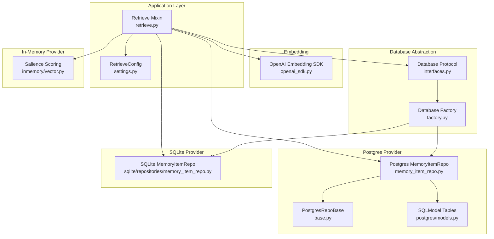
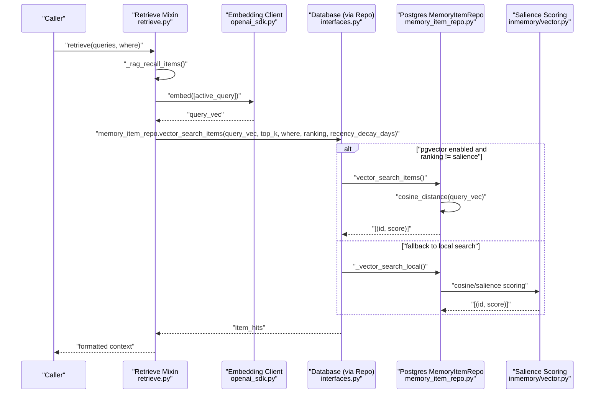
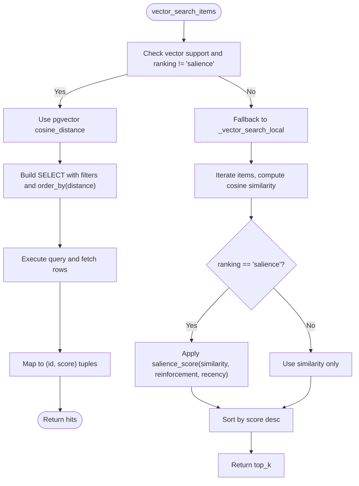
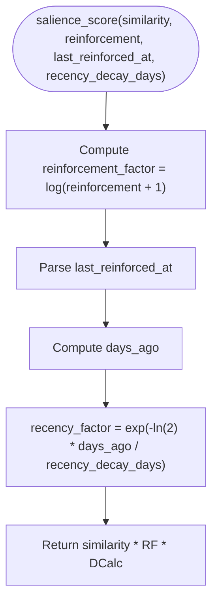
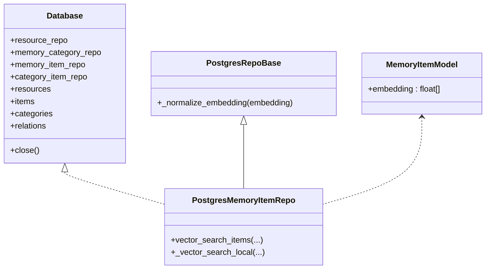
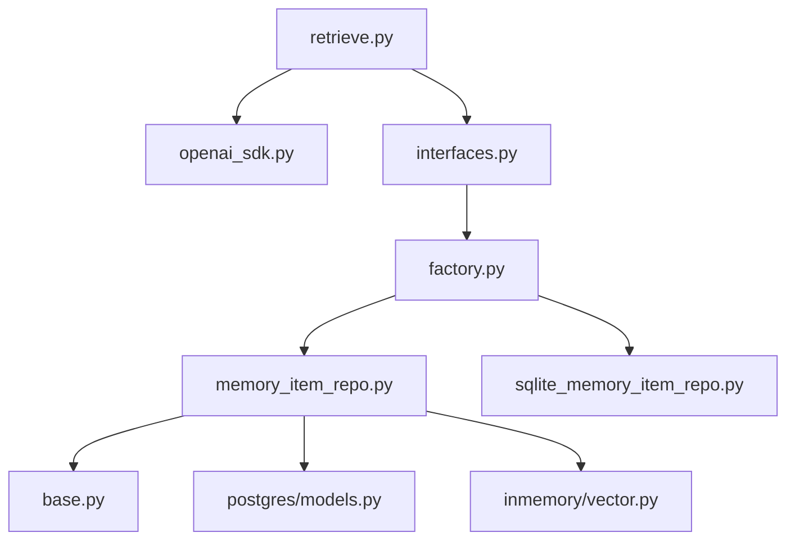

# Item Recall

<cite>
**Referenced Files in This Document**
- [retrieve.py](file://src/memu/app/retrieve.py)
- [settings.py](file://src/memu/app/settings.py)
- [memory_item_repo.py](file://src/memu/database/postgres/repositories/memory_item_repo.py)
- [base.py](file://src/memu/database/postgres/repositories/base.py)
- [models.py](file://src/memu/database/postgres/models.py)
- [vector.py](file://src/memu/database/inmemory/vector.py)
- [sqlite_memory_item_repo.py](file://src/memu/database/sqlite/repositories/memory_item_repo.py)
- [models.py](file://src/memu/database/models.py)
- [openai_sdk.py](file://src/memu/embedding/openai_sdk.py)
- [factory.py](file://src/memu/database/factory.py)
- [interfaces.py](file://src/memu/database/interfaces.py)
- [0002-pluggable-storage-and-vector-strategy.md](file://docs/adr/0002-pluggable-storage-and-vector-strategy.md)
- [test_salience.py](file://tests/test_salience.py)
</cite>

## Table of Contents
1. [Introduction](#introduction)
2. [Project Structure](#project-structure)
3. [Core Components](#core-components)
4. [Architecture Overview](#architecture-overview)
5. [Detailed Component Analysis](#detailed-component-analysis)
6. [Dependency Analysis](#dependency-analysis)
7. [Performance Considerations](#performance-considerations)
8. [Troubleshooting Guide](#troubleshooting-guide)
9. [Conclusion](#conclusion)

## Introduction
This document explains the item recall phase for atomic memory retrieval using vector similarity search with recency weighting. It covers:
- How item embeddings are produced and stored
- Integration with pgvector for native vector similarity
- Cosine similarity computations and ranking strategies
- Recency decay mechanisms and hybrid salience scoring
- Configuration options for recency_decay_days
- Performance optimization for large item collections
- Database integration patterns and scaling considerations

## Project Structure
The item recall pipeline spans application orchestration, embedding generation, database repositories, and vector scoring utilities. The following diagram shows the key modules involved in item recall.

**Diagram sources**
- [retrieve.py](file://src/memu/app/retrieve.py#L346-L367)
- [settings.py](file://src/memu/app/settings.py#L151-L167)
- [openai_sdk.py](file://src/memu/embedding/openai_sdk.py#L19-L43)
- [interfaces.py](file://src/memu/database/interfaces.py#L12-L26)
- [factory.py](file://src/memu/database/factory.py#L15-L43)
- [memory_item_repo.py](file://src/memu/database/postgres/repositories/memory_item_repo.py#L280-L308)
- [base.py](file://src/memu/database/postgres/repositories/base.py#L15-L45)
- [models.py](file://src/memu/database/postgres/models.py#L46-L75)
- [sqlite_memory_item_repo.py](file://src/memu/database/sqlite/repositories/memory_item_repo.py#L477-L500)
- [vector.py](file://src/memu/database/inmemory/vector.py#L16-L53)

**Section sources**
- [retrieve.py](file://src/memu/app/retrieve.py#L346-L367)
- [settings.py](file://src/memu/app/settings.py#L151-L167)
- [factory.py](file://src/memu/database/factory.py#L15-L43)
- [interfaces.py](file://src/memu/database/interfaces.py#L12-L26)

## Core Components
- Retrieve workflow orchestrator: builds and executes the recall pipeline for items, including query vectorization and vector search.
- Item vector search:
  - Postgres: native pgvector cosine distance with SQLModel ORM.
  - SQLite and in-memory: brute-force cosine similarity with optional salience scoring.
- Salience scoring: combines cosine similarity with reinforcement count and recency decay.
- Configuration: controls ranking mode, top_k, and recency_decay_days.

**Section sources**
- [retrieve.py](file://src/memu/app/retrieve.py#L346-L367)
- [memory_item_repo.py](file://src/memu/database/postgres/repositories/memory_item_repo.py#L280-L308)
- [sqlite_memory_item_repo.py](file://src/memu/database/sqlite/repositories/memory_item_repo.py#L477-L500)
- [vector.py](file://src/memu/database/inmemory/vector.py#L16-L53)
- [settings.py](file://src/memu/app/settings.py#L151-L167)

## Architecture Overview
The item recall phase follows a two-stage process:
1. Query vectorization: embed the active query text into a dense vector.
2. Vector search and ranking: perform similarity search and rank results by either pure cosine similarity or salience (similarity × reinforcement × recency).

**Diagram sources**
- [retrieve.py](file://src/memu/app/retrieve.py#L346-L367)
- [openai_sdk.py](file://src/memu/embedding/openai_sdk.py#L19-L43)
- [memory_item_repo.py](file://src/memu/database/postgres/repositories/memory_item_repo.py#L280-L354)
- [vector.py](file://src/memu/database/inmemory/vector.py#L56-L127)

## Detailed Component Analysis

### Item Embedding Process
- Query text is embedded into a dense vector using an embedding client.
- The embedding client supports batching and asynchronous API calls.
- The resulting vector is passed to the vector search method for item recall.

Implementation highlights:
- Embedding client creation and batched embedding calls.
- Integration in the recall step to obtain query vectors when missing.

**Section sources**
- [openai_sdk.py](file://src/memu/embedding/openai_sdk.py#L19-L43)
- [retrieve.py](file://src/memu/app/retrieve.py#L355-L358)

### pgvector Integration and Cosine Similarity
- Postgres repository exposes vector_search_items that leverages pgvector’s native cosine_distance.
- The SQLModel ORM composes a query selecting item id and computing score as (1 - distance).
- Filters include embedding presence and optional where clauses.

**Diagram sources**
- [memory_item_repo.py](file://src/memu/database/postgres/repositories/memory_item_repo.py#L280-L308)
- [memory_item_repo.py](file://src/memu/database/postgres/repositories/memory_item_repo.py#L319-L354)

**Section sources**
- [memory_item_repo.py](file://src/memu/database/postgres/repositories/memory_item_repo.py#L280-L308)
- [memory_item_repo.py](file://src/memu/database/postgres/repositories/memory_item_repo.py#L319-L354)

### Recency Decay Mechanisms
- Recency is modeled as exponential decay with a configurable half-life (recency_decay_days).
- When last reinforcement time is unknown, a neutral recency factor is applied.
- The decay constant uses natural logarithm of 2 to achieve correct half-life behavior.

**Diagram sources**
- [vector.py](file://src/memu/database/inmemory/vector.py#L16-L53)
- [test_salience.py](file://tests/test_salience.py#L23-L39)

**Section sources**
- [vector.py](file://src/memu/database/inmemory/vector.py#L16-L53)
- [test_salience.py](file://tests/test_salience.py#L23-L39)

### Ranking Strategies: Similarity vs Salience
- similarity: Pure cosine similarity between query and item embeddings.
- salience: similarity multiplied by log(reinforcement_count + 1) and recency_factor.
- The ranking mode and recency_decay_days are configurable per retrieval request.

**Section sources**
- [settings.py](file://src/memu/app/settings.py#L151-L167)
- [memory_item_repo.py](file://src/memu/database/postgres/repositories/memory_item_repo.py#L337-L349)
- [vector.py](file://src/memu/database/inmemory/vector.py#L94-L127)

### Concrete Examples

#### Example 1: Query Vector Processing and Item Scoring
- The recall step obtains a query vector from the embedding client.
- It calls vector_search_items with top_k, where filters, ranking mode, and recency_decay_days.
- Results are returned as (item_id, score) pairs.

Paths:
- [retrieve.py](file://src/memu/app/retrieve.py#L355-L365)
- [memory_item_repo.py](file://src/memu/database/postgres/repositories/memory_item_repo.py#L280-L308)

#### Example 2: Hybrid Ranking with Salience
- For salience ranking, the repository computes cosine similarity locally and applies salience_score.
- The scoring combines reinforcement count and recency decay.

Paths:
- [memory_item_repo.py](file://src/memu/database/postgres/repositories/memory_item_repo.py#L337-L349)
- [vector.py](file://src/memu/database/inmemory/vector.py#L16-L53)

#### Example 3: Brute-Force Similarity in SQLite
- SQLite repository performs brute-force cosine similarity since native vector ops are unavailable.
- It loads filtered items and computes similarities locally.

Paths:
- [sqlite_memory_item_repo.py](file://src/memu/database/sqlite/repositories/memory_item_repo.py#L477-L500)

### Database Integration Patterns
- Database provider selection is handled by a factory that chooses in-memory, SQLite, or Postgres backends.
- The Database protocol abstracts repositories for resources, categories, items, and relations.
- Postgres models define pgvector-enabled embedding columns and indexes.

**Diagram sources**
- [interfaces.py](file://src/memu/database/interfaces.py#L12-L26)
- [memory_item_repo.py](file://src/memu/database/postgres/repositories/memory_item_repo.py#L14-L30)
- [base.py](file://src/memu/database/postgres/repositories/base.py#L15-L45)
- [models.py](file://src/memu/database/postgres/models.py#L46-L75)

**Section sources**
- [factory.py](file://src/memu/database/factory.py#L15-L43)
- [interfaces.py](file://src/memu/database/interfaces.py#L12-L26)
- [memory_item_repo.py](file://src/memu/database/postgres/repositories/memory_item_repo.py#L14-L30)
- [models.py](file://src/memu/database/postgres/models.py#L46-L75)

## Dependency Analysis
- The retrieve mixin depends on the embedding client and the database abstraction.
- The Postgres repository depends on SQLModel and pgvector for native similarity.
- The in-memory and SQLite repositories depend on local vector utilities for brute-force similarity and salience scoring.

**Diagram sources**
- [retrieve.py](file://src/memu/app/retrieve.py#L346-L367)
- [openai_sdk.py](file://src/memu/embedding/openai_sdk.py#L19-L43)
- [interfaces.py](file://src/memu/database/interfaces.py#L12-L26)
- [factory.py](file://src/memu/database/factory.py#L15-L43)
- [memory_item_repo.py](file://src/memu/database/postgres/repositories/memory_item_repo.py#L280-L308)
- [base.py](file://src/memu/database/postgres/repositories/base.py#L15-L45)
- [models.py](file://src/memu/database/postgres/models.py#L46-L75)
- [sqlite_memory_item_repo.py](file://src/memu/database/sqlite/repositories/memory_item_repo.py#L477-L500)
- [vector.py](file://src/memu/database/inmemory/vector.py#L56-L127)

**Section sources**
- [retrieve.py](file://src/memu/app/retrieve.py#L346-L367)
- [memory_item_repo.py](file://src/memu/database/postgres/repositories/memory_item_repo.py#L280-L308)
- [sqlite_memory_item_repo.py](file://src/memu/database/sqlite/repositories/memory_item_repo.py#L477-L500)
- [vector.py](file://src/memu/database/inmemory/vector.py#L56-L127)

## Performance Considerations
- Native pgvector vs brute-force:
  - Prefer pgvector for large-scale item collections to leverage hardware-accelerated distance computations.
  - For SQLite and in-memory providers, brute-force similarity is used; performance scales with O(n×d) per query.
- Top-k selection:
  - Postgres uses ordered distance with limit; SQLite and in-memory compute all similarities then sort.
  - Consider increasing top_k judiciously to reduce false negatives while bounding cost.
- Salience scoring overhead:
  - Salience adds O(n) scoring and sorting; beneficial for relevance but increases latency.
- Embedding batching:
  - Use the embedding client’s batch_size to amortize API overhead.
- Indexing and normalization:
  - Ensure embeddings are normalized consistently; cosine similarity is sensitive to vector magnitude.
- Configuration:
  - Adjust recency_decay_days to balance freshness vs stability of recalled memories.

[No sources needed since this section provides general guidance]

## Troubleshooting Guide
- No results or low-quality results:
  - Verify embeddings are present and normalized; check repository’s embedding normalization logic.
  - Confirm ranking mode and recency_decay_days are set appropriately.
- Performance regressions:
  - Switch to pgvector provider for large datasets.
  - Reduce top_k or refine where filters to narrow candidate sets.
- Salience scoring anomalies:
  - Inspect reinforcement_count and last_reinforced_at fields in item extra metadata.
  - Validate recency_decay_days units and expected half-life behavior.

**Section sources**
- [base.py](file://src/memu/database/postgres/repositories/base.py#L34-L45)
- [memory_item_repo.py](file://src/memu/database/postgres/repositories/memory_item_repo.py#L337-L349)
- [vector.py](file://src/memu/database/inmemory/vector.py#L16-L53)

## Conclusion
The item recall phase integrates query vectorization with backend-aware vector search and hybrid ranking. pgvector enables efficient cosine similarity for large-scale deployments, while local salience scoring ensures temporal relevance through reinforcement and recency decay. Configuration options allow tuning for accuracy, performance, and scalability across diverse deployment footprints.