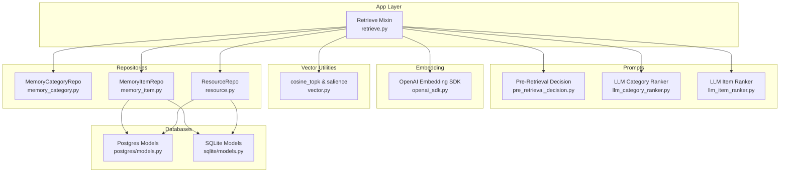
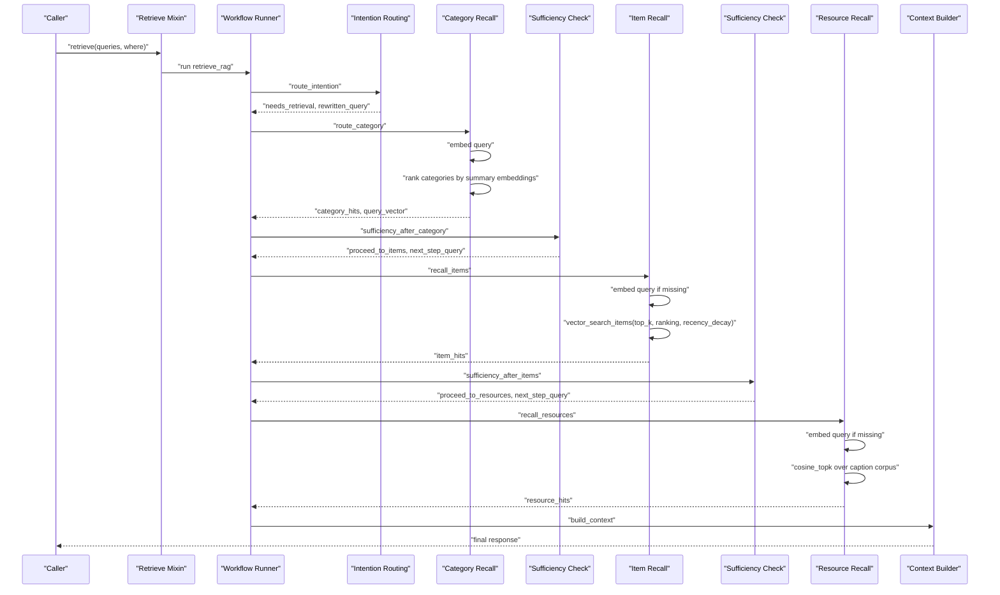
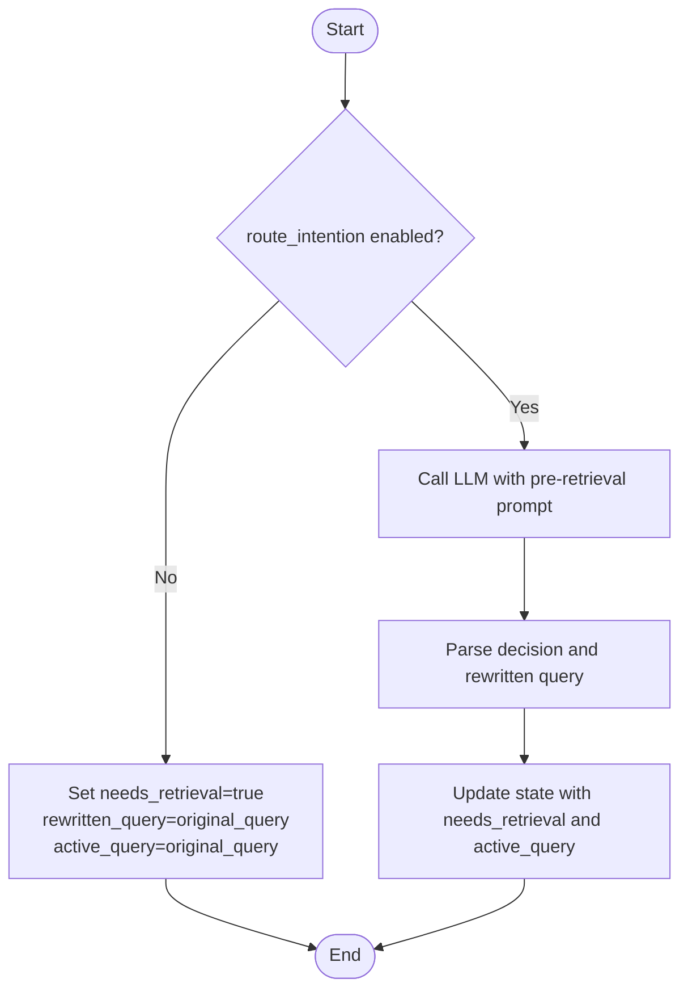
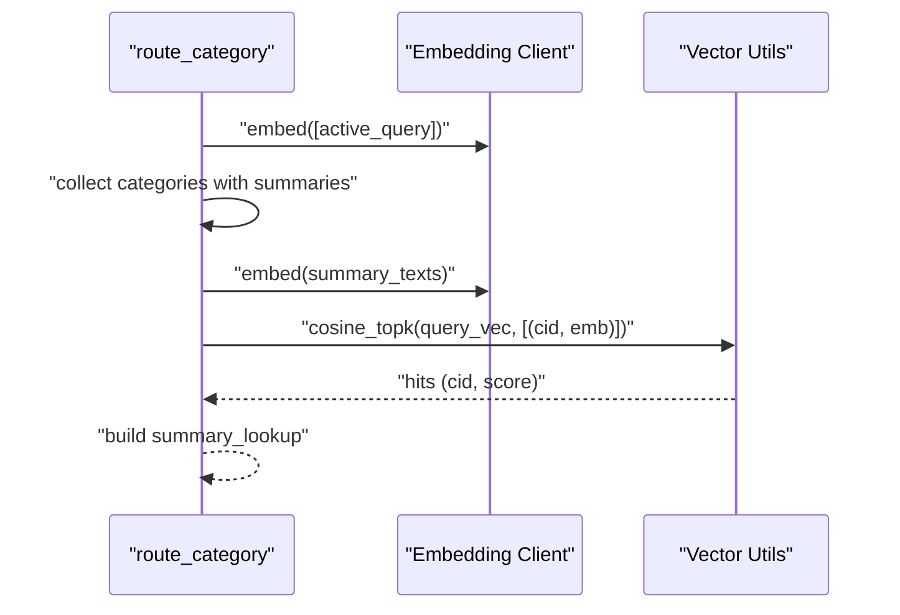
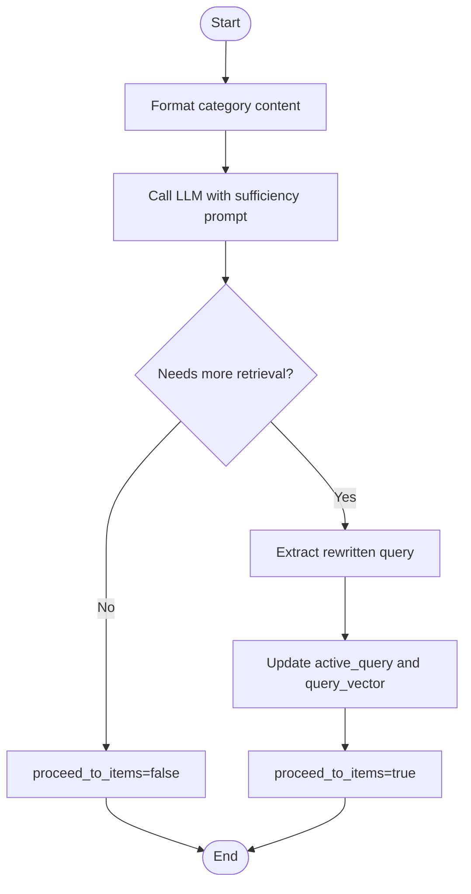
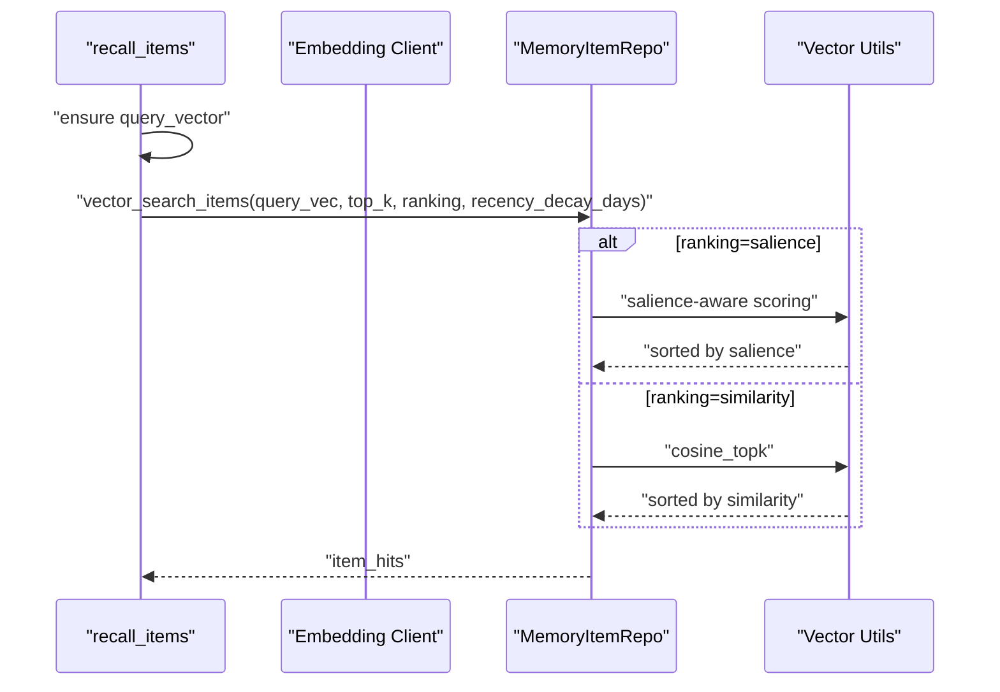
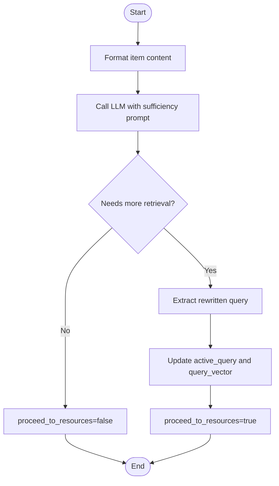
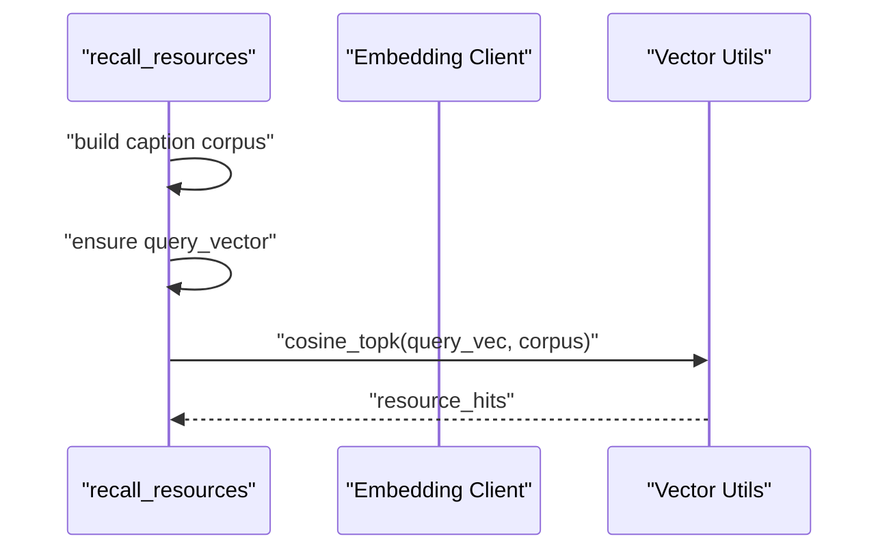
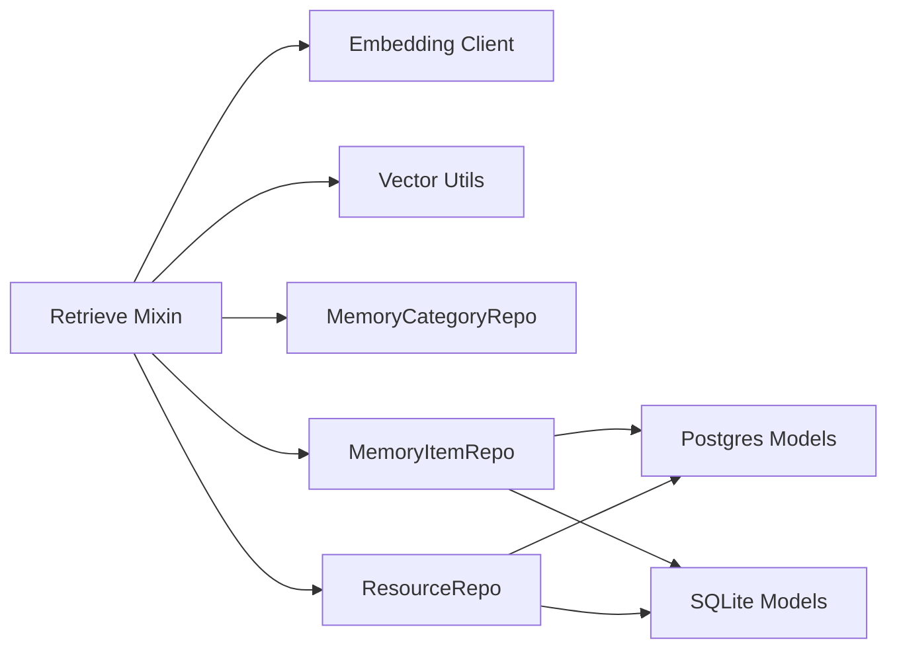

# RAG Retrieval Mode

<cite>
**Referenced Files in This Document**
- [retrieve.py](file://src/memu/app/retrieve.py)
- [settings.py](file://src/memu/app/settings.py)
- [vector.py](file://src/memu/database/inmemory/vector.py)
- [memory_category.py](file://src/memu/database/repositories/memory_category.py)
- [memory_item.py](file://src/memu/database/repositories/memory_item.py)
- [resource.py](file://src/memu/database/repositories/resource.py)
- [models.py (Postgres)](file://src/memu/database/postgres/models.py)
- [models.py (SQLite)](file://src/memu/database/sqlite/models.py)
- [openai_sdk.py](file://src/memu/embedding/openai_sdk.py)
- [pre_retrieval_decision.py](file://src/memu/prompts/retrieve/pre_retrieval_decision.py)
- [llm_category_ranker.py](file://src/memu/prompts/retrieve/llm_category_ranker.py)
- [llm_item_ranker.py](file://src/memu/prompts/retrieve/llm_item_ranker.py)
</cite>

## Table of Contents
1. [Introduction](#introduction)
2. [Project Structure](#project-structure)
3. [Core Components](#core-components)
4. [Architecture Overview](#architecture-overview)
5. [Detailed Component Analysis](#detailed-component-analysis)
6. [Dependency Analysis](#dependency-analysis)
7. [Performance Considerations](#performance-considerations)
8. [Troubleshooting Guide](#troubleshooting-guide)
9. [Conclusion](#conclusion)
10. [Appendices](#appendices)

## Introduction
This document explains the Retrieval-Augmented Generation (RAG) retrieval mode with emphasis on vector similarity search and hybrid retrieval. It details the end-to-end workflow: intention routing, category recall via vector search over category summaries, sufficiency checks, item recall using pgvector-compatible embeddings with optional recency decay, and resource retrieval using cosine similarity over captions. It also covers vector embedding generation, cosine similarity computations, top-k retrieval, configuration options, database backends, and scalability guidance.

## Project Structure
The retrieval mode is implemented as a workflow-driven module that orchestrates LLM-based routing, embedding-based vector search, and sufficiency checks across three tiers: categories, items, and resources. Supporting components include:
- Retrieval orchestration and workflow steps
- Embedding clients and vector utilities
- Repository interfaces for categories, items, and resources
- Database models for Postgres (pgvector) and SQLite (JSON embeddings)
- Prompt templates for routing and ranking

**Diagram sources**
- [retrieve.py](file://src/memu/app/retrieve.py#L106-L210)
- [pre_retrieval_decision.py](file://src/memu/prompts/retrieve/pre_retrieval_decision.py#L1-L54)
- [llm_category_ranker.py](file://src/memu/prompts/retrieve/llm_category_ranker.py#L1-L36)
- [llm_item_ranker.py](file://src/memu/prompts/retrieve/llm_item_ranker.py#L1-L41)
- [openai_sdk.py](file://src/memu/embedding/openai_sdk.py#L1-L44)
- [vector.py](file://src/memu/database/inmemory/vector.py#L56-L138)
- [memory_category.py](file://src/memu/database/repositories/memory_category.py#L9-L34)
- [memory_item.py](file://src/memu/database/repositories/memory_item.py#L9-L55)
- [resource.py](file://src/memu/database/repositories/resource.py#L9-L31)
- [models.py (Postgres)](file://src/memu/database/postgres/models.py#L46-L76)
- [models.py (SQLite)](file://src/memu/database/sqlite/models.py#L48-L146)

**Section sources**
- [retrieve.py](file://src/memu/app/retrieve.py#L106-L210)
- [settings.py](file://src/memu/app/settings.py#L175-L202)

## Core Components
- Retrieve Mixin: Orchestrates the retrieval workflow, builds state, and executes steps for intention routing, category recall, sufficiency checks, item recall, resource recall, and context building.
- Embedding Clients: Provide text embedding generation used for query vectors and corpus vectors.
- Vector Utilities: Implement cosine similarity and top-k retrieval, including salience-aware scoring with recency decay.
- Repositories: Define contracts for categories, items, and resources, enabling list and vector search operations.
- Database Models: Define schema for Postgres (pgvector) and SQLite (JSON) embeddings.
- Prompts: Supply templates for routing decisions and LLM-based ranking.

**Section sources**
- [retrieve.py](file://src/memu/app/retrieve.py#L42-L85)
- [openai_sdk.py](file://src/memu/embedding/openai_sdk.py#L19-L43)
- [vector.py](file://src/memu/database/inmemory/vector.py#L56-L138)
- [memory_category.py](file://src/memu/database/repositories/memory_category.py#L9-L34)
- [memory_item.py](file://src/memu/database/repositories/memory_item.py#L9-L55)
- [resource.py](file://src/memu/database/repositories/resource.py#L9-L31)
- [models.py (Postgres)](file://src/memu/database/postgres/models.py#L46-L76)
- [models.py (SQLite)](file://src/memu/database/sqlite/models.py#L48-L146)
- [pre_retrieval_decision.py](file://src/memu/prompts/retrieve/pre_retrieval_decision.py#L1-L54)
- [llm_category_ranker.py](file://src/memu/prompts/retrieve/llm_category_ranker.py#L1-L36)
- [llm_item_ranker.py](file://src/memu/prompts/retrieve/llm_item_ranker.py#L1-L41)

## Architecture Overview
The retrieval mode supports two strategies:
- RAG strategy: Uses embedding vectors for category and item recall, cosine similarity for top-k, and optional recency decay.
- LLM strategy: Delegates ranking to LLM prompts for categories and items; resources are recalled via caption corpus matching.

**Diagram sources**
- [retrieve.py](file://src/memu/app/retrieve.py#L106-L210)
- [retrieve.py](file://src/memu/app/retrieve.py#L228-L286)
- [retrieve.py](file://src/memu/app/retrieve.py#L288-L322)
- [retrieve.py](file://src/memu/app/retrieve.py#L346-L367)
- [retrieve.py](file://src/memu/app/retrieve.py#L369-L398)
- [retrieve.py](file://src/memu/app/retrieve.py#L400-L424)
- [retrieve.py](file://src/memu/app/retrieve.py#L426-L452)

## Detailed Component Analysis

### Intention Routing
- Purpose: Decide whether retrieval is needed and optionally rewrite the query to be self-contained.
- Inputs: Original query, context queries, flags for routing and skipping rewrite.
- Outputs: Needs retrieval flag, rewritten query, active query for subsequent steps.
- Implementation highlights:
  - Uses a sufficiency-check prompt to determine whether to retrieve or not.
  - Rewrites the query to incorporate context when retrieval is needed.
  - Supports skipping rewrite for single-query scenarios.

**Diagram sources**
- [retrieve.py](file://src/memu/app/retrieve.py#L228-L258)
- [pre_retrieval_decision.py](file://src/memu/prompts/retrieve/pre_retrieval_decision.py#L1-L54)

**Section sources**
- [retrieve.py](file://src/memu/app/retrieve.py#L228-L258)
- [pre_retrieval_decision.py](file://src/memu/prompts/retrieve/pre_retrieval_decision.py#L1-L54)

### Category Recall via Vector Search
- Purpose: Retrieve relevant memory categories by embedding their summaries and ranking by cosine similarity to the query vector.
- Steps:
  - Embed the active query.
  - Collect categories with non-empty summaries.
  - Embed summary texts and compute cosine similarity with the query vector.
  - Return top-k category IDs and a summary lookup for materialization.
- Configuration:
  - top_k for category recall.
  - Embedding model via embedding profile.

**Diagram sources**
- [retrieve.py](file://src/memu/app/retrieve.py#L260-L286)
- [vector.py](file://src/memu/database/inmemory/vector.py#L56-L92)

**Section sources**
- [retrieve.py](file://src/memu/app/retrieve.py#L260-L286)
- [vector.py](file://src/memu/database/inmemory/vector.py#L56-L92)

### Sufficiency Checking After Category
- Purpose: Evaluate whether category recall alone is sufficient or if item recall is needed; optionally rewrite the query for deeper retrieval.
- Inputs: Active query, context queries, category hits, and category pool.
- Outputs: Flag to proceed to items, next step query, and updated query vector if needed.

**Diagram sources**
- [retrieve.py](file://src/memu/app/retrieve.py#L288-L322)
- [pre_retrieval_decision.py](file://src/memu/prompts/retrieve/pre_retrieval_decision.py#L1-L54)

**Section sources**
- [retrieve.py](file://src/memu/app/retrieve.py#L288-L322)
- [pre_retrieval_decision.py](file://src/memu/prompts/retrieve/pre_retrieval_decision.py#L1-L54)

### Item Recall Using pgvector Embeddings
- Purpose: Retrieve relevant memory items using vector search with optional salience-aware ranking and recency decay.
- Steps:
  - Embed the active query if not already present.
  - Perform vector search on items with:
    - top_k limit
    - ranking strategy: similarity or salience
    - recency_decay_days for salience scoring
- Database backends:
  - Postgres: Uses pgvector column types for efficient vector operations.
  - SQLite: Stores embeddings as JSON strings; retrieval uses in-memory cosine_topk.

**Diagram sources**
- [retrieve.py](file://src/memu/app/retrieve.py#L346-L367)
- [memory_item.py](file://src/memu/database/repositories/memory_item.py#L50-L52)
- [vector.py](file://src/memu/database/inmemory/vector.py#L94-L127)
- [models.py (Postgres)](file://src/memu/database/postgres/models.py#L54-L61)
- [models.py (SQLite)](file://src/memu/database/sqlite/models.py#L78-L107)

**Section sources**
- [retrieve.py](file://src/memu/app/retrieve.py#L346-L367)
- [memory_item.py](file://src/memu/database/repositories/memory_item.py#L50-L52)
- [vector.py](file://src/memu/database/inmemory/vector.py#L94-L127)
- [models.py (Postgres)](file://src/memu/database/postgres/models.py#L54-L61)
- [models.py (SQLite)](file://src/memu/database/sqlite/models.py#L78-L107)

### Sufficiency Checking After Items
- Purpose: Decide whether item recall is sufficient or if resource recall is needed; optionally rewrite the query.
- Inputs: Active query, context queries, item hits, and item pool.
- Outputs: Flag to proceed to resources and updated query vector if needed.

**Diagram sources**
- [retrieve.py](file://src/memu/app/retrieve.py#L369-L398)
- [pre_retrieval_decision.py](file://src/memu/prompts/retrieve/pre_retrieval_decision.py#L1-L54)

**Section sources**
- [retrieve.py](file://src/memu/app/retrieve.py#L369-L398)
- [pre_retrieval_decision.py](file://src/memu/prompts/retrieve/pre_retrieval_decision.py#L1-L54)

### Resource Recall Using Caption Corpus Matching
- Purpose: Retrieve relevant resources by matching the query vector against caption embeddings and selecting top-k by cosine similarity.
- Steps:
  - Build a caption corpus from resources.
  - Embed the active query if not already present.
  - Compute cosine similarity against the corpus and return top-k matches.

**Diagram sources**
- [retrieve.py](file://src/memu/app/retrieve.py#L400-L424)
- [vector.py](file://src/memu/database/inmemory/vector.py#L56-L92)

**Section sources**
- [retrieve.py](file://src/memu/app/retrieve.py#L400-L424)
- [vector.py](file://src/memu/database/inmemory/vector.py#L56-L92)

### Context Building
- Purpose: Materialize the final response by combining category, item, and resource hits with pools for display or downstream use.

**Section sources**
- [retrieve.py](file://src/memu/app/retrieve.py#L426-L452)

### Configuration Options
- Retrieval method: rag or llm.
- Route intention: enable/disable.
- Category retrieval: enabled, top_k.
- Item retrieval: enabled, top_k, use_category_references, ranking (similarity/salience), recency_decay_days.
- Resource retrieval: enabled, top_k.
- Sufficiency checks: enabled, prompt override, LLM profiles for routing and ranking.
- Embedding model: configured via LLM profiles (embed_model, embed_batch_size).
- Database provider: inmemory, postgres, sqlite; vector index provider: bruteforce, pgvector, none.

**Section sources**
- [settings.py](file://src/memu/app/settings.py#L175-L202)
- [settings.py](file://src/memu/app/settings.py#L146-L173)
- [settings.py](file://src/memu/app/settings.py#L151-L168)
- [settings.py](file://src/memu/app/settings.py#L170-L173)
- [settings.py](file://src/memu/app/settings.py#L263-L297)
- [settings.py](file://src/memu/app/settings.py#L300-L322)

### Embedding and Similarity Details
- Embedding generation:
  - OpenAI embedding client supports batching and asynchronous calls.
  - Embedding model and batch size configurable via LLM profiles.
- Cosine similarity:
  - Vectorized computation using numpy for batch scoring.
  - Top-k selection via argpartition for efficiency.
- Salience-aware scoring:
  - Combines similarity, logarithmic reinforcement count, and exponential recency decay.
  - Recency half-life configurable.

**Section sources**
- [openai_sdk.py](file://src/memu/embedding/openai_sdk.py#L19-L43)
- [vector.py](file://src/memu/database/inmemory/vector.py#L11-L13)
- [vector.py](file://src/memu/database/inmemory/vector.py#L56-L92)
- [vector.py](file://src/memu/database/inmemory/vector.py#L94-L127)

### Hybrid Retrieval Approach
- RAG mode:
  - Embeddings drive category and item recall; captions drive resource recall.
  - Optional recency decay for items.
- LLM mode:
  - LLM ranks categories and items; resources ranked by LLM prompts.
  - References extracted from category summaries to narrow item recall.

**Section sources**
- [retrieve.py](file://src/memu/app/retrieve.py#L106-L210)
- [retrieve.py](file://src/memu/app/retrieve.py#L454-L536)
- [llm_category_ranker.py](file://src/memu/prompts/retrieve/llm_category_ranker.py#L1-L36)
- [llm_item_ranker.py](file://src/memu/prompts/retrieve/llm_item_ranker.py#L1-L41)

## Dependency Analysis
- Retrieve Mixin depends on:
  - Embedding clients for query vector generation.
  - Vector utilities for cosine similarity and top-k.
  - Repository interfaces for categories, items, and resources.
  - Database models for Postgres and SQLite.
  - Prompt templates for routing and ranking.
- Coupling and Cohesion:
  - High cohesion within Retrieve Mixin steps; low coupling via protocol-based repositories.
  - Clear separation between embedding, vector math, and database storage.

**Diagram sources**
- [retrieve.py](file://src/memu/app/retrieve.py#L106-L210)
- [memory_category.py](file://src/memu/database/repositories/memory_category.py#L9-L34)
- [memory_item.py](file://src/memu/database/repositories/memory_item.py#L9-L55)
- [resource.py](file://src/memu/database/repositories/resource.py#L9-L31)
- [models.py (Postgres)](file://src/memu/database/postgres/models.py#L46-L76)
- [models.py (SQLite)](file://src/memu/database/sqlite/models.py#L48-L146)

**Section sources**
- [retrieve.py](file://src/memu/app/retrieve.py#L106-L210)
- [memory_category.py](file://src/memu/database/repositories/memory_category.py#L9-L34)
- [memory_item.py](file://src/memu/database/repositories/memory_item.py#L9-L55)
- [resource.py](file://src/memu/database/repositories/resource.py#L9-L31)
- [models.py (Postgres)](file://src/memu/database/postgres/models.py#L46-L76)
- [models.py (SQLite)](file://src/memu/database/sqlite/models.py#L48-L146)

## Performance Considerations
- Vector search efficiency:
  - Use argpartition for top-k selection to avoid full sorting.
  - Batch embedding calls to reduce API overhead.
- Database backends:
  - Postgres with pgvector enables hardware-accelerated vector operations and indexing.
  - SQLite stores embeddings as JSON; retrieval uses in-memory cosine_topk.
- Ranking strategies:
  - salience-aware scoring adds computational cost; use similarity-only for speed.
  - Adjust recency_decay_days to balance freshness and performance.
- Scaling:
  - Increase top_k judiciously; large k increases post-processing cost.
  - Consider caching query vectors for repeated queries.
  - Optimize embedding batch sizes according to provider limits.

[No sources needed since this section provides general guidance]

## Troubleshooting Guide
- No retrieval results:
  - Verify embedding model configuration and API keys.
  - Ensure categories have non-empty summaries for category recall.
  - Confirm resource captions exist for resource recall.
- Poor relevance:
  - Increase top_k for categories/items/resources.
  - Switch ranking to salience for recency-weighted results.
  - Improve query rewrite quality via context.
- Performance issues:
  - Reduce top_k or disable salience scoring.
  - Use Postgres with pgvector for large-scale vector search.
  - Tune embedding batch size and provider rate limits.

[No sources needed since this section provides general guidance]

## Conclusion
The RAG retrieval mode integrates embedding-based vector search with LLM-driven routing and sufficiency checks across categories, items, and resources. It supports flexible configuration for top-k, ranking strategies, and embedding models, and it scales across in-memory, Postgres (with pgvector), and SQLite backends. By leveraging cosine similarity, optional recency decay, and hybrid approaches, it balances precision, relevance, and performance for real-world deployments.

[No sources needed since this section summarizes without analyzing specific files]

## Appendices

### Concrete Examples (Step-by-Step)
- Query vector generation:
  - Embed the active query using the configured embedding client.
  - Use the resulting vector for category, item, and resource recall.
- Category ranking by summary embeddings:
  - Embed category summaries and compute cosine similarity to the query vector.
  - Return top-k categories with their summaries for materialization.
- Item recall with recency decay:
  - Embed the query if needed.
  - Perform vector search with ranking set to salience and appropriate recency_decay_days.
  - Return top-k items ordered by salience score.
- Resource caption corpus matching:
  - Build a corpus of (resource_id, caption_embedding).
  - Compute cosine similarity against the query vector and return top-k matches.

**Section sources**
- [retrieve.py](file://src/memu/app/retrieve.py#L267-L286)
- [retrieve.py](file://src/memu/app/retrieve.py#L354-L367)
- [retrieve.py](file://src/memu/app/retrieve.py#L413-L424)
- [vector.py](file://src/memu/database/inmemory/vector.py#L56-L92)
- [vector.py](file://src/memu/database/inmemory/vector.py#L94-L127)