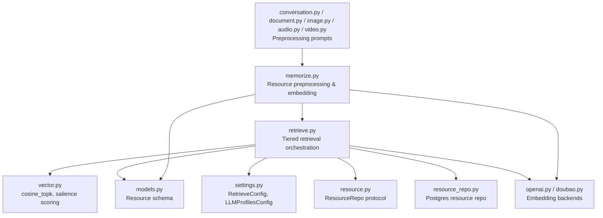
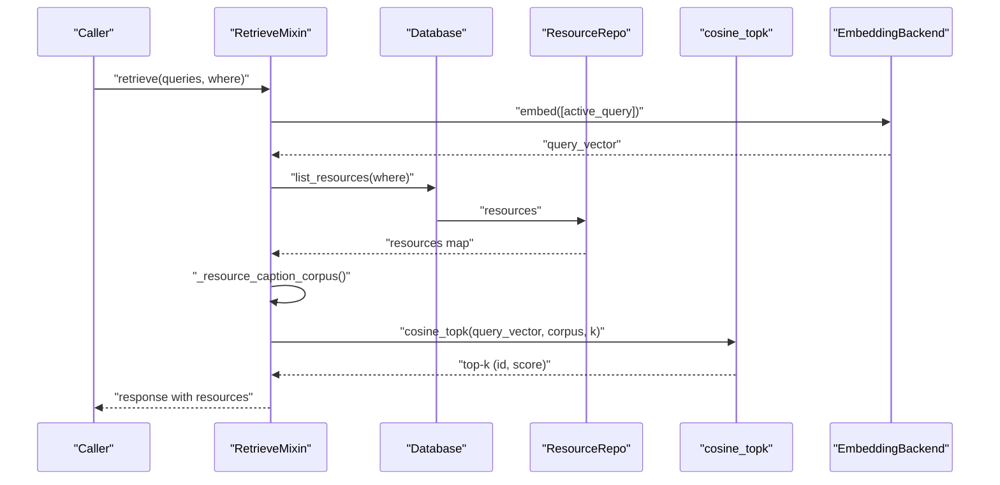
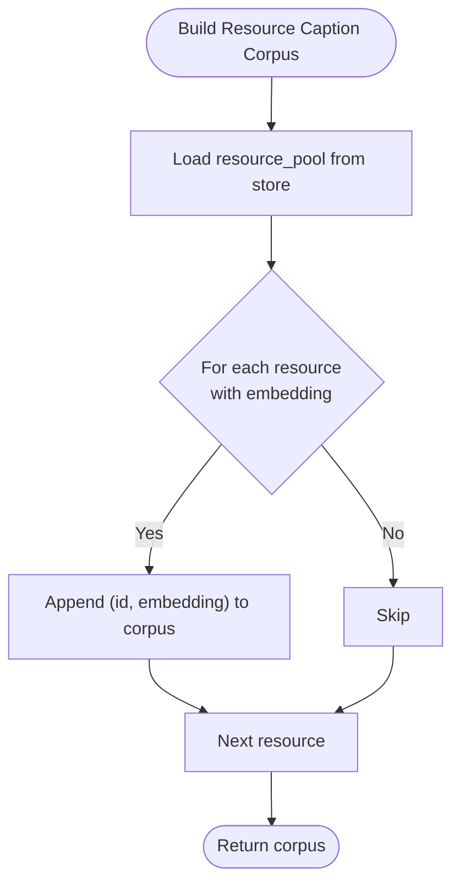
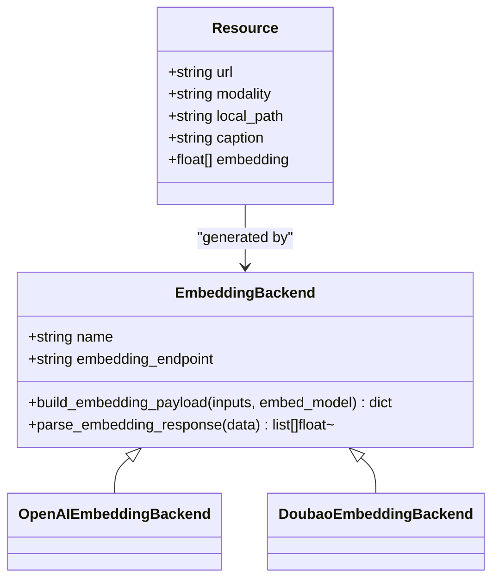
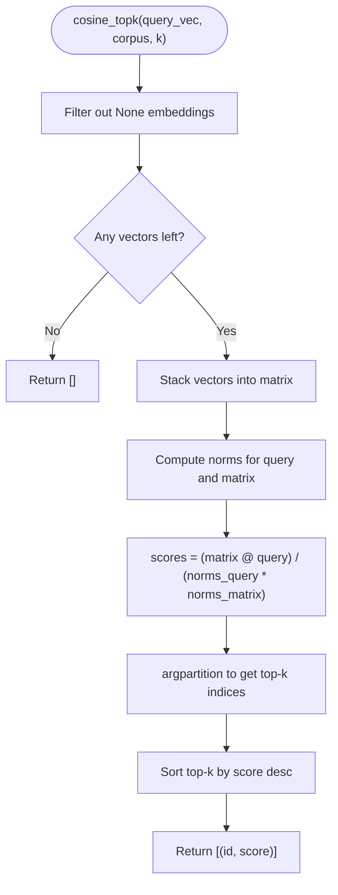
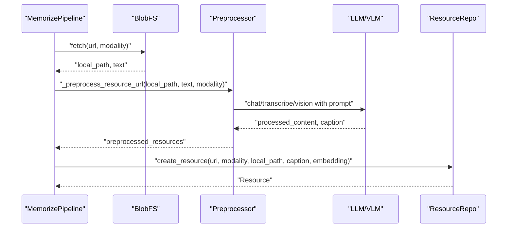
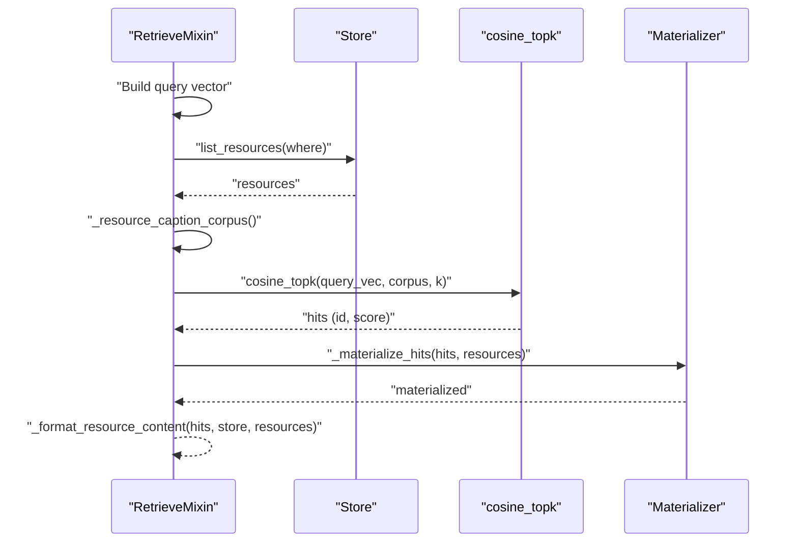
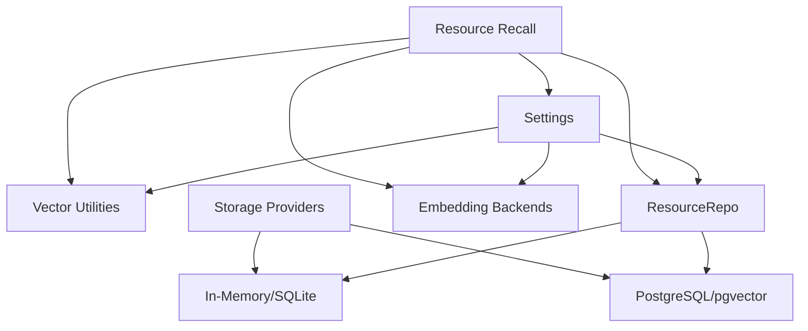

# Resource Recall

<cite>
**Referenced Files in This Document**
- [retrieve.py](file://src/memu/app/retrieve.py)
- [vector.py](file://src/memu/database/inmemory/vector.py)
- [models.py](file://src/memu/database/models.py)
- [settings.py](file://src/memu/app/settings.py)
- [resource.py](file://src/memu/database/repositories/resource.py)
- [resource_repo.py](file://src/memu/database/postgres/repositories/resource_repo.py)
- [openai.py](file://src/memu/embedding/backends/openai.py)
- [doubao.py](file://src/memu/embedding/backends/doubao.py)
- [conversation.py](file://src/memu/prompts/preprocess/conversation.py)
- [document.py](file://src/memu/prompts/preprocess/document.py)
- [image.py](file://src/memu/prompts/preprocess/image.py)
- [audio.py](file://src/memu/prompts/preprocess/audio.py)
- [video.py](file://src/memu/prompts/preprocess/video.py)
- [memorize.py](file://src/memu/app/memorize.py)
- [0002-pluggable-storage-and-vector-strategy.md](file://docs/adr/0002-pluggable-storage-and-vector-strategy.md)
</cite>

## Table of Contents
1. [Introduction](#introduction)
2. [Project Structure](#project-structure)
3. [Core Components](#core-components)
4. [Architecture Overview](#architecture-overview)
5. [Detailed Component Analysis](#detailed-component-analysis)
6. [Dependency Analysis](#dependency-analysis)
7. [Performance Considerations](#performance-considerations)
8. [Troubleshooting Guide](#troubleshooting-guide)
9. [Conclusion](#conclusion)

## Introduction
This document explains the resource recall phase that retrieves external resources using caption corpus matching. It covers how resource captions are constructed, how vector embeddings are generated and normalized, and how cosine similarity search is performed across heterogeneous resource collections. It also documents configuration options for resource processing, embedding models, and performance tuning for scalable retrieval.

## Project Structure
The resource recall pipeline spans several modules:
- Retrieval orchestration and tiered retrieval logic
- Vector utilities for cosine similarity and salience-aware scoring
- Data models for resources and embeddings
- Settings for retrieval configuration and embedding clients
- Repositories for resource persistence (in-memory and PostgreSQL)
- Embedding backends for different providers
- Preprocessing prompts for multimodal resource captioning
- Memory ingestion that generates captions and embeddings

**Diagram sources**
- [retrieve.py](file://src/memu/app/retrieve.py#L400-L424)
- [vector.py](file://src/memu/database/inmemory/vector.py#L56-L92)
- [models.py](file://src/memu/database/models.py#L68-L74)
- [settings.py](file://src/memu/app/settings.py#L175-L202)
- [resource.py](file://src/memu/database/repositories/resource.py#L9-L31)
- [resource_repo.py](file://src/memu/database/postgres/repositories/resource_repo.py#L34-L73)
- [openai.py](file://src/memu/embedding/backends/openai.py#L8-L19)
- [doubao.py](file://src/memu/embedding/backends/doubao.py#L31-L73)
- [memorize.py](file://src/memu/app/memorize.py#L333-L360)
- [conversation.py](file://src/memu/prompts/preprocess/conversation.py#L1-L44)
- [document.py](file://src/memu/prompts/preprocess/document.py#L1-L36)
- [image.py](file://src/memu/prompts/preprocess/image.py#L1-L35)
- [audio.py](file://src/memu/prompts/preprocess/audio.py#L1-L36)
- [video.py](file://src/memu/prompts/preprocess/video.py#L1-L36)

**Section sources**
- [retrieve.py](file://src/memu/app/retrieve.py#L400-L424)
- [vector.py](file://src/memu/database/inmemory/vector.py#L56-L92)
- [models.py](file://src/memu/database/models.py#L68-L74)
- [settings.py](file://src/memu/app/settings.py#L175-L202)
- [resource.py](file://src/memu/database/repositories/resource.py#L9-L31)
- [resource_repo.py](file://src/memu/database/postgres/repositories/resource_repo.py#L34-L73)
- [openai.py](file://src/memu/embedding/backends/openai.py#L8-L19)
- [doubao.py](file://src/memu/embedding/backends/doubao.py#L31-L73)
- [memorize.py](file://src/memu/app/memorize.py#L333-L360)
- [conversation.py](file://src/memu/prompts/preprocess/conversation.py#L1-L44)
- [document.py](file://src/memu/prompts/preprocess/document.py#L1-L36)
- [image.py](file://src/memu/prompts/preprocess/image.py#L1-L35)
- [audio.py](file://src/memu/prompts/preprocess/audio.py#L1-L36)
- [video.py](file://src/memu/prompts/preprocess/video.py#L1-L36)

## Core Components
- Resource recall orchestration: Builds a resource caption corpus from stored embeddings and performs cosine similarity top-k retrieval.
- Vector utilities: Provides vectorized cosine similarity computation and top-k selection with NumPy.
- Resource model: Defines the Resource entity with optional caption and embedding fields.
- Retrieval configuration: Controls enabling/disabling resource recall and top-k limits.
- Embedding backends: Abstract embedding providers with payload building and response parsing.
- Preprocessing prompts: Templates for generating captions and processed content for different modalities.
- Memory ingestion: Fetches, preprocesses, and persists resources with captions and embeddings.

**Section sources**
- [retrieve.py](file://src/memu/app/retrieve.py#L400-L424)
- [vector.py](file://src/memu/database/inmemory/vector.py#L56-L92)
- [models.py](file://src/memu/database/models.py#L68-L74)
- [settings.py](file://src/memu/app/settings.py#L170-L173)
- [openai.py](file://src/memu/embedding/backends/openai.py#L8-L19)
- [doubao.py](file://src/memu/embedding/backends/doubao.py#L31-L73)
- [memorize.py](file://src/memu/app/memorize.py#L333-L360)
- [conversation.py](file://src/memu/prompts/preprocess/conversation.py#L1-L44)
- [document.py](file://src/memu/prompts/preprocess/document.py#L1-L36)
- [image.py](file://src/memu/prompts/preprocess/image.py#L1-L35)
- [audio.py](file://src/memu/prompts/preprocess/audio.py#L1-L36)
- [video.py](file://src/memu/prompts/preprocess/video.py#L1-L36)

## Architecture Overview
The resource recall phase is invoked during the retrieval workflow. It constructs a corpus of (id, embedding) pairs from resources that have embeddings, then computes cosine similarity against the query vector and returns top-k matches.

**Diagram sources**
- [retrieve.py](file://src/memu/app/retrieve.py#L400-L424)
- [retrieve.py](file://src/memu/app/retrieve.py#L996-L1005)
- [vector.py](file://src/memu/database/inmemory/vector.py#L56-L92)
- [resource.py](file://src/memu/database/repositories/resource.py#L9-L31)
- [openai.py](file://src/memu/embedding/backends/openai.py#L14-L18)
- [doubao.py](file://src/memu/embedding/backends/doubao.py#L38-L44)

## Detailed Component Analysis

### Resource Caption Corpus Construction
- The corpus is built from the resource pool by selecting only resources that have an embedding.
- Each entry contributes (resource_id, embedding) to the corpus used for similarity search.

**Diagram sources**
- [retrieve.py](file://src/memu/app/retrieve.py#L996-L1005)

**Section sources**
- [retrieve.py](file://src/memu/app/retrieve.py#L996-L1005)

### Vector Embedding Generation and Normalization
- Embeddings are produced by an embedding backend selected via LLM profiles.
- For PostgreSQL-backed stores, embeddings are normalized upon loading to ensure unit vectors for cosine similarity.
- In-memory stores rely on the caller to provide normalized embeddings.

**Diagram sources**
- [models.py](file://src/memu/database/models.py#L68-L74)
- [openai.py](file://src/memu/embedding/backends/openai.py#L8-L19)
- [doubao.py](file://src/memu/embedding/backends/doubao.py#L31-L73)

**Section sources**
- [models.py](file://src/memu/database/models.py#L68-L74)
- [openai.py](file://src/memu/embedding/backends/openai.py#L8-L19)
- [doubao.py](file://src/memu/embedding/backends/doubao.py#L31-L73)
- [resource_repo.py](file://src/memu/database/postgres/repositories/resource_repo.py#L34-L38)

### Cosine Similarity Search and Top-K Retrieval
- The search is vectorized using NumPy to compute all cosine similarities at once.
- argpartition is used to select top-k efficiently without full sorting.
- The function filters out entries with missing embeddings and returns ranked pairs of (id, score).

**Diagram sources**
- [vector.py](file://src/memu/database/inmemory/vector.py#L56-L92)

**Section sources**
- [vector.py](file://src/memu/database/inmemory/vector.py#L56-L92)

### Resource Caption Preprocessing and Embedding Strategies
- Preprocessing templates generate processed content and a one-sentence caption for each modality.
- The ingestion pipeline fetches the resource, applies the appropriate preprocessor, and persists the resource with caption and embedding.
- Supported modalities include conversation, document, image, audio, and video.

**Diagram sources**
- [memorize.py](file://src/memu/app/memorize.py#L333-L360)
- [memorize.py](file://src/memu/app/memorize.py#L690-L736)
- [memorize.py](file://src/memu/app/memorize.py#L796-L929)
- [conversation.py](file://src/memu/prompts/preprocess/conversation.py#L1-L44)
- [document.py](file://src/memu/prompts/preprocess/document.py#L1-L36)
- [image.py](file://src/memu/prompts/preprocess/image.py#L1-L35)
- [audio.py](file://src/memu/prompts/preprocess/audio.py#L1-L36)
- [video.py](file://src/memu/prompts/preprocess/video.py#L1-L36)

**Section sources**
- [memorize.py](file://src/memu/app/memorize.py#L333-L360)
- [memorize.py](file://src/memu/app/memorize.py#L690-L736)
- [memorize.py](file://src/memu/app/memorize.py#L796-L929)
- [conversation.py](file://src/memu/prompts/preprocess/conversation.py#L1-L44)
- [document.py](file://src/memu/prompts/preprocess/document.py#L1-L36)
- [image.py](file://src/memu/prompts/preprocess/image.py#L1-L35)
- [audio.py](file://src/memu/prompts/preprocess/audio.py#L1-L36)
- [video.py](file://src/memu/prompts/preprocess/video.py#L1-L36)

### Retrieval Workflow for Resources
- The retrieval workflow builds a query vector, lists resources, constructs the corpus, runs cosine_topk, and formats results.

**Diagram sources**
- [retrieve.py](file://src/memu/app/retrieve.py#L400-L424)
- [retrieve.py](file://src/memu/app/retrieve.py#L933-L941)
- [retrieve.py](file://src/memu/app/retrieve.py#L983-L994)
- [vector.py](file://src/memu/database/inmemory/vector.py#L56-L92)

**Section sources**
- [retrieve.py](file://src/memu/app/retrieve.py#L400-L424)
- [retrieve.py](file://src/memu/app/retrieve.py#L933-L941)
- [retrieve.py](file://src/memu/app/retrieve.py#L983-L994)

## Dependency Analysis
- Retrieval depends on:
  - Vector utilities for similarity computation
  - Resource repository for listing and materializing resources
  - Embedding backends for query and resource embeddings
  - Settings for enabling resource recall and top-k limits
- Storage backends:
  - In-memory and SQLite stores rely on brute-force cosine search
  - PostgreSQL can leverage native vector indexes when configured

**Diagram sources**
- [retrieve.py](file://src/memu/app/retrieve.py#L400-L424)
- [vector.py](file://src/memu/database/inmemory/vector.py#L56-L92)
- [settings.py](file://src/memu/app/settings.py#L170-L173)
- [0002-pluggable-storage-and-vector-strategy.md](file://docs/adr/0002-pluggable-storage-and-vector-strategy.md#L18-L28)

**Section sources**
- [retrieve.py](file://src/memu/app/retrieve.py#L400-L424)
- [vector.py](file://src/memu/database/inmemory/vector.py#L56-L92)
- [settings.py](file://src/memu/app/settings.py#L170-L173)
- [0002-pluggable-storage-and-vector-strategy.md](file://docs/adr/0002-pluggable-storage-and-vector-strategy.md#L18-L28)

## Performance Considerations
- Vectorized computation: The cosine_topk implementation uses NumPy to compute similarities in bulk, minimizing Python loops.
- Efficient top-k selection: argpartition selects candidates in O(n) and sorts only the top-k, reducing complexity compared to full sort.
- Brute-force vs native index:
  - In-memory and SQLite backends use brute-force cosine search for portability.
  - PostgreSQL can use native vector indexes when enabled, improving scalability for large corpora.
- Embedding normalization:
  - PostgreSQL loads and normalizes embeddings to ensure unit vectors for accurate cosine similarity.
- Batch embedding:
  - Embedding backends support batching via provider-specific payload construction.

[No sources needed since this section provides general guidance]

## Troubleshooting Guide
- No embeddings found:
  - Ensure resources were ingested with captions and embeddings. Confirm that the resource embedding field is populated.
- Poor similarity scores:
  - Verify embeddings are normalized (PostgreSQL path normalizes on load). Confirm the query vector is also normalized.
- Empty corpus:
  - Check that resources have non-null embeddings before invoking recall.
- Backend mismatch:
  - Confirm the selected embedding provider matches the configured LLM profile and that the backend supports the intended model.

**Section sources**
- [resource_repo.py](file://src/memu/database/postgres/repositories/resource_repo.py#L34-L38)
- [retrieve.py](file://src/memu/app/retrieve.py#L996-L1005)
- [settings.py](file://src/memu/app/settings.py#L263-L289)

## Conclusion
The resource recall phase leverages a caption corpus derived from resource embeddings to perform efficient, vectorized cosine similarity search. By constructing a corpus from resources with embeddings, computing similarities in a vectorized manner, and applying configurable top-k selection, the system supports heterogeneous resource collections. Proper preprocessing and embedding generation, combined with storage-aware vector strategies, enable scalable retrieval across local and production environments.