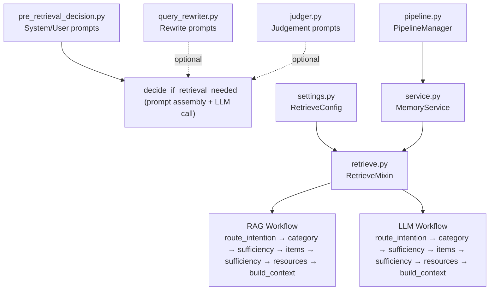
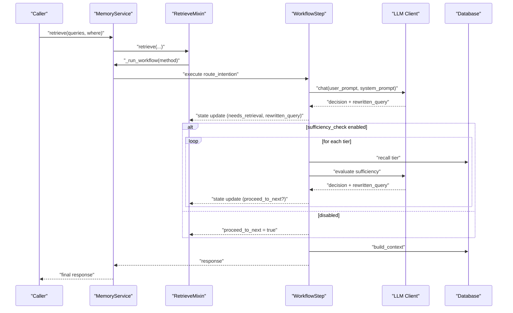
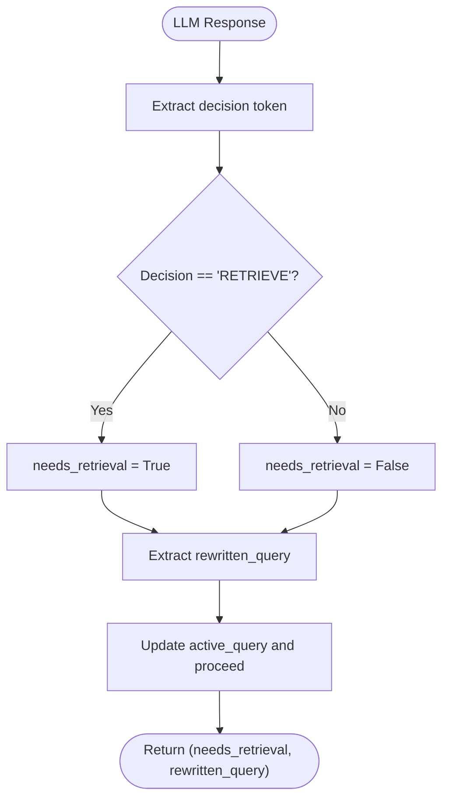
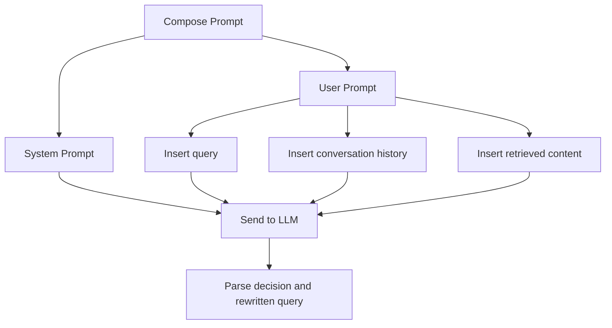
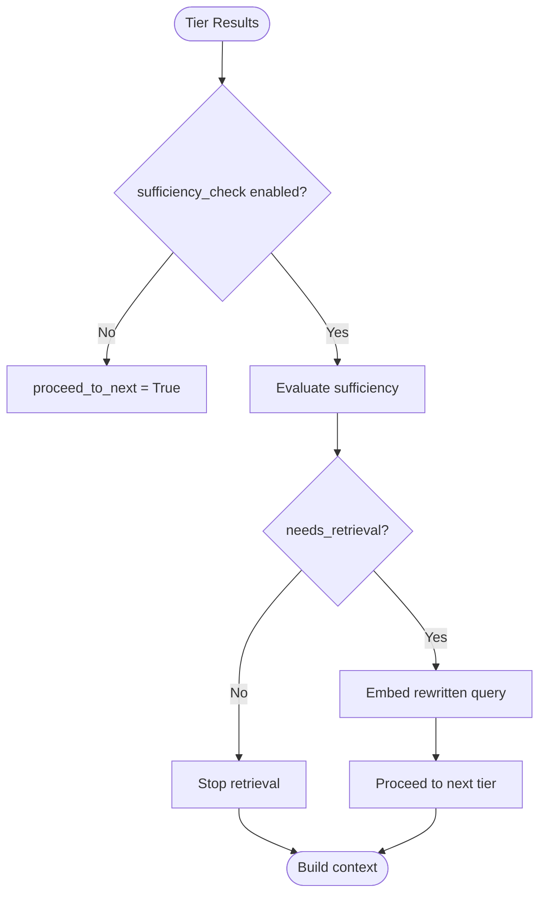
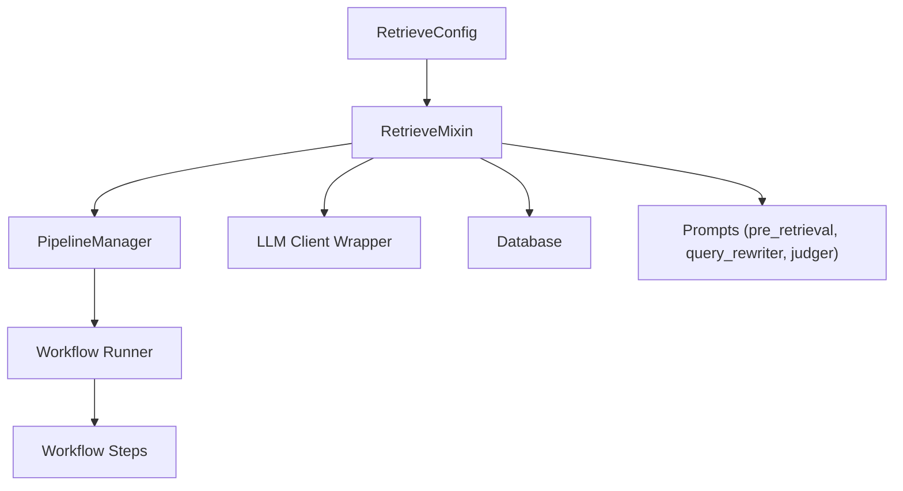

# Sufficiency Check

<cite>
**Referenced Files in This Document**
- [retrieve.py](file://src/memu/app/retrieve.py)
- [pre_retrieval_decision.py](file://src/memu/prompts/retrieve/pre_retrieval_decision.py)
- [query_rewriter.py](file://src/memu/prompts/retrieve/query_rewriter.py)
- [judger.py](file://src/memu/prompts/retrieve/judger.py)
- [settings.py](file://src/memu/app/settings.py)
- [service.py](file://src/memu/app/service.py)
- [pipeline.py](file://src/memu/workflow/pipeline.py)
</cite>

## Table of Contents
1. [Introduction](#introduction)
2. [Project Structure](#project-structure)
3. [Core Components](#core-components)
4. [Architecture Overview](#architecture-overview)
5. [Detailed Component Analysis](#detailed-component-analysis)
6. [Dependency Analysis](#dependency-analysis)
7. [Performance Considerations](#performance-considerations)
8. [Troubleshooting Guide](#troubleshooting-guide)
9. [Conclusion](#conclusion)

## Introduction
This document explains the sufficiency check phase that determines whether retrieved content is adequate or requires additional retrieval steps. It covers the iterative decision-making process using LLM-based evaluation, content assessment logic, and dynamic query refinement. It documents the sufficiency check prompt system, decision extraction mechanisms, and conditional workflow branching across retrieval tiers (categories → items → resources). It also provides configuration options for evaluation criteria, thresholds, and performance optimization for multi-stage retrieval loops.

## Project Structure
The sufficiency check is implemented as part of the retrieval workflow. Two retrieval strategies are supported:
- RAG-style retrieval with vector search and LLM-guided routing
- LLM-driven ranking and routing

Each stage performs a sufficiency check after retrieval to decide whether to continue to the next tier or terminate.

**Diagram sources**
- [retrieve.py](file://src/memu/app/retrieve.py#L42-L85)
- [pre_retrieval_decision.py](file://src/memu/prompts/retrieve/pre_retrieval_decision.py#L1-L54)
- [query_rewriter.py](file://src/memu/prompts/retrieve/query_rewriter.py#L1-L45)
- [judger.py](file://src/memu/prompts/retrieve/judger.py#L1-L40)
- [settings.py](file://src/memu/app/settings.py#L175-L202)
- [service.py](file://src/memu/app/service.py#L315-L349)
- [pipeline.py](file://src/memu/workflow/pipeline.py#L21-L49)

**Section sources**
- [retrieve.py](file://src/memu/app/retrieve.py#L42-L85)
- [settings.py](file://src/memu/app/settings.py#L175-L202)
- [service.py](file://src/memu/app/service.py#L315-L349)
- [pipeline.py](file://src/memu/workflow/pipeline.py#L21-L49)

## Core Components
- RetrieveMixin: Orchestrates retrieval workflows, builds state, and executes the selected pipeline (RAG or LLM).
- _decide_if_retrieval_needed: Centralized sufficiency evaluation that composes prompts, invokes the LLM, and extracts decisions and rewritten queries.
- Workflow steps: Route intention, category recall, sufficiency checks, item recall, sufficiency checks, resource recall, and context building.
- Configuration: RetrieveConfig controls enabling/disabling sufficiency checks, choosing prompts, and selecting LLM profiles.

Key responsibilities:
- Iterative sufficiency checks after each tier
- Dynamic query rewriting to improve subsequent retrieval
- Conditional branching to skip later stages when unnecessary
- Materializing final context for downstream consumers

**Section sources**
- [retrieve.py](file://src/memu/app/retrieve.py#L746-L784)
- [retrieve.py](file://src/memu/app/retrieve.py#L106-L210)
- [retrieve.py](file://src/memu/app/retrieve.py#L454-L536)
- [settings.py](file://src/memu/app/settings.py#L175-L202)

## Architecture Overview
The sufficiency check sits between retrieval and decision-making in each tier. It evaluates:
- Whether the current tier’s content is sufficient to answer the query
- Whether a rewritten query would yield better results in the next tier

**Diagram sources**
- [retrieve.py](file://src/memu/app/retrieve.py#L42-L85)
- [retrieve.py](file://src/memu/app/retrieve.py#L228-L258)
- [retrieve.py](file://src/memu/app/retrieve.py#L288-L322)
- [retrieve.py](file://src/memu/app/retrieve.py#L369-L398)
- [retrieve.py](file://src/memu/app/retrieve.py#L400-L424)
- [retrieve.py](file://src/memu/app/retrieve.py#L426-L452)
- [service.py](file://src/memu/app/service.py#L350-L360)

## Detailed Component Analysis

### Decision Extraction Mechanism
The sufficiency decision is extracted from the LLM response and used to drive workflow control:
- Decision: "RETRIEVE" or "NO_RETRIEVE" (or mapped to needs_retrieval)
- Rewritten query: Updated query for the next iteration
- The decision is derived from the sufficiency prompt and parsed by the mixin

**Diagram sources**
- [retrieve.py](file://src/memu/app/retrieve.py#L746-L784)
- [pre_retrieval_decision.py](file://src/memu/prompts/retrieve/pre_retrieval_decision.py#L29-L40)

**Section sources**
- [retrieve.py](file://src/memu/app/retrieve.py#L746-L784)
- [pre_retrieval_decision.py](file://src/memu/prompts/retrieve/pre_retrieval_decision.py#L29-L40)

### Prompt System for Sufficiency Evaluation
The sufficiency check uses a configurable prompt assembled from:
- System prompt: Defines the task and rules
- User prompt: Provides query, conversation history, and retrieved content
- Optional overrides via RetrieveConfig.sufficiency_check_prompt

**Diagram sources**
- [retrieve.py](file://src/memu/app/retrieve.py#L771-L778)
- [pre_retrieval_decision.py](file://src/memu/prompts/retrieve/pre_retrieval_decision.py#L43-L53)

**Section sources**
- [retrieve.py](file://src/memu/app/retrieve.py#L771-L778)
- [pre_retrieval_decision.py](file://src/memu/prompts/retrieve/pre_retrieval_decision.py#L1-L54)

### Conditional Workflow Branching
After each tier, sufficiency determines:
- Whether to proceed to the next tier
- Whether to embed the rewritten query for vector search
- Whether to skip later tiers if not needed

**Diagram sources**
- [retrieve.py](file://src/memu/app/retrieve.py#L288-L322)
- [retrieve.py](file://src/memu/app/retrieve.py#L369-L398)
- [retrieve.py](file://src/memu/app/retrieve.py#L400-L424)

**Section sources**
- [retrieve.py](file://src/memu/app/retrieve.py#L288-L322)
- [retrieve.py](file://src/memu/app/retrieve.py#L369-L398)
- [retrieve.py](file://src/memu/app/retrieve.py#L400-L424)

### Concrete Examples: Evaluation, Scoring, and Query Rewriting
Below are representative scenarios illustrating the sufficiency check behavior. These examples describe the decision-making process and outcomes without quoting code.

- Example 1: Category tier insufficient
  - Retrieved content: General category summaries with limited specifics
  - Evaluation: Insufficient detail to answer domain-specific questions
  - Decision: needs_retrieval = True
  - Outcome: Rewrite query to include explicit context and proceed to item tier

- Example 2: Item tier sufficient
  - Retrieved content: Specific memories and items addressing the query
  - Evaluation: Enough evidence to answer the query
  - Decision: needs_retrieval = False
  - Outcome: Build final context and stop retrieval

- Example 3: Resource tier not needed
  - Retrieved content: Sufficient from items; no multimedia or external resources required
  - Evaluation: No gaps requiring resource recall
  - Decision: needs_retrieval = False
  - Outcome: Skip resource tier and finalize context

These examples reflect the iterative nature of the sufficiency check across tiers and the dynamic query refinement that improves subsequent recall.

**Section sources**
- [retrieve.py](file://src/memu/app/retrieve.py#L288-L322)
- [retrieve.py](file://src/memu/app/retrieve.py#L369-L398)
- [retrieve.py](file://src/memu/app/retrieve.py#L400-L424)

### Configuration Options for Evaluation Criteria and Thresholds
- sufficiency_check: Enable/disable sufficiency checks after each tier
- sufficiency_check_prompt: Override user prompt for sufficiency evaluation
- sufficiency_check_llm_profile: Select LLM profile for sufficiency decisions
- llm_ranking_llm_profile: Select LLM profile for LLM-driven ranking
- route_intention: Enable/disable initial intention routing and query rewriting
- category/item/resource top_k: Control breadth of retrieval per tier

These settings are defined in RetrieveConfig and influence both prompt selection and LLM profile resolution.

**Section sources**
- [settings.py](file://src/memu/app/settings.py#L175-L202)
- [service.py](file://src/memu/app/service.py#L220-L226)

## Dependency Analysis
The sufficiency check depends on:
- Prompt composition and selection
- LLM client profiles and wrappers
- Database and vector clients for embeddings and recall
- Workflow pipeline orchestration

**Diagram sources**
- [settings.py](file://src/memu/app/settings.py#L175-L202)
- [service.py](file://src/memu/app/service.py#L91-L95)
- [service.py](file://src/memu/app/service.py#L220-L226)
- [pipeline.py](file://src/memu/workflow/pipeline.py#L21-L49)
- [retrieve.py](file://src/memu/app/retrieve.py#L746-L784)

**Section sources**
- [settings.py](file://src/memu/app/settings.py#L175-L202)
- [service.py](file://src/memu/app/service.py#L91-L95)
- [service.py](file://src/memu/app/service.py#L220-L226)
- [pipeline.py](file://src/memu/workflow/pipeline.py#L21-L49)
- [retrieve.py](file://src/memu/app/retrieve.py#L746-L784)

## Performance Considerations
- Minimize redundant LLM calls by disabling sufficiency checks when not needed
- Use appropriate top_k values per tier to balance recall quality and latency
- Prefer embedding-based vector search for scalability; fall back to LLM ranking when richer semantics are required
- Cache LLM clients per profile to reduce initialization overhead
- Limit prompt sizes by trimming conversation history and retrieved content appropriately

[No sources needed since this section provides general guidance]

## Troubleshooting Guide
Common issues and resolutions:
- Unknown LLM profile: Ensure the sufficiency_check_llm_profile and llm_ranking_llm_profile exist in LLMProfilesConfig
- Missing required state keys: Verify that previous steps produce the keys required by sufficiency steps
- Empty or invalid prompts: Confirm sufficiency_check_prompt override is valid and properly escaped
- Excessive iterations: Tune sufficiency_check to False for simple queries or adjust top_k values

Operational hooks:
- Interceptors for LLM calls and workflow steps to observe and debug behavior
- Pipeline revision tracking to detect configuration drift

**Section sources**
- [service.py](file://src/memu/app/service.py#L228-L296)
- [pipeline.py](file://src/memu/workflow/pipeline.py#L131-L164)
- [retrieve.py](file://src/memu/app/retrieve.py#L771-L778)

## Conclusion
The sufficiency check phase provides a robust, iterative mechanism to ensure retrieval quality across multiple tiers. By combining LLM-based evaluation, dynamic query rewriting, and conditional workflow branching, the system balances accuracy and efficiency. Proper configuration of prompts, profiles, and thresholds enables tuning for diverse use cases while maintaining predictable performance.