# Retrieval System

<cite>
**Referenced Files in This Document**
- [retrieve.py](file://src/memu/app/retrieve.py)
- [settings.py](file://src/memu/app/settings.py)
- [vector.py](file://src/memu/database/inmemory/vector.py)
- [pipeline.py](file://src/memu/workflow/pipeline.py)
- [service.py](file://src/memu/app/service.py)
- [interfaces.py](file://src/memu/database/interfaces.py)
- [models.py](file://src/memu/database/models.py)
- [references.py](file://src/memu/utils/references.py)
- [query_rewriter.py](file://src/memu/prompts/retrieve/query_rewriter.py)
- [llm_category_ranker.py](file://src/memu/prompts/retrieve/llm_category_ranker.py)
- [llm_item_ranker.py](file://src/memu/prompts/retrieve/llm_item_ranker.py)
- [llm_resource_ranker.py](file://src/memu/prompts/retrieve/llm_resource_ranker.py)
- [pre_retrieval_decision.py](file://src/memu/prompts/retrieve/pre_retrieval_decision.py)
- [proactive.py](file://examples/proactive/proactive.py)
</cite>

## Table of Contents
1. [Introduction](#introduction)
2. [Project Structure](#project-structure)
3. [Core Components](#core-components)
4. [Architecture Overview](#architecture-overview)
5. [Detailed Component Analysis](#detailed-component-analysis)
6. [Dependency Analysis](#dependency-analysis)
7. [Performance Considerations](#performance-considerations)
8. [Troubleshooting Guide](#troubleshooting-guide)
9. [Conclusion](#conclusion)
10. [Appendices](#appendices)

## Introduction
This document explains memU’s dual-mode retrieval system that combines:
- Retrieval-Augmented Generation (RAG) using vector similarity search
- LLM-driven retrieval using contextual ranking

It covers the retrieval workflow, query rewriting and evolution, proactive context loading, category prioritization, and integration with LLM providers, embedding models, and database backends. It also provides examples of query construction, filtering via where clauses, result interpretation, and production optimization guidance.

## Project Structure
The retrieval system is implemented as a mixin integrated into the MemoryService, orchestrated by a workflow engine. Key areas:
- Retrieval orchestration and workflow definition
- Configuration for retrieval modes, tiers, and LLM/embedding profiles
- Vector similarity and salience-aware scoring
- LLM prompts for query rewriting and ranking
- Database abstraction and typed records
- Utilities for reference-aware retrieval

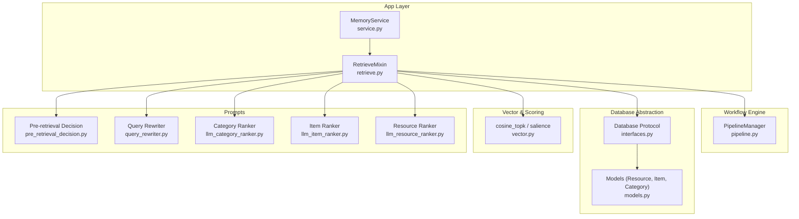

**Diagram sources**
- [service.py](file://src/memu/app/service.py#L49-L323)
- [retrieve.py](file://src/memu/app/retrieve.py#L42-L226)
- [pipeline.py](file://src/memu/workflow/pipeline.py#L21-L171)
- [interfaces.py](file://src/memu/database/interfaces.py#L12-L26)
- [models.py](file://src/memu/database/models.py#L68-L106)
- [vector.py](file://src/memu/database/inmemory/vector.py#L56-L138)
- [pre_retrieval_decision.py](file://src/memu/prompts/retrieve/pre_retrieval_decision.py#L1-L54)
- [query_rewriter.py](file://src/memu/prompts/retrieve/query_rewriter.py#L1-L45)
- [llm_category_ranker.py](file://src/memu/prompts/retrieve/llm_category_ranker.py#L1-L36)
- [llm_item_ranker.py](file://src/memu/prompts/retrieve/llm_item_ranker.py#L1-L41)
- [llm_resource_ranker.py](file://src/memu/prompts/retrieve/llm_resource_ranker.py#L1-L41)

**Section sources**
- [service.py](file://src/memu/app/service.py#L49-L323)
- [retrieve.py](file://src/memu/app/retrieve.py#L42-L226)
- [pipeline.py](file://src/memu/workflow/pipeline.py#L21-L171)
- [interfaces.py](file://src/memu/database/interfaces.py#L12-L26)
- [models.py](file://src/memu/database/models.py#L68-L106)
- [vector.py](file://src/memu/database/inmemory/vector.py#L56-L138)
- [pre_retrieval_decision.py](file://src/memu/prompts/retrieve/pre_retrieval_decision.py#L1-L54)
- [query_rewriter.py](file://src/memu/prompts/retrieve/query_rewriter.py#L1-L45)
- [llm_category_ranker.py](file://src/memu/prompts/retrieve/llm_category_ranker.py#L1-L36)
- [llm_item_ranker.py](file://src/memu/prompts/retrieve/llm_item_ranker.py#L1-L41)
- [llm_resource_ranker.py](file://src/memu/prompts/retrieve/llm_resource_ranker.py#L1-L41)

## Core Components
- RetrieveMixin: Implements the dual-mode retrieval workflow, routing, sufficiency checks, and context building.
- MemoryService: Provides LLM and embedding clients, database abstraction, and workflow orchestration.
- PipelineManager: Validates and constructs retrieval pipelines with capability gating and profile resolution.
- Database protocol and models: Define typed records and repository interfaces for categories, items, and resources.
- Vector utilities: Provide cosine similarity and salience-aware scoring for item retrieval.
- Prompts: Define query rewriting, sufficiency judgment, and LLM-driven ranking for categories, items, and resources.

**Section sources**
- [retrieve.py](file://src/memu/app/retrieve.py#L27-L226)
- [service.py](file://src/memu/app/service.py#L49-L323)
- [pipeline.py](file://src/memu/workflow/pipeline.py#L21-L171)
- [interfaces.py](file://src/memu/database/interfaces.py#L12-L26)
- [models.py](file://src/memu/database/models.py#L68-L106)
- [vector.py](file://src/memu/database/inmemory/vector.py#L56-L138)
- [pre_retrieval_decision.py](file://src/memu/prompts/retrieve/pre_retrieval_decision.py#L1-L54)
- [query_rewriter.py](file://src/memu/prompts/retrieve/query_rewriter.py#L1-L45)
- [llm_category_ranker.py](file://src/memu/prompts/retrieve/llm_category_ranker.py#L1-L36)
- [llm_item_ranker.py](file://src/memu/prompts/retrieve/llm_item_ranker.py#L1-L41)
- [llm_resource_ranker.py](file://src/memu/prompts/retrieve/llm_resource_ranker.py#L1-L41)

## Architecture Overview
The retrieval system supports two strategies:
- RAG mode: Uses vector similarity search for categories/items/resources; embeds queries and pools; applies sufficiency checks after each tier.
- LLM mode: Delegates ranking to LLM prompts per tier; uses category references and contextual information to refine results.

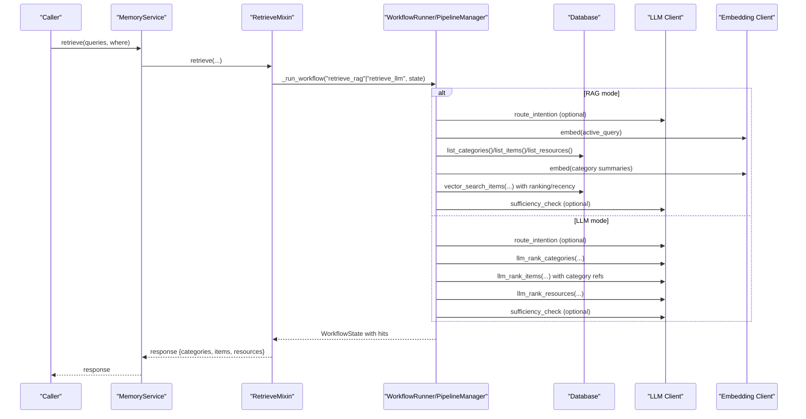

**Diagram sources**
- [service.py](file://src/memu/app/service.py#L350-L361)
- [retrieve.py](file://src/memu/app/retrieve.py#L42-L226)
- [pipeline.py](file://src/memu/workflow/pipeline.py#L47-L63)

## Detailed Component Analysis

### Dual-Mode Retrieval Workflow
- Method selection: Based on configuration, the system chooses either RAG or LLM mode.
- Route intention: Optionally decides whether retrieval is needed and rewrites the query using a dedicated prompt.
- Tiered retrieval:
  - Categories: Embed category summaries or use LLM ranking.
  - Items: Vector search or LLM ranking; optional reference-aware fetching.
  - Resources: Vector search over captions or LLM ranking.
- Sufficiency checks: After each tier, decide whether to continue and optionally rewrite the query.
- Context building: Materialize hits into structured response.

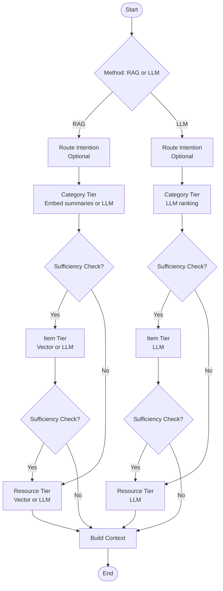

**Diagram sources**
- [retrieve.py](file://src/memu/app/retrieve.py#L106-L226)
- [retrieve.py](file://src/memu/app/retrieve.py#L454-L536)

**Section sources**
- [retrieve.py](file://src/memu/app/retrieve.py#L42-L226)
- [retrieve.py](file://src/memu/app/retrieve.py#L454-L536)

### Query Rewriting and Evolution
- Query rewriting prompt resolves pronouns, referential expressions, and implicit context into a self-contained query.
- After each tier, a sufficiency prompt determines whether more retrieval is needed and returns a rewritten query tailored to retrieved content.

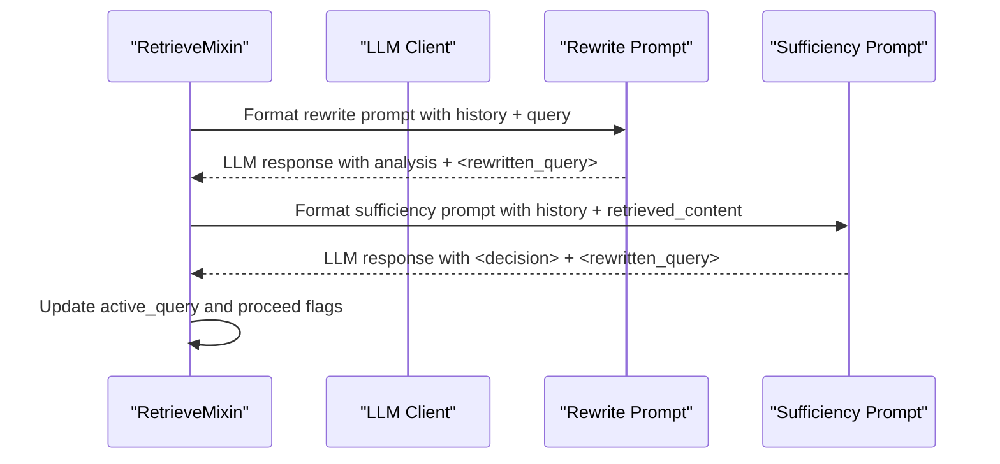

**Diagram sources**
- [query_rewriter.py](file://src/memu/prompts/retrieve/query_rewriter.py#L1-L45)
- [pre_retrieval_decision.py](file://src/memu/prompts/retrieve/pre_retrieval_decision.py#L1-L54)
- [retrieve.py](file://src/memu/app/retrieve.py#L746-L784)

**Section sources**
- [query_rewriter.py](file://src/memu/prompts/retrieve/query_rewriter.py#L1-L45)
- [pre_retrieval_decision.py](file://src/memu/prompts/retrieve/pre_retrieval_decision.py#L1-L54)
- [retrieve.py](file://src/memu/app/retrieve.py#L746-L784)

### Proactive Context Loading and Category Prioritization
- Categories are prioritized by embedding category summaries and selecting top-K via cosine similarity.
- Optional category references enable reference-aware item retrieval: extract item IDs from category summaries and fetch them directly.

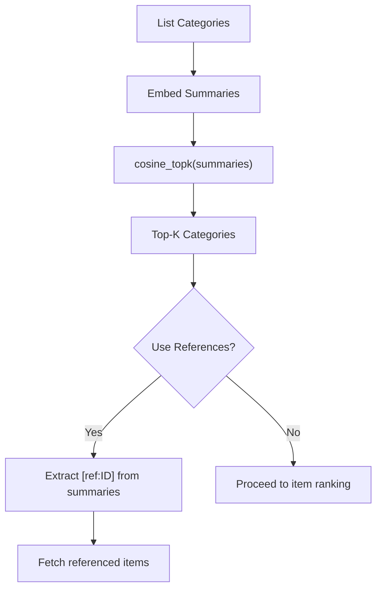

**Diagram sources**
- [retrieve.py](file://src/memu/app/retrieve.py#L725-L744)
- [references.py](file://src/memu/utils/references.py#L20-L49)
- [retrieve.py](file://src/memu/app/retrieve.py#L626-L635)

**Section sources**
- [retrieve.py](file://src/memu/app/retrieve.py#L725-L744)
- [references.py](file://src/memu/utils/references.py#L20-L49)
- [retrieve.py](file://src/memu/app/retrieve.py#L626-L635)

### LLM-Driven Ranking Prompts
- Category ranker: Select top-K relevant categories given the query and available categories.
- Item ranker: Select top-K relevant items within identified categories.
- Resource ranker: Select top-K relevant resources given the query and context info.

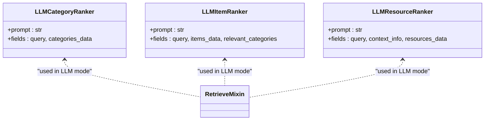

**Diagram sources**
- [llm_category_ranker.py](file://src/memu/prompts/retrieve/llm_category_ranker.py#L1-L36)
- [llm_item_ranker.py](file://src/memu/prompts/retrieve/llm_item_ranker.py#L1-L41)
- [llm_resource_ranker.py](file://src/memu/prompts/retrieve/llm_resource_ranker.py#L1-L41)
- [retrieve.py](file://src/memu/app/retrieve.py#L570-L588)
- [retrieve.py](file://src/memu/app/retrieve.py#L643-L654)
- [retrieve.py](file://src/memu/app/retrieve.py#L694-L704)

**Section sources**
- [llm_category_ranker.py](file://src/memu/prompts/retrieve/llm_category_ranker.py#L1-L36)
- [llm_item_ranker.py](file://src/memu/prompts/retrieve/llm_item_ranker.py#L1-L41)
- [llm_resource_ranker.py](file://src/memu/prompts/retrieve/llm_resource_ranker.py#L1-L41)
- [retrieve.py](file://src/memu/app/retrieve.py#L570-L588)
- [retrieve.py](file://src/memu/app/retrieve.py#L643-L654)
- [retrieve.py](file://src/memu/app/retrieve.py#L694-L704)

### Vector Similarity Search and Salience-Aware Scoring
- RAG mode uses cosine similarity to retrieve categories and items.
- Items support salience-aware ranking combining similarity, reinforcement count, and recency decay.

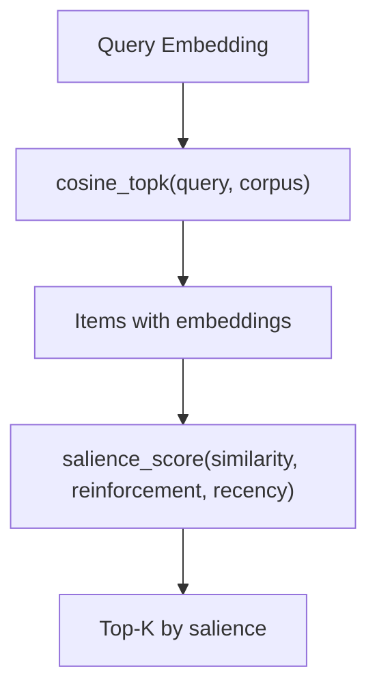

**Diagram sources**
- [vector.py](file://src/memu/database/inmemory/vector.py#L56-L92)
- [vector.py](file://src/memu/database/inmemory/vector.py#L94-L127)
- [retrieve.py](file://src/memu/app/retrieve.py#L359-L366)

**Section sources**
- [vector.py](file://src/memu/database/inmemory/vector.py#L56-L138)
- [retrieve.py](file://src/memu/app/retrieve.py#L359-L366)

### Filtering with Where Clauses
- Where filters are validated against the user scope model fields and normalized before use.
- Filters apply to category, item, and resource listings to constrain retrieval scope.

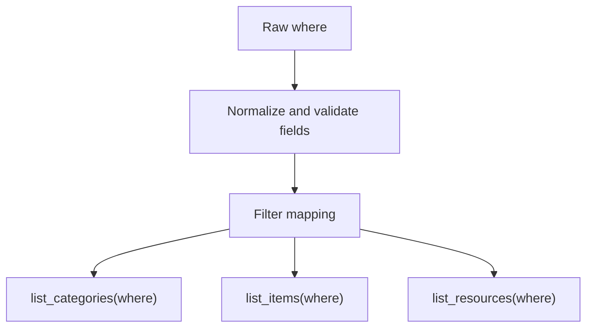

**Diagram sources**
- [retrieve.py](file://src/memu/app/retrieve.py#L87-L104)
- [models.py](file://src/memu/database/models.py#L108-L134)

**Section sources**
- [retrieve.py](file://src/memu/app/retrieve.py#L87-L104)
- [models.py](file://src/memu/database/models.py#L108-L134)

### Integration with LLM Providers and Embedding Models
- LLM profiles support multiple providers and backends (SDK, HTTP, lazyllm).
- Embedding models are configurable per profile; RAG mode uses embeddings for vector search.

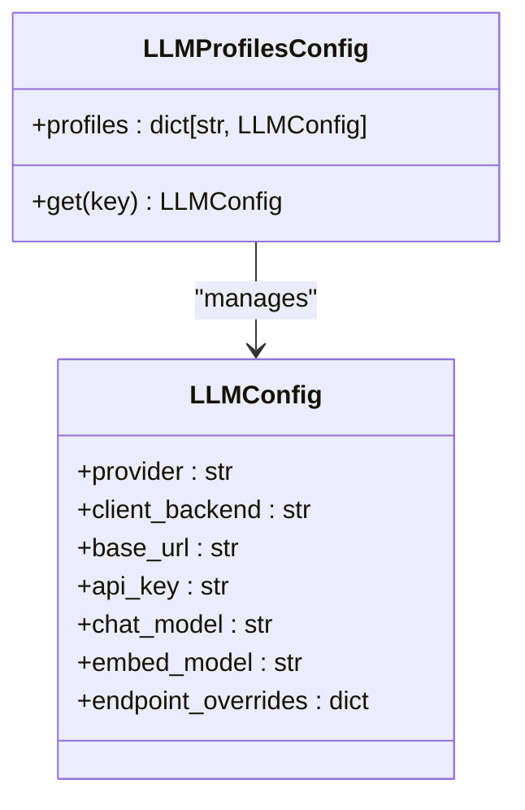

**Diagram sources**
- [settings.py](file://src/memu/app/settings.py#L263-L297)
- [settings.py](file://src/memu/app/settings.py#L102-L127)
- [service.py](file://src/memu/app/service.py#L97-L135)

**Section sources**
- [settings.py](file://src/memu/app/settings.py#L102-L127)
- [settings.py](file://src/memu/app/settings.py#L263-L297)
- [service.py](file://src/memu/app/service.py#L97-L135)

### Integration with Database Backends
- Database protocol abstracts resource_repo, memory_category_repo, memory_item_repo, and category_item_repo.
- Supported providers include in-memory, SQLite, and Postgres (with optional pgvector).

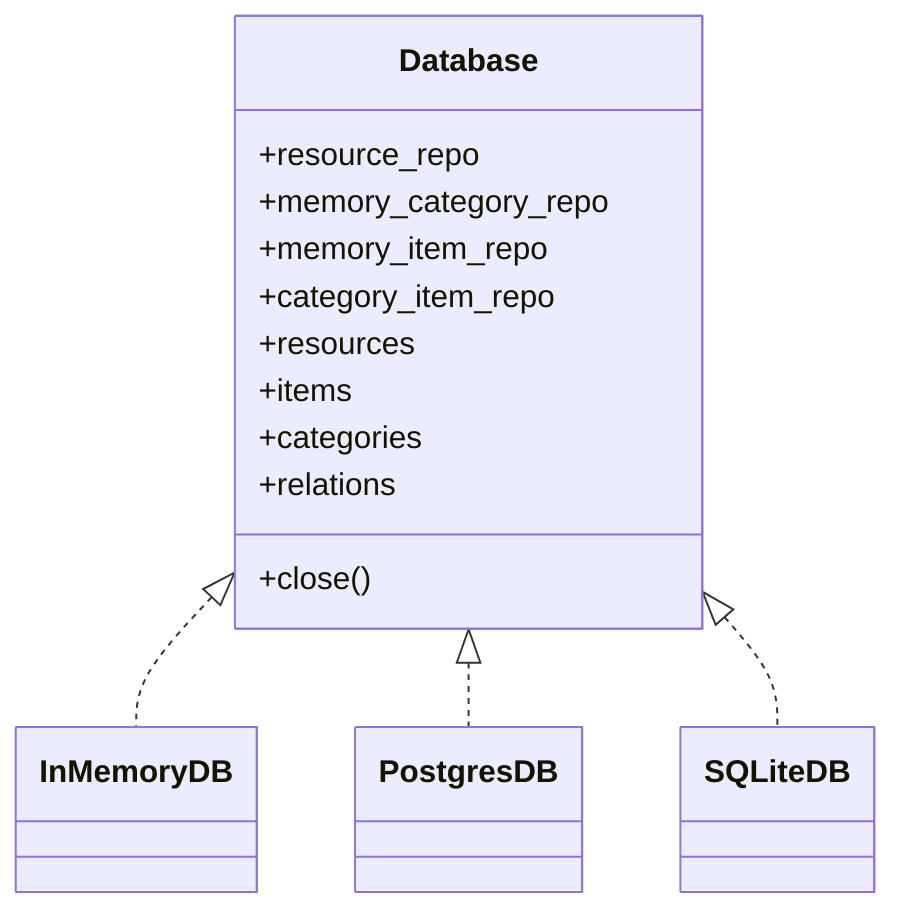

**Diagram sources**
- [interfaces.py](file://src/memu/database/interfaces.py#L12-L26)
- [settings.py](file://src/memu/app/settings.py#L300-L322)

**Section sources**
- [interfaces.py](file://src/memu/database/interfaces.py#L12-L26)
- [settings.py](file://src/memu/app/settings.py#L300-L322)

### Proactive Context Loading Examples
- Proactive memory examples demonstrate background tasks and iterative loops for continuous memory updates and retrieval triggers.

**Section sources**
- [proactive.py](file://examples/proactive/proactive.py#L20-L199)

## Dependency Analysis
- RetrieveMixin depends on:
  - MemoryService for LLM/Embedding clients, database access, and workflow runner.
  - Vector utilities for similarity and salience scoring.
  - Prompts for query rewriting and ranking.
  - Database protocol for repository access.
- PipelineManager validates step capabilities and profile availability before execution.

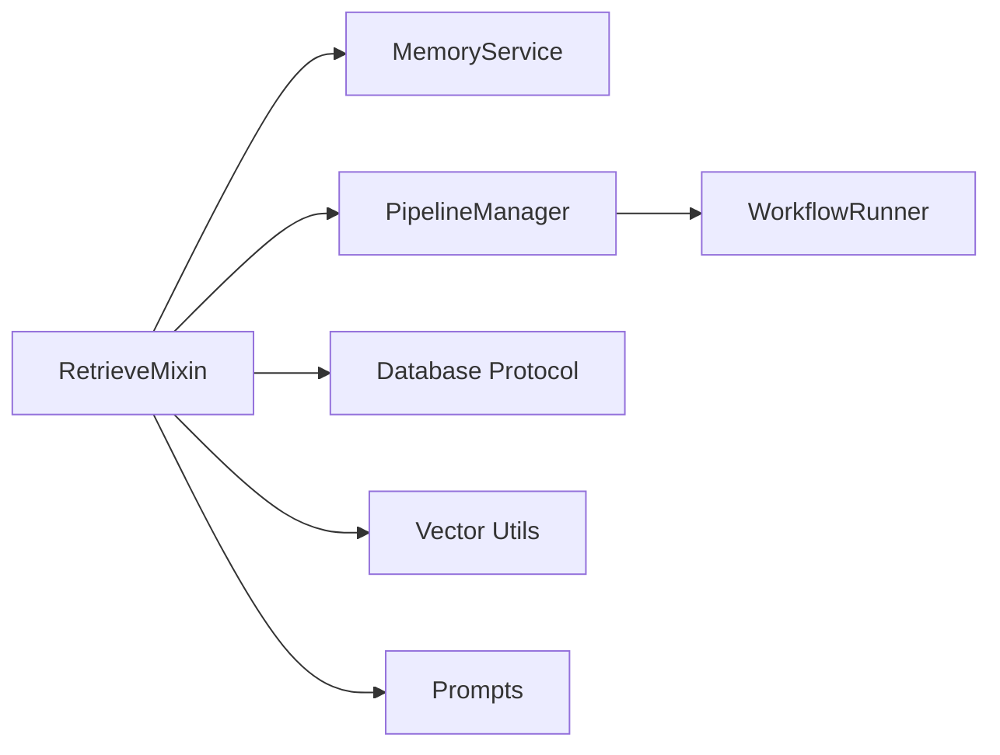

**Diagram sources**
- [retrieve.py](file://src/memu/app/retrieve.py#L27-L85)
- [service.py](file://src/memu/app/service.py#L350-L361)
- [pipeline.py](file://src/memu/workflow/pipeline.py#L131-L164)

**Section sources**
- [retrieve.py](file://src/memu/app/retrieve.py#L27-L85)
- [service.py](file://src/memu/app/service.py#L350-L361)
- [pipeline.py](file://src/memu/workflow/pipeline.py#L131-L164)

## Performance Considerations
- RAG mode:
  - Vector similarity search uses efficient top-k selection with vectorized computation.
  - Salience-aware ranking adds logarithmic reinforcement and exponential recency factors.
- LLM mode:
  - Ranking prompts reduce search space by constraining to relevant categories and items.
- Early termination:
  - Sufficiency checks can skip subsequent tiers when sufficient context is gathered.
- Cross-referencing:
  - Reference-aware item retrieval reduces redundant embeddings by fetching specific items linked from category summaries.

[No sources needed since this section provides general guidance]

## Troubleshooting Guide
Common issues and resolutions:
- Empty queries: Validation raises an error; ensure non-empty query list.
- Unknown filter fields: Where clause normalization rejects invalid fields; align with user scope model.
- Missing LLM profile: Pipeline validation errors if profile is not defined; define profiles in LLMProfilesConfig.
- Insufficient retrieval: Enable sufficiency_check and adjust top_k per tier; consider reference-aware item retrieval.
- Slow vector search: Use salience-aware ranking or reduce top_k; ensure vector index provider matches database backend.

**Section sources**
- [retrieve.py](file://src/memu/app/retrieve.py#L47-L48)
- [retrieve.py](file://src/memu/app/retrieve.py#L87-L104)
- [pipeline.py](file://src/memu/workflow/pipeline.py#L141-L164)
- [settings.py](file://src/memu/app/settings.py#L300-L322)

## Conclusion
memU’s retrieval system offers a flexible, dual-mode approach:
- RAG mode for scalable vector search with optional salience-aware ranking.
- LLM mode for precise, context-aware ranking with query rewriting and sufficiency checks.
With robust filtering, reference-aware retrieval, and modular integrations, it supports production-grade memory retrieval across diverse backends and providers.

[No sources needed since this section summarizes without analyzing specific files]

## Appendices

### When to Use Which Approach
- Choose RAG mode when:
  - You want fast, deterministic vector search.
  - Embeddings are reliable and sufficient for ranking.
  - You need early termination and cross-referencing via references.
- Choose LLM mode when:
  - Contextual nuance and domain-specific ranking are critical.
  - You want to leverage LLMs for query rewriting and tier decisions.

[No sources needed since this section provides general guidance]

### Concrete Examples and Best Practices
- Query construction:
  - Use query rewriting to resolve pronouns and implicit references.
  - Keep queries concise but self-contained.
- Filtering strategies:
  - Use where clauses aligned with user scope model fields to constrain retrieval.
- Result interpretation:
  - RAG mode returns materialized hits; LLM mode returns ranked lists with analyses.
- Optimization tips:
  - Tune top_k per tier to balance recall and latency.
  - Enable reference-aware item retrieval to reduce redundant embeddings.
  - Monitor vector index provider and database performance for large datasets.

[No sources needed since this section provides general guidance]