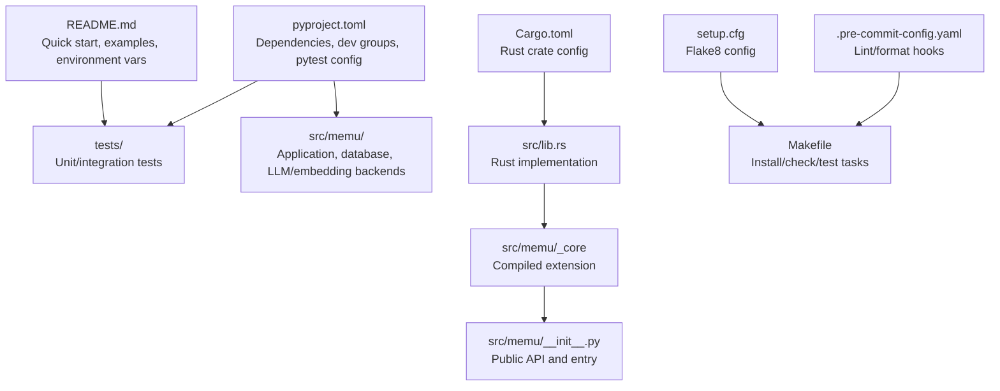
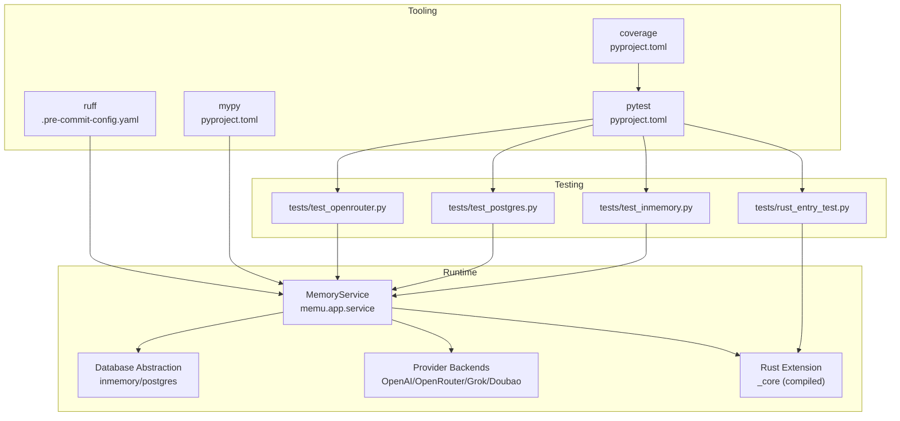
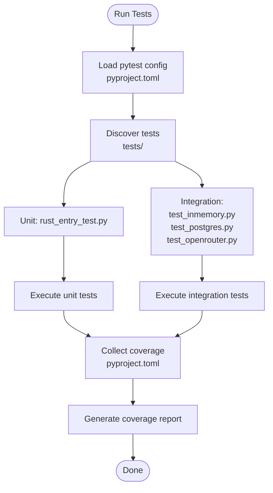
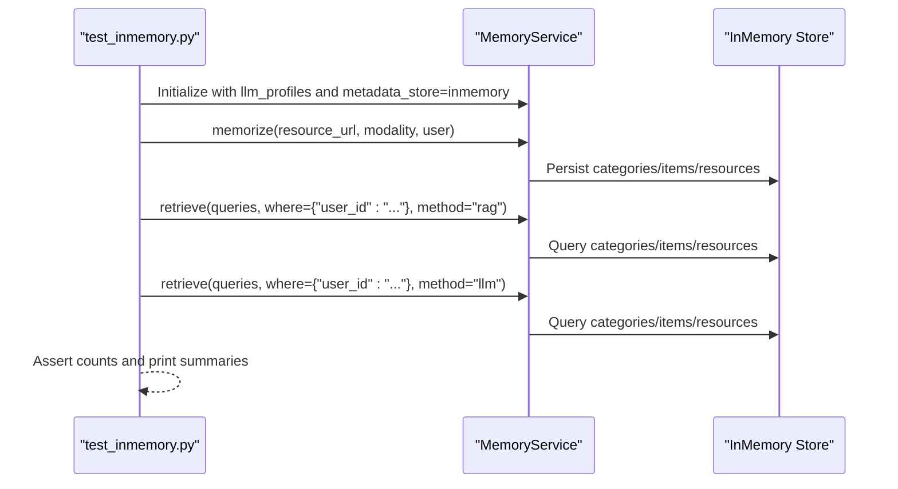
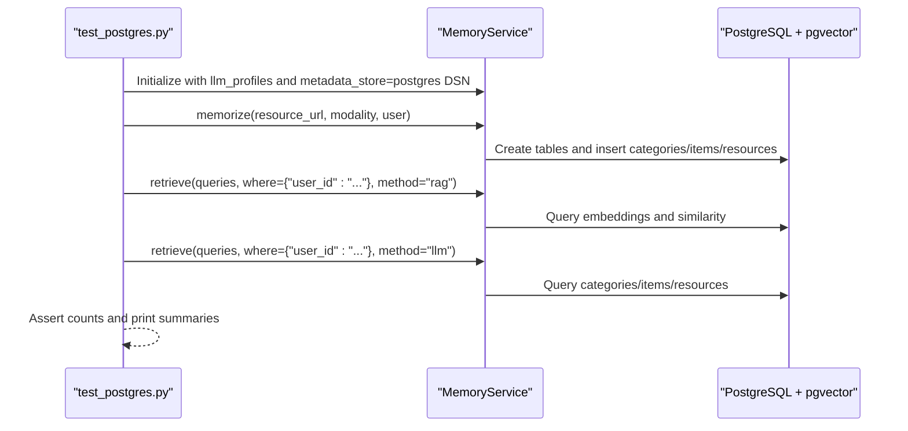
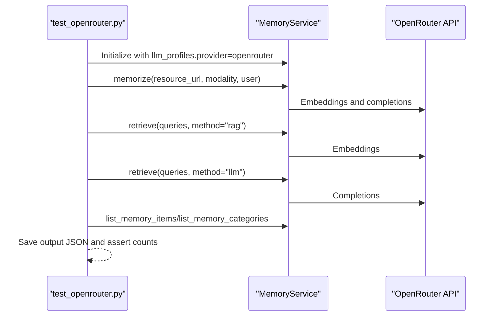
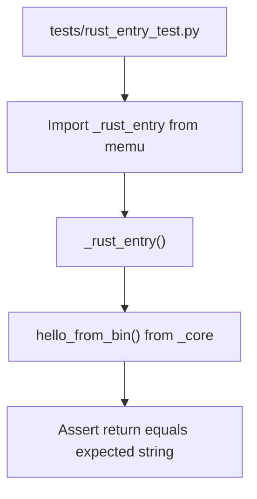
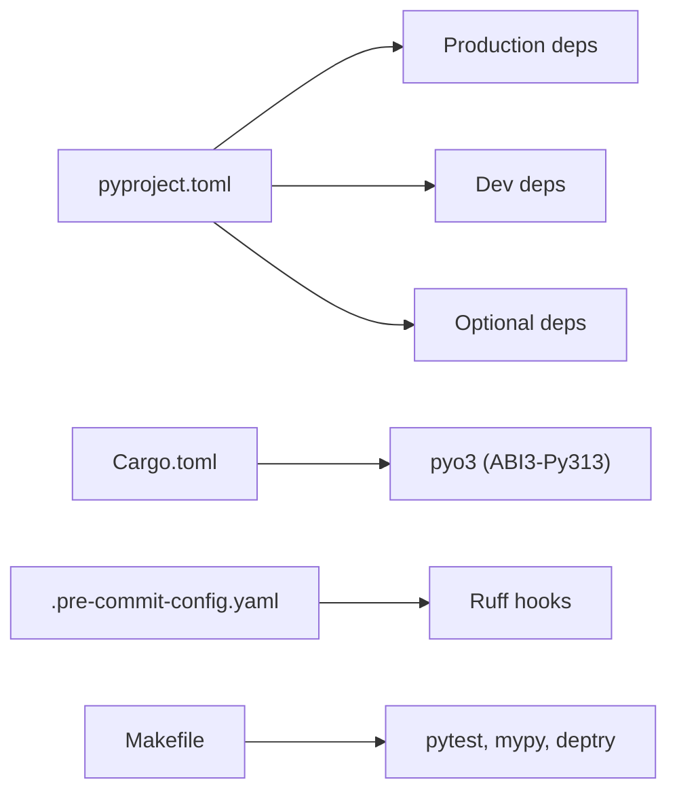

# Testing and Deployment

<cite>
**Referenced Files in This Document**
- [README.md](file://README.md)
- [pyproject.toml](file://pyproject.toml)
- [Makefile](file://Makefile)
- [.pre-commit-config.yaml](file://.pre-commit-config.yaml)
- [setup.cfg](file://setup.cfg)
- [Cargo.toml](file://Cargo.toml)
- [src/memu/__init__.py](file://src/memu/__init__.py)
- [tests/test_inmemory.py](file://tests/test_inmemory.py)
- [tests/test_postgres.py](file://tests/test_postgres.py)
- [tests/test_openrouter.py](file://tests/test_openrouter.py)
- [tests/rust_entry_test.py](file://tests/rust_entry_test.py)
</cite>

## Table of Contents
1. [Introduction](#introduction)
2. [Project Structure](#project-structure)
3. [Core Components](#core-components)
4. [Architecture Overview](#architecture-overview)
5. [Detailed Component Analysis](#detailed-component-analysis)
6. [Dependency Analysis](#dependency-analysis)
7. [Performance Considerations](#performance-considerations)
8. [Troubleshooting Guide](#troubleshooting-guide)
9. [Conclusion](#conclusion)
10. [Appendices](#appendices)

## Introduction
This document provides a comprehensive guide to testing and deployment for reliable memU installations and operations. It explains the test suite organization, unit and integration testing strategies, and performance testing methodologies. It also documents deployment procedures for different environments, CI/CD and quality assurance processes, release management, database migrations, configuration validation, rollback strategies, monitoring and logging, alerting, troubleshooting, scaling, secrets management, security, benchmarking, capacity planning, and operational excellence.

## Project Structure
The repository is a Python/Rust hybrid project with a clear separation of concerns:
- Python core and application logic under src/memu
- Rust extension under src/lib.rs, compiled via Cargo and exposed to Python
- Tests under tests/, covering in-memory and PostgreSQL persistence, provider integrations, and Rust entry points
- Tooling and configuration for linting, type checking, coverage, and packaging

**Diagram sources**
- [pyproject.toml](file://pyproject.toml#L1-L181)
- [Cargo.toml](file://Cargo.toml#L1-L15)
- [src/memu/__init__.py](file://src/memu/__init__.py#L1-L10)
- [.pre-commit-config.yaml](file://.pre-commit-config.yaml#L1-L21)
- [Makefile](file://Makefile#L1-L23)
- [setup.cfg](file://setup.cfg#L1-L19)
- [README.md](file://README.md#L276-L317)

**Section sources**
- [pyproject.toml](file://pyproject.toml#L1-L181)
- [Cargo.toml](file://Cargo.toml#L1-L15)
- [src/memu/__init__.py](file://src/memu/__init__.py#L1-L10)
- [.pre-commit-config.yaml](file://.pre-commit-config.yaml#L1-L21)
- [Makefile](file://Makefile#L1-L23)
- [setup.cfg](file://setup.cfg#L1-L19)
- [README.md](file://README.md#L276-L317)

## Core Components
- Application service: MemoryService orchestrates continuous learning (memorize) and dual-mode retrieval (RAG/LLM).
- Database backends: in-memory and PostgreSQL with pgvector support for embeddings.
- Provider backends: OpenAI, OpenRouter, Grok, Doubao, LazyLLM client integration.
- Rust extension: Compiled ABI-compatible module exposing a minimal entry point for validation.

Key testing components:
- In-memory workflow test validates end-to-end memorize and retrieve with RAG and LLM modes.
- PostgreSQL workflow test validates persistent storage and vector index setup.
- OpenRouter workflow test validates provider integration end-to-end.
- Rust entry test validates the compiled extension is importable and functional.

**Section sources**
- [tests/test_inmemory.py](file://tests/test_inmemory.py#L1-L90)
- [tests/test_postgres.py](file://tests/test_postgres.py#L1-L83)
- [tests/test_openrouter.py](file://tests/test_openrouter.py#L1-L162)
- [tests/rust_entry_test.py](file://tests/rust_entry_test.py#L1-L6)
- [src/memu/__init__.py](file://src/memu/__init__.py#L1-L10)

## Architecture Overview
The testing and deployment architecture centers around:
- Python application layer with configurable LLM and embedding providers
- Database abstraction supporting in-memory and PostgreSQL/pgvector
- Rust extension compiled as a shared library for performance-sensitive routines
- Test harnesses validating provider integrations and persistence backends
- Tooling for pre-commit hooks, type checking, linting, and coverage

**Diagram sources**
- [tests/test_inmemory.py](file://tests/test_inmemory.py#L1-L90)
- [tests/test_postgres.py](file://tests/test_postgres.py#L1-L83)
- [tests/test_openrouter.py](file://tests/test_openrouter.py#L1-L162)
- [tests/rust_entry_test.py](file://tests/rust_entry_test.py#L1-L6)
- [pyproject.toml](file://pyproject.toml#L63-L181)
- [.pre-commit-config.yaml](file://.pre-commit-config.yaml#L1-L21)

## Detailed Component Analysis

### Test Suite Organization
- Unit tests: rust_entry_test.py validates the Rust extension import and basic return value.
- Integration tests:
  - test_inmemory.py: end-to-end workflow with in-memory persistence and both retrieval methods.
  - test_postgres.py: end-to-end workflow with PostgreSQL persistence and vector index initialization.
  - test_openrouter.py: end-to-end workflow with OpenRouter provider and multiple retrieval modes.
- Test configuration:
  - pytest configured via pyproject.toml with testpaths, asyncio mode, and logging.
  - Coverage enabled via pytest-cov and configured in pyproject.toml.
  - Linting and formatting enforced by pre-commit hooks and Ruff.

**Diagram sources**
- [pyproject.toml](file://pyproject.toml#L176-L181)
- [tests/rust_entry_test.py](file://tests/rust_entry_test.py#L1-L6)
- [tests/test_inmemory.py](file://tests/test_inmemory.py#L1-L90)
- [tests/test_postgres.py](file://tests/test_postgres.py#L1-L83)
- [tests/test_openrouter.py](file://tests/test_openrouter.py#L1-L162)

**Section sources**
- [pyproject.toml](file://pyproject.toml#L63-L181)
- [tests/rust_entry_test.py](file://tests/rust_entry_test.py#L1-L6)
- [tests/test_inmemory.py](file://tests/test_inmemory.py#L1-L90)
- [tests/test_postgres.py](file://tests/test_postgres.py#L1-L83)
- [tests/test_openrouter.py](file://tests/test_openrouter.py#L1-L162)

### In-Memory Workflow Test
This test validates:
- Initialization of MemoryService with in-memory metadata store
- Continuous learning (memorize) from a conversation resource
- Dual-mode retrieval (RAG and LLM) with scoped filters

**Diagram sources**
- [tests/test_inmemory.py](file://tests/test_inmemory.py#L1-L90)

**Section sources**
- [tests/test_inmemory.py](file://tests/test_inmemory.py#L1-L90)

### PostgreSQL Workflow Test
This test validates:
- Initialization of MemoryService with PostgreSQL metadata store and DDL mode
- Vector index auto-configuration for pgvector
- End-to-end memorize and retrieval with persistent storage

**Diagram sources**
- [tests/test_postgres.py](file://tests/test_postgres.py#L1-L83)

**Section sources**
- [tests/test_postgres.py](file://tests/test_postgres.py#L1-L83)

### OpenRouter Integration Test
This test validates:
- Provider configuration for OpenRouter
- Full workflow: memorize, RAG retrieval, LLM retrieval, list items and categories
- Output serialization to a JSON file for inspection

**Diagram sources**
- [tests/test_openrouter.py](file://tests/test_openrouter.py#L1-L162)

**Section sources**
- [tests/test_openrouter.py](file://tests/test_openrouter.py#L1-L162)

### Rust Extension Validation
This test ensures the compiled Rust module is importable and returns the expected value.

**Diagram sources**
- [tests/rust_entry_test.py](file://tests/rust_entry_test.py#L1-L6)
- [src/memu/__init__.py](file://src/memu/__init__.py#L1-L10)
- [Cargo.toml](file://Cargo.toml#L1-L15)

**Section sources**
- [tests/rust_entry_test.py](file://tests/rust_entry_test.py#L1-L6)
- [src/memu/__init__.py](file://src/memu/__init__.py#L1-L10)
- [Cargo.toml](file://Cargo.toml#L1-L15)

## Dependency Analysis
- Python dependencies are declared in pyproject.toml with strict version pins and optional extras for PostgreSQL, LangGraph, and Claude SDK.
- Dev dependencies include linting (Ruff), type checking (mypy), dependency analysis (deptry), and testing (pytest, pytest-asyncio, pytest-cov).
- Rust dependency pyo3 is configured for ABI stability targeting Python 3.13.
- Pre-commit hooks enforce code quality and formatting prior to commits.

**Diagram sources**
- [pyproject.toml](file://pyproject.toml#L20-L73)
- [Cargo.toml](file://Cargo.toml#L11-L15)
- [.pre-commit-config.yaml](file://.pre-commit-config.yaml#L1-L21)
- [Makefile](file://Makefile#L7-L23)

**Section sources**
- [pyproject.toml](file://pyproject.toml#L20-L73)
- [Cargo.toml](file://Cargo.toml#L11-L15)
- [.pre-commit-config.yaml](file://.pre-commit-config.yaml#L1-L21)
- [Makefile](file://Makefile#L7-L23)

## Performance Considerations
- Benchmarking: The project reports average accuracy on a benchmark dataset, indicating readiness for performance validation.
- Retrieval modes:
  - RAG-based retrieval uses embeddings for fast, proactive context assembly.
  - LLM-based retrieval performs deeper reasoning but at higher cost and latency.
- Recommendations:
  - Use RAG for real-time suggestions and continuous monitoring.
  - Use LLM retrieval for complex anticipatory reasoning when acceptable latency/cost is ensured.
  - Monitor embedding throughput and vector index performance in PostgreSQL deployments.

[No sources needed since this section provides general guidance]

## Troubleshooting Guide
Common issues and resolutions:
- Missing environment variables:
  - OPENAI_API_KEY for OpenAI-based tests
  - OPENROUTER_API_KEY for OpenRouter tests
  - POSTGRES_DSN for PostgreSQL tests
- PostgreSQL not running or pgvector missing:
  - Ensure container is started with the correct image and port mapping before running PostgreSQL tests.
- Provider configuration errors:
  - Verify provider profiles in llm_profiles and correct model identifiers.
- Coverage and lint failures:
  - Run pre-commit hooks and mypy locally before committing.
- Rust compilation issues:
  - Confirm Rust toolchain and maturin installation; ensure ABI compatibility settings.

Concrete references:
- Environment variables and quick start examples are documented in the repository’s README.
- Test scripts demonstrate expected environment variables and usage patterns.

**Section sources**
- [README.md](file://README.md#L276-L317)
- [tests/test_inmemory.py](file://tests/test_inmemory.py#L1-L90)
- [tests/test_postgres.py](file://tests/test_postgres.py#L1-L83)
- [tests/test_openrouter.py](file://tests/test_openrouter.py#L1-L162)

## Conclusion
The memU project provides a robust testing and deployment foundation with:
- Clear test organization across unit and integration suites
- Configurable persistence and provider backends validated by dedicated tests
- Tooling for quality assurance and coverage
- Practical deployment examples for self-hosted environments

Adopting the recommended practices in this document will ensure reliable installations, predictable operations, and smooth CI/CD integration.

[No sources needed since this section summarizes without analyzing specific files]

## Appendices

### A. Running Tests Locally
- Install dependencies and pre-commit hooks:
  - Use the provided Makefile targets to synchronize environment and install hooks.
- Execute tests:
  - Run pytest with coverage reporting configured in pyproject.toml.
- Inspect coverage:
  - Coverage XML report is generated per pytest configuration.

**Section sources**
- [Makefile](file://Makefile#L1-L23)
- [pyproject.toml](file://pyproject.toml#L176-L181)

### B. CI/CD and Quality Assurance
- Pre-commit hooks:
  - Enforce case/conflict checks, YAML/JSON formatting, and Ruff lint/format.
- Local quality checks:
  - Lock file verification, pre-commit run, mypy type checks, and deptry dependency analysis.
- Test execution:
  - pytest with asyncio mode and logging enabled.

**Section sources**
- [.pre-commit-config.yaml](file://.pre-commit-config.yaml#L1-L21)
- [Makefile](file://Makefile#L7-L23)
- [pyproject.toml](file://pyproject.toml#L176-L181)

### C. Release Management
- Versioning:
  - Project version is defined in pyproject.toml; increment according to semantic versioning.
- Packaging:
  - Rust extension compiled via maturin with ABI3 targeting Python 3.13.
- Distribution:
  - Publish to PyPI using standard Python packaging workflows.

**Section sources**
- [pyproject.toml](file://pyproject.toml#L1-L181)
- [Cargo.toml](file://Cargo.toml#L1-L15)

### D. Database Migrations and Rollbacks
- PostgreSQL schema:
  - DDL mode is supported in tests; configure DSN and ensure pgvector is available.
- Migration tooling:
  - Alembic is included as a dependency; integrate migration scripts as needed for production deployments.
- Rollback strategy:
  - Maintain safe DDL patterns and versioned migrations; test rollback procedures in staging.

**Section sources**
- [tests/test_postgres.py](file://tests/test_postgres.py#L1-L83)
- [pyproject.toml](file://pyproject.toml#L27-L27)

### E. Monitoring and Logging Best Practices
- Logging:
  - Enable INFO-level logs during tests via pytest configuration.
- Observability:
  - Instrument retrieval and memorize operations with structured logs.
- Alerting:
  - Define thresholds for embedding latency, provider error rates, and database connection health.
- Health checks:
  - Implement lightweight endpoints to verify service readiness and provider connectivity.

[No sources needed since this section provides general guidance]

### F. Scaling and Security
- Scaling:
  - Horizontal scaling of workers for ingestion and retrieval; use async concurrency patterns.
  - Database scaling: read replicas for retrieval-heavy workloads.
- Secrets management:
  - Store API keys and DSNs in environment variables or secret managers; avoid hardcoding.
- Security:
  - Validate provider responses, sanitize inputs, and apply least-privilege network policies.

[No sources needed since this section provides general guidance]

### G. Performance Benchmarking and Capacity Planning
- Benchmarks:
  - Use reported metrics as baselines; extend with custom benchmarks for your workload.
- Capacity planning:
  - Estimate embedding storage, compute, and database I/O needs; provision headroom for growth.
- Profiling:
  - Profile hotspots in retrieval and embedding pipelines; optimize batch sizes and parallelism.

[No sources needed since this section provides general guidance]