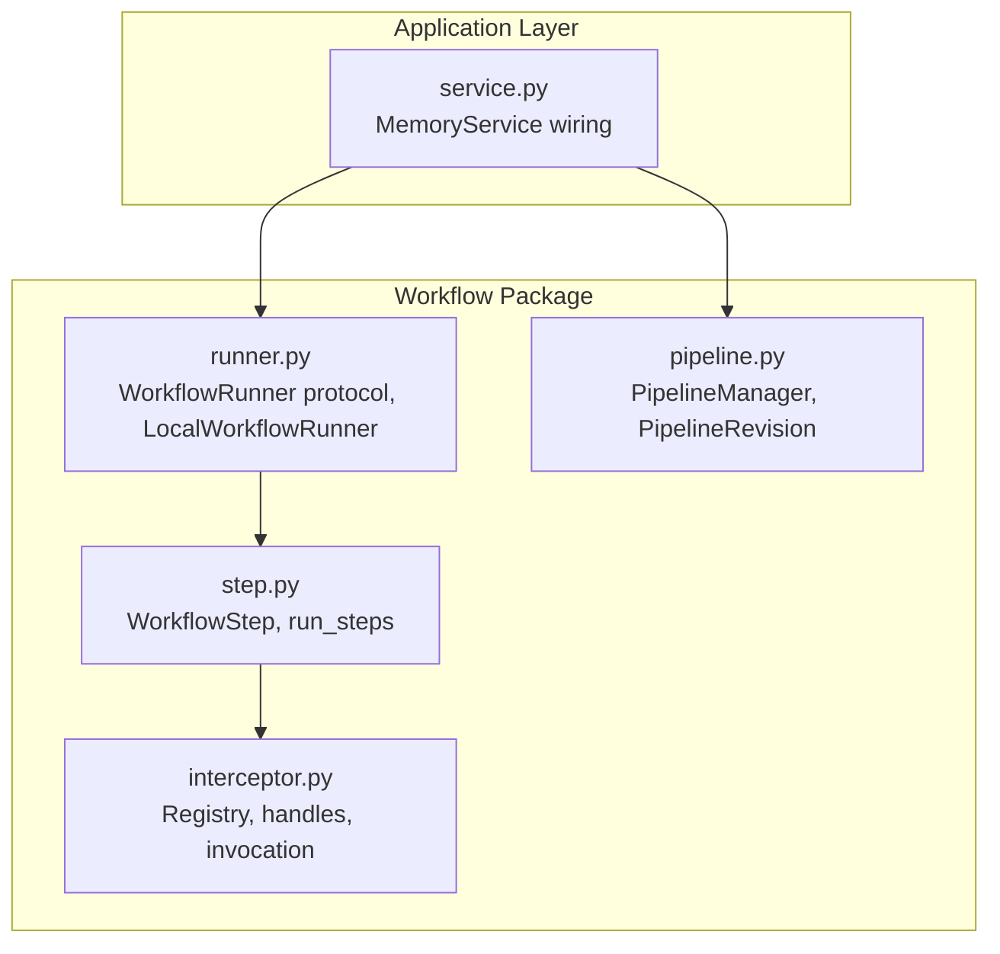
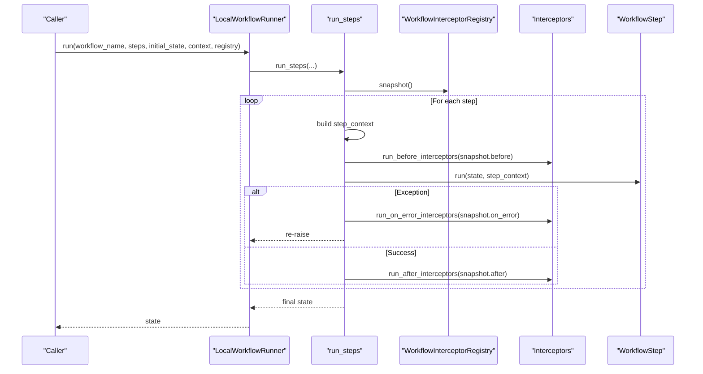
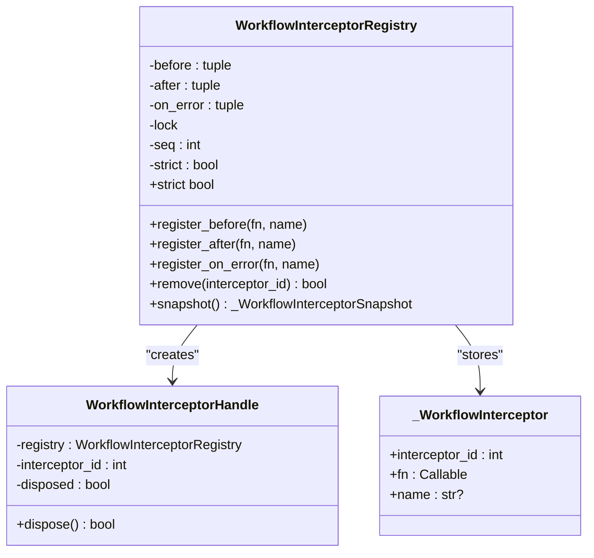
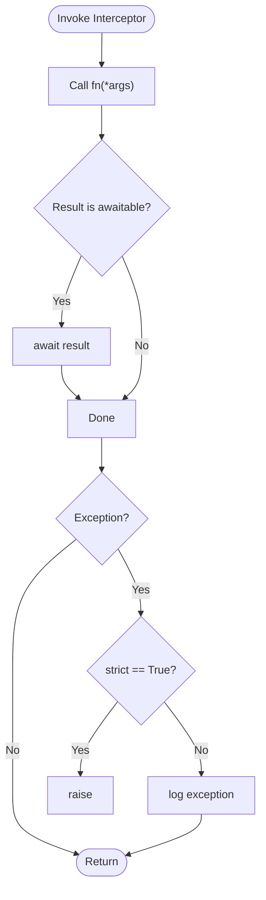
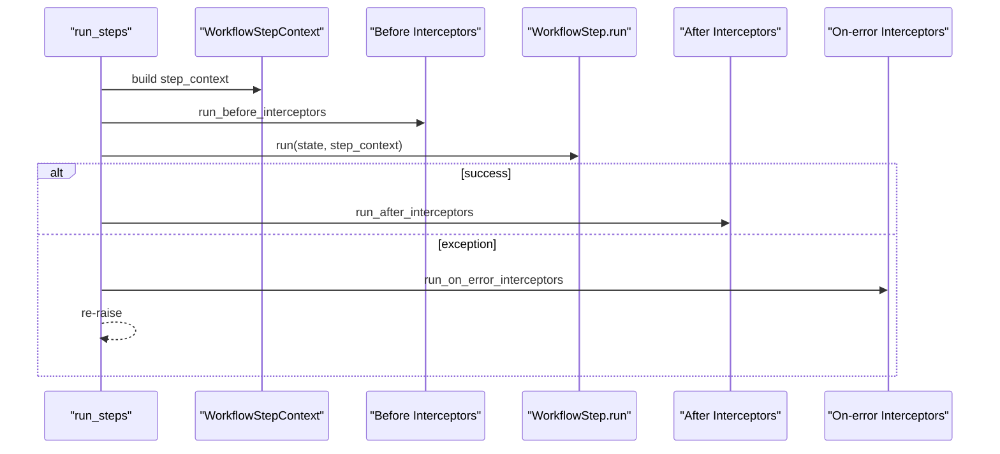
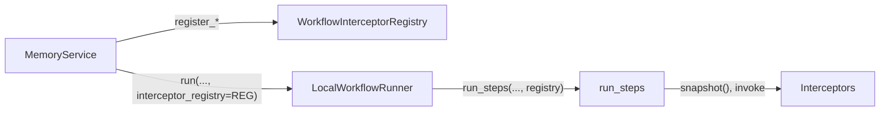
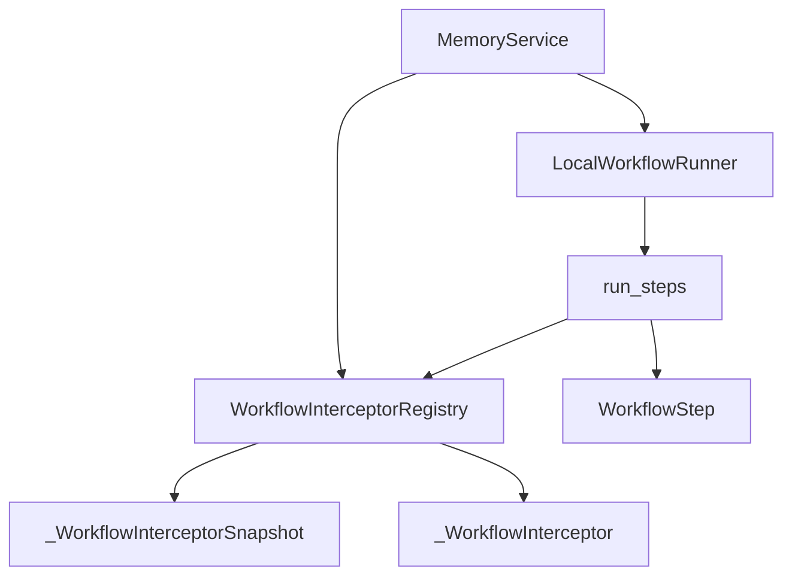

# Interceptor System

<cite>
**Referenced Files in This Document**
- [interceptor.py](file://src/memu/workflow/interceptor.py)
- [step.py](file://src/memu/workflow/step.py)
- [runner.py](file://src/memu/workflow/runner.py)
- [pipeline.py](file://src/memu/workflow/pipeline.py)
- [service.py](file://src/memu/app/service.py)
- [architecture.md](file://docs/architecture.md)
- [__init__.py](file://src/memu/workflow/__init__.py)
</cite>

## Table of Contents
1. [Introduction](#introduction)
2. [Project Structure](#project-structure)
3. [Core Components](#core-components)
4. [Architecture Overview](#architecture-overview)
5. [Detailed Component Analysis](#detailed-component-analysis)
6. [Dependency Analysis](#dependency-analysis)
7. [Performance Considerations](#performance-considerations)
8. [Troubleshooting Guide](#troubleshooting-guide)
9. [Conclusion](#conclusion)
10. [Appendices](#appendices)

## Introduction
This document explains the workflow interceptor system that enables observation and modification of workflow execution. It covers how interceptors are registered, where they execute in the workflow lifecycle, and how execution context is managed. It also documents interceptor types, execution order, error handling, and practical guidance for implementing, debugging, and extending interceptors while maintaining compatibility.

The workflow interceptor system is distinct from LLM interceptors and operates around each workflow step, providing before, after, and on-error hooks. Interceptors receive a step context and current workflow state, allowing them to read and modify state, log, enforce policies, or short-circuit execution when appropriate.

## Project Structure
The interceptor system lives under the workflow package and integrates with the pipeline manager, runner, and service layer.

**Diagram sources**
- [interceptor.py](file://src/memu/workflow/interceptor.py#L56-L219)
- [step.py](file://src/memu/workflow/step.py#L50-L102)
- [runner.py](file://src/memu/workflow/runner.py#L28-L82)
- [pipeline.py](file://src/memu/workflow/pipeline.py#L21-L171)
- [service.py](file://src/memu/app/service.py#L350-L360)

**Section sources**
- [interceptor.py](file://src/memu/workflow/interceptor.py#L56-L219)
- [step.py](file://src/memu/workflow/step.py#L50-L102)
- [runner.py](file://src/memu/workflow/runner.py#L28-L82)
- [pipeline.py](file://src/memu/workflow/pipeline.py#L21-L171)
- [service.py](file://src/memu/app/service.py#L350-L360)
- [architecture.md](file://docs/architecture.md#L64-L71)

## Core Components
- WorkflowInterceptorRegistry: Central registry for before, after, and on-error interceptors. Supports thread-safe registration and removal, and snapshots for deterministic execution.
- WorkflowInterceptorHandle: Disposable handle to remove a registered interceptor by its internal ID.
- WorkflowStepContext: Immutable context passed to interceptors containing workflow name, step identity, role, and step-scoped context.
- Execution helpers: run_before_interceptors, run_after_interceptors, run_on_error_interceptors, and a safe invocation utility.

Key behaviors:
- Registration order determines execution order for before interceptors and reverse order for after/on_error interceptors.
- Strict mode controls whether interceptor exceptions propagate or are logged.
- Interceptors receive (step_context, state) for before/after, and (step_context, state, error) for on_error.

**Section sources**
- [interceptor.py](file://src/memu/workflow/interceptor.py#L56-L219)
- [step.py](file://src/memu/workflow/step.py#L50-L102)
- [runner.py](file://src/memu/workflow/runner.py#L28-L82)
- [service.py](file://src/memu/app/service.py#L258-L295)

## Architecture Overview
The interceptor system participates in the workflow execution loop around each step. The runner resolves a workflow backend, builds steps from the pipeline, and delegates execution to run_steps. During each step, the system constructs a step context and invokes interceptors before, after, and on error.

**Diagram sources**
- [runner.py](file://src/memu/workflow/runner.py#L28-L40)
- [step.py](file://src/memu/workflow/step.py#L50-L102)
- [interceptor.py](file://src/memu/workflow/interceptor.py#L168-L219)

## Detailed Component Analysis

### WorkflowInterceptorRegistry
Responsibilities:
- Thread-safe registration of before/after/on_error interceptors.
- Deterministic snapshot capture for a consistent execution view during a single run.
- Removal of interceptors by ID.
- Strict mode toggle affecting exception propagation.

Execution semantics:
- Before: invoked in registration order.
- After: invoked in reverse registration order.
- On-error: invoked in reverse registration order.

**Diagram sources**
- [interceptor.py](file://src/memu/workflow/interceptor.py#L56-L166)

**Section sources**
- [interceptor.py](file://src/memu/workflow/interceptor.py#L56-L166)

### Execution Helpers and Safe Invocation
- run_before_interceptors: iterates forward over snapshot.before.
- run_after_interceptors: iterates backward over snapshot.after.
- run_on_error_interceptors: iterates backward over snapshot.on_error.
- _safe_invoke_interceptor: wraps interceptor invocation, awaiting coroutines and handling exceptions according to strict mode.

**Diagram sources**
- [interceptor.py](file://src/memu/workflow/interceptor.py#L205-L219)

**Section sources**
- [interceptor.py](file://src/memu/workflow/interceptor.py#L168-L219)

### WorkflowStepContext and run_steps Integration
- run_steps constructs a step_context from the workflow context and step metadata, then builds a WorkflowStepContext for each step.
- Interceptors are executed around step.run, with error handling and reverse-order after/on_error execution.

**Diagram sources**
- [step.py](file://src/memu/workflow/step.py#L50-L102)
- [interceptor.py](file://src/memu/workflow/interceptor.py#L168-L219)

**Section sources**
- [step.py](file://src/memu/workflow/step.py#L50-L102)

### Service Integration and Public API
- MemoryService exposes convenience methods to register workflow interceptors and passes the registry to the runner.
- The runner receives the registry and forwards it to run_steps, ensuring interceptors participate in every step.

**Diagram sources**
- [service.py](file://src/memu/app/service.py#L258-L295)
- [runner.py](file://src/memu/workflow/runner.py#L28-L40)
- [step.py](file://src/memu/workflow/step.py#L50-L102)
- [interceptor.py](file://src/memu/workflow/interceptor.py#L163-L166)

**Section sources**
- [service.py](file://src/memu/app/service.py#L258-L295)
- [runner.py](file://src/memu/workflow/runner.py#L28-L40)
- [step.py](file://src/memu/workflow/step.py#L50-L102)

## Dependency Analysis
- Registry depends on immutable tuples to maintain deterministic iteration order and uses a lock for thread safety.
- run_steps depends on the registry’s snapshot to avoid dynamic changes mid-run.
- Runner delegates execution to run_steps and optionally passes the registry.
- Service composes the registry and passes it to the runner.

**Diagram sources**
- [interceptor.py](file://src/memu/workflow/interceptor.py#L56-L166)
- [step.py](file://src/memu/workflow/step.py#L50-L102)
- [runner.py](file://src/memu/workflow/runner.py#L28-L40)
- [service.py](file://src/memu/app/service.py#L350-L360)

**Section sources**
- [interceptor.py](file://src/memu/workflow/interceptor.py#L56-L166)
- [step.py](file://src/memu/workflow/step.py#L50-L102)
- [runner.py](file://src/memu/workflow/runner.py#L28-L40)
- [service.py](file://src/memu/app/service.py#L350-L360)

## Performance Considerations
- Interceptors are synchronous or awaited per invocation; keep logic lightweight to avoid slowing step execution.
- Snapshot captures a fixed view of interceptors; frequent registration/removal mid-run is not supported.
- Reverse-order after/on_error execution implies last-in-first-out semantics; consider interceptor ordering carefully.
- Strict mode disables exception suppression, which can reduce resilience but improves visibility during development.

[No sources needed since this section provides general guidance]

## Troubleshooting Guide
Common issues and remedies:
- Interceptor not invoked:
  - Verify registration via the public service methods and confirm the registry is passed to the runner.
  - Ensure the step context and state are valid; run_steps validates required keys before invoking interceptors.
- Exceptions in interceptors:
  - In non-strict mode, exceptions are logged; switch to strict mode during debugging to surface errors immediately.
  - Use the disposable handle to remove problematic interceptors.
- Conflicting interceptors:
  - Leverage reverse-order execution for cleanup-like after handlers.
  - Use step-scoped context to coordinate behavior across interceptors.
- Monitoring:
  - Add structured logging inside interceptors using the provided logger.
  - Attach correlation IDs to step_context to trace end-to-end execution.

**Section sources**
- [interceptor.py](file://src/memu/workflow/interceptor.py#L205-L219)
- [step.py](file://src/memu/workflow/step.py#L69-L72)
- [service.py](file://src/memu/app/service.py#L258-L295)

## Conclusion
The workflow interceptor system offers a simple, deterministic way to observe and modify step-level behavior. By registering before/after/on-error hooks and leveraging the provided execution helpers, developers can implement cross-cutting concerns such as auditing, validation, metrics, and error handling. The system’s design prioritizes clarity and ease of use, with strict mode and snapshots supporting robust operation in production.

[No sources needed since this section summarizes without analyzing specific files]

## Appendices

### Interceptor Types and Execution Order
- Before: executed in registration order.
- After: executed in reverse registration order.
- On-error: executed in reverse registration order when a step raises an exception.

**Section sources**
- [interceptor.py](file://src/memu/workflow/interceptor.py#L168-L219)

### Implementation Examples (by reference)
- Registering a before interceptor:
  - See [service.py](file://src/memu/app/service.py#L258-L269)
- Registering an after interceptor:
  - See [service.py](file://src/memu/app/service.py#L271-L282)
- Registering an on-error interceptor:
  - See [service.py](file://src/memu/app/service.py#L284-L295)
- Passing registry to runner:
  - See [service.py](file://src/memu/app/service.py#L350-L360)
- Exported API:
  - See [__init__.py](file://src/memu/workflow/__init__.py#L1-L30)

### Relationship to LLM Interceptors
- LLM interceptors support filtering, priority, and ordering; workflow interceptors do not.
- LLM interceptors operate around LLM calls; workflow interceptors operate around workflow steps.

**Section sources**
- [architecture.md](file://docs/architecture.md#L64-L71)
- [interceptor.py](file://src/memu/workflow/interceptor.py#L57-L63)