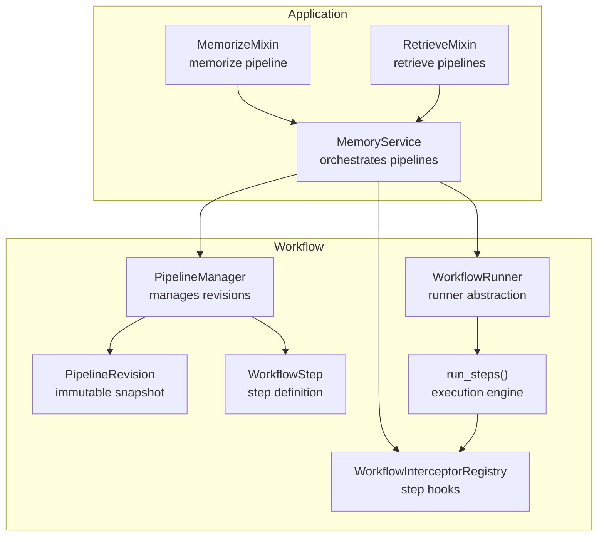
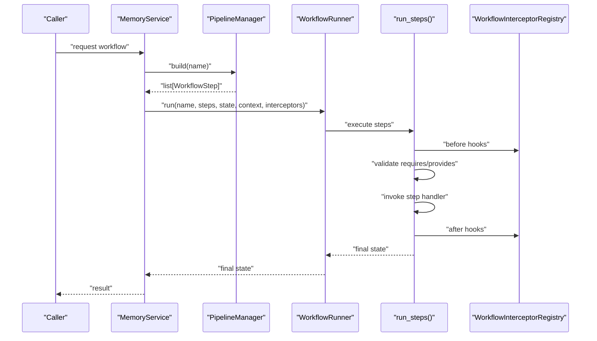
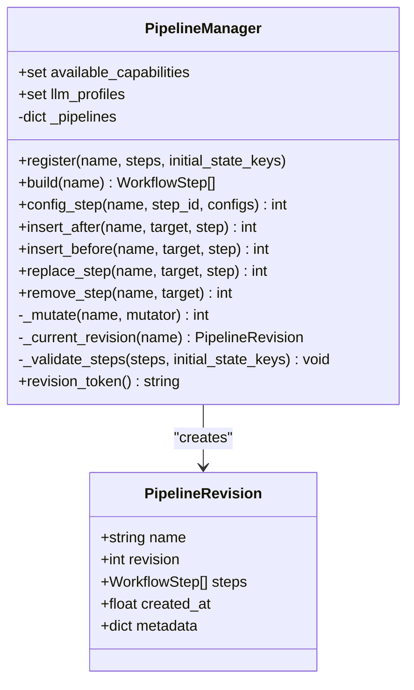
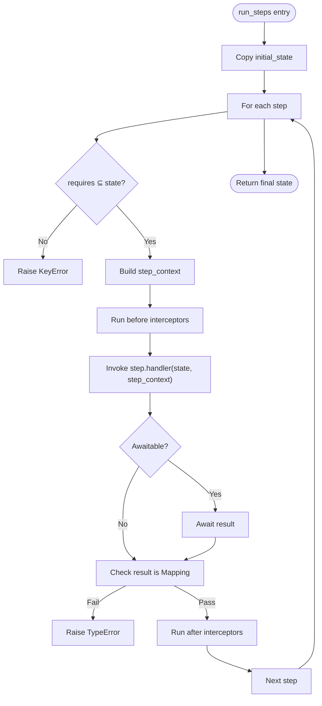
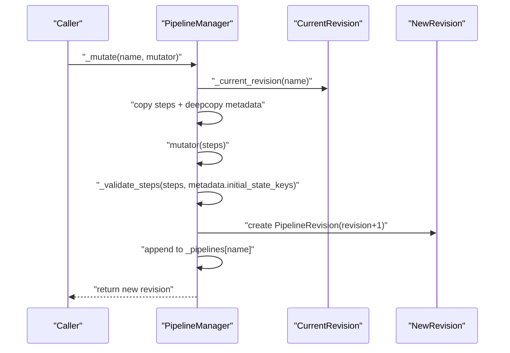
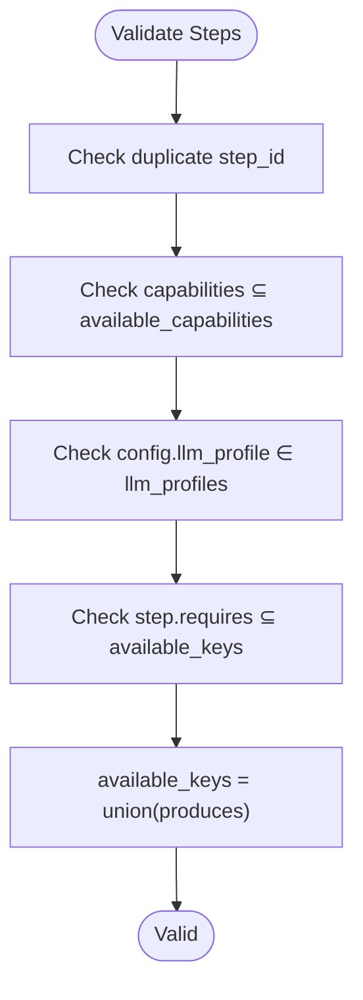
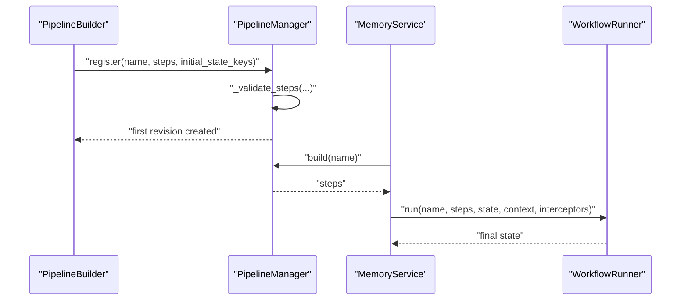
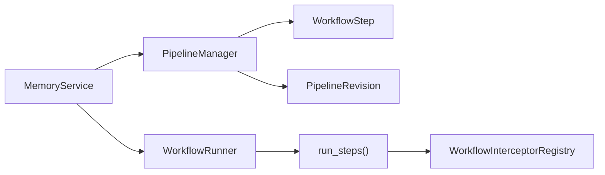

# Pipeline Architecture

<cite>
**Referenced Files in This Document**
- [pipeline.py](file://src/memu/workflow/pipeline.py)
- [step.py](file://src/memu/workflow/step.py)
- [runner.py](file://src/memu/workflow/runner.py)
- [interceptor.py](file://src/memu/workflow/interceptor.py)
- [service.py](file://src/memu/app/service.py)
- [memorize.py](file://src/memu/app/memorize.py)
- [retrieve.py](file://src/memu/app/retrieve.py)
- [0001-workflow-pipeline-architecture.md](file://docs/adr/0001-workflow-pipeline-architecture.md)
</cite>

## Table of Contents
1. [Introduction](#introduction)
2. [Project Structure](#project-structure)
3. [Core Components](#core-components)
4. [Architecture Overview](#architecture-overview)
5. [Detailed Component Analysis](#detailed-component-analysis)
6. [Dependency Analysis](#dependency-analysis)
7. [Performance Considerations](#performance-considerations)
8. [Troubleshooting Guide](#troubleshooting-guide)
9. [Conclusion](#conclusion)
10. [Appendices](#appendices)

## Introduction
This document explains the pipeline architecture centered on memU’s PipelineManager and PipelineRevision system. It covers how pipelines are registered, validated, mutated, and executed, along with the relationships among pipeline capabilities, LLM profiles, and step requirements. It also documents lifecycle patterns, mutation operations, composition strategies, and performance considerations for robust, extensible workflow execution.

## Project Structure
The pipeline system lives under the workflow package and integrates with application services to orchestrate multi-step operations such as memorize and retrieve.

**Diagram sources**
- [pipeline.py](file://src/memu/workflow/pipeline.py#L12-L171)
- [step.py](file://src/memu/workflow/step.py#L16-L102)
- [runner.py](file://src/memu/workflow/runner.py#L12-L82)
- [interceptor.py](file://src/memu/workflow/interceptor.py#L56-L219)
- [service.py](file://src/memu/app/service.py#L49-L427)
- [memorize.py](file://src/memu/app/memorize.py#L97-L167)
- [retrieve.py](file://src/memu/app/retrieve.py#L106-L211)

**Section sources**
- [pipeline.py](file://src/memu/workflow/pipeline.py#L1-L171)
- [step.py](file://src/memu/workflow/step.py#L1-L102)
- [runner.py](file://src/memu/workflow/runner.py#L1-L82)
- [interceptor.py](file://src/memu/workflow/interceptor.py#L1-L219)
- [service.py](file://src/memu/app/service.py#L1-L427)
- [memorize.py](file://src/memu/app/memorize.py#L1-L1331)
- [retrieve.py](file://src/memu/app/retrieve.py#L1-L1419)
- [0001-workflow-pipeline-architecture.md](file://docs/adr/0001-workflow-pipeline-architecture.md#L1-L36)

## Core Components
- PipelineManager: Central registry and orchestrator for named pipelines with revision history. Validates steps at registration and mutation, enforces capability and profile constraints, and supports structural mutations.
- PipelineRevision: Immutable snapshot of a pipeline at a revision number, capturing steps, metadata, and creation timestamp.
- WorkflowStep: Typed step with identifiers, roles, handlers, and explicit state requirements/productions, plus capability tags and step-level config.
- WorkflowRunner: Pluggable execution backend abstraction (local/sync supported; others can be registered).
- WorkflowInterceptorRegistry: Hook system for before/after/on_error step execution with strict mode and thread-safe snapshotting.
- MemoryService: Integrates PipelineManager, registers built-in pipelines, resolves runners, and exposes mutation APIs.

**Section sources**
- [pipeline.py](file://src/memu/workflow/pipeline.py#L12-L171)
- [step.py](file://src/memu/workflow/step.py#L16-L102)
- [runner.py](file://src/memu/workflow/runner.py#L12-L82)
- [interceptor.py](file://src/memu/workflow/interceptor.py#L56-L219)
- [service.py](file://src/memu/app/service.py#L49-L427)

## Architecture Overview
The system models each core operation as a named pipeline composed of ordered WorkflowStep units. Registration validates step correctness and state contracts. Execution runs through a WorkflowRunner with optional step interceptors. Runtime customization is supported via step configuration and structural mutations that create new revisions.

**Diagram sources**
- [service.py](file://src/memu/app/service.py#L350-L361)
- [runner.py](file://src/memu/workflow/runner.py#L28-L40)
- [step.py](file://src/memu/workflow/step.py#L50-L102)
- [interceptor.py](file://src/memu/workflow/interceptor.py#L163-L219)
- [pipeline.py](file://src/memu/workflow/pipeline.py#L47-L49)

## Detailed Component Analysis

### PipelineManager and PipelineRevision
- Responsibilities:
  - Register pipelines with initial state keys and validate step correctness.
  - Build executable step lists from the current revision.
  - Mutate pipelines via insert/replace/remove/configure, validating each change and bumping revision.
  - Enforce capability availability and LLM profile validity per step.
  - Track revision history and compute a token summarizing pipeline versions.
- Validation rules:
  - Duplicate step IDs are rejected.
  - Unknown capabilities are rejected if capabilities are constrained.
  - Unknown LLM profiles are rejected if profiles are constrained.
  - Missing required state keys at step boundaries are rejected.
  - Produces from prior steps become available keys for subsequent steps.

**Diagram sources**
- [pipeline.py](file://src/memu/workflow/pipeline.py#L12-L171)

**Section sources**
- [pipeline.py](file://src/memu/workflow/pipeline.py#L21-L171)

### WorkflowStep and Execution Engine
- WorkflowStep fields:
  - step_id, role, handler, description, requires, produces, capabilities, config.
  - Copy semantics preserve handler reference but copy mutable fields.
- Execution:
  - run_steps iterates steps, validates per-step requires, builds step context, runs before/after/error interceptors, invokes handler, and enforces return type contract.
- Handler contract:
  - Handlers must return a mapping; otherwise a type error is raised.

**Diagram sources**
- [step.py](file://src/memu/workflow/step.py#L50-L102)
- [interceptor.py](file://src/memu/workflow/interceptor.py#L163-L219)

**Section sources**
- [step.py](file://src/memu/workflow/step.py#L16-L102)

### Mutation Operations and Revision Management
- Supported mutations:
  - config_step: Merge step-level config; raises if step not found.
  - insert_after/insert_before: Insert new step adjacent to target; raises if target not found.
  - replace_step: Replace target step; raises if target not found.
  - remove_step: Remove target step; raises if target not found.
- Behavior:
  - Each mutation copies current steps, applies the change, re-validates, and appends a new PipelineRevision with incremented revision number.
  - Metadata (e.g., initial_state_keys) is preserved across revisions.

**Diagram sources**
- [pipeline.py](file://src/memu/workflow/pipeline.py#L108-L122)

**Section sources**
- [pipeline.py](file://src/memu/workflow/pipeline.py#L51-L122)

### Capability Validation and LLM Profile Constraints
- Capability checks:
  - If available_capabilities is set, each step’s capabilities must be a subset; otherwise a value error is raised.
- LLM profile checks:
  - If a step config specifies an llm_profile, it must be present in PipelineManager.llm_profiles; otherwise a value error is raised.
- Step requirement checks:
  - At registration and mutation, missing required keys across steps are detected and reported.

**Diagram sources**
- [pipeline.py](file://src/memu/workflow/pipeline.py#L131-L165)

**Section sources**
- [pipeline.py](file://src/memu/workflow/pipeline.py#L131-L165)

### Pipeline Lifecycle: Registration to Execution
- Registration:
  - Build step list and metadata (initial_state_keys).
  - Validate steps and create first revision.
- Execution:
  - MemoryService builds steps from PipelineManager and runs via WorkflowRunner.
  - Interceptors can wrap each step for instrumentation and control.
- Mutation:
  - Runtime mutations create new revisions; consumers can track changes via revision_token.

**Diagram sources**
- [pipeline.py](file://src/memu/workflow/pipeline.py#L27-L49)
- [service.py](file://src/memu/app/service.py#L350-L361)
- [runner.py](file://src/memu/workflow/runner.py#L61-L82)

**Section sources**
- [pipeline.py](file://src/memu/workflow/pipeline.py#L27-L49)
- [service.py](file://src/memu/app/service.py#L350-L361)
- [runner.py](file://src/memu/workflow/runner.py#L61-L82)

### Pipeline Composition Patterns and Best Practices
- Compose pipelines from small, focused steps with explicit requires/provides contracts.
- Use capabilities to declare required backends (e.g., llm, vector, db, io, vision).
- Prefer step-level config for runtime tuning rather than structural changes when possible.
- Keep initial_state_keys minimal and explicit to simplify validation.
- Use interceptors for cross-cutting concerns (logging, tracing, metrics) without modifying step logic.
- Maintain idempotent steps and avoid side effects in handlers.

[No sources needed since this section provides general guidance]

### Examples: Registration, Versioning, and Validation Errors
- Registering pipelines:
  - MemoryService registers built-in pipelines (memorize, retrieve_rag, retrieve_llm, CRUD) with initial_state_keys and step definitions.
  - See pipeline registrations and step definitions in the application mixins.
- Managing versions:
  - Use revision_token to detect changes across pipelines.
  - Mutations return the new revision number; callers can persist or propagate this number.
- Handling validation errors:
  - Duplicate step_id, unknown capabilities, unknown LLM profile, or missing required keys will raise descriptive errors during registration or mutation.

**Section sources**
- [service.py](file://src/memu/app/service.py#L315-L349)
- [memorize.py](file://src/memu/app/memorize.py#L97-L167)
- [retrieve.py](file://src/memu/app/retrieve.py#L106-L211)
- [pipeline.py](file://src/memu/workflow/pipeline.py#L131-L165)

## Dependency Analysis
- PipelineManager depends on WorkflowStep and enforces capability/profile constraints.
- MemoryService composes PipelineManager, registers pipelines, and exposes mutation APIs.
- WorkflowRunner abstracts execution; run_steps executes steps and integrates interceptors.
- InterceptorRegistry snapshots and invokes before/after/on_error hooks safely.

**Diagram sources**
- [pipeline.py](file://src/memu/workflow/pipeline.py#L12-L171)
- [service.py](file://src/memu/app/service.py#L49-L427)
- [runner.py](file://src/memu/workflow/runner.py#L12-L82)
- [step.py](file://src/memu/workflow/step.py#L50-L102)
- [interceptor.py](file://src/memu/workflow/interceptor.py#L56-L219)

**Section sources**
- [pipeline.py](file://src/memu/workflow/pipeline.py#L1-L171)
- [service.py](file://src/memu/app/service.py#L1-L427)
- [runner.py](file://src/memu/workflow/runner.py#L1-L82)
- [step.py](file://src/memu/workflow/step.py#L1-L102)
- [interceptor.py](file://src/memu/workflow/interceptor.py#L1-L219)

## Performance Considerations
- Minimize step count and IO-bound operations inside handlers; leverage vector and LLM clients efficiently.
- Use step-level config to tune model parameters and batch sizes rather than restructuring pipelines.
- Keep requires/provides sets small and precise to reduce validation overhead.
- Prefer local runner for synchronous, low-latency scenarios; register external runners for distributed execution.
- Use interceptors judiciously; each adds async overhead per step.

[No sources needed since this section provides general guidance]

## Troubleshooting Guide
Common validation and execution errors:
- Duplicate step_id: Registration or mutation rejects repeated step IDs.
- Unknown capabilities: If available_capabilities is set, steps must not request unknown capabilities.
- Unknown LLM profile: Step config must reference a known profile; otherwise a value error is raised.
- Missing required keys: At registration or mutation, if a step requires keys not produced by prior steps or provided via initial_state_keys, a value error is raised.
- Handler return type: If a step handler does not return a mapping, a type error is raised during execution.
- Unknown pipeline name: Accessing a non-registered pipeline raises a key error.
- Unknown workflow runner: Resolving an unregistered runner name raises a value error.

Mitigation tips:
- Review step.requires and step.produces to ensure a valid chain.
- Verify llm_profiles passed to PipelineManager match step configs.
- Use revision_token to confirm pipeline changes across deployments.
- Wrap handlers defensively and rely on interceptors for error handling.

**Section sources**
- [pipeline.py](file://src/memu/workflow/pipeline.py#L131-L165)
- [step.py](file://src/memu/workflow/step.py#L40-L47)
- [runner.py](file://src/memu/workflow/runner.py#L61-L82)
- [service.py](file://src/memu/app/service.py#L315-L349)

## Conclusion
The PipelineManager and PipelineRevision system provides a robust, validated, and versioned foundation for composing and executing multi-step workflows in memU. By enforcing capability and profile constraints, validating state contracts, and supporting safe mutations, the system enables flexible, observable, and maintainable pipelines across operations like memorize and retrieve.

## Appendices

### Relationship Between Pipelines, Capabilities, LLM Profiles, and Step Requirements
- Pipelines define ordered steps with explicit requires/provides.
- Capabilities constrain what backends a step can use.
- LLM profiles constrain which chat/embedding clients a step can consume.
- Initial_state_keys and step.produces drive the evolving state graph.

**Section sources**
- [pipeline.py](file://src/memu/workflow/pipeline.py#L131-L165)
- [service.py](file://src/memu/app/service.py#L91-L95)

### ADR Summary
- Decision rationale: Model core operations as named pipelines of ordered WorkflowStep units.
- Benefits: Uniform execution, explicit stage boundaries, extension points, observability.
- Trade-offs: Dict-based state relies on disciplined key naming; mutations can vary behavior across deployments.

**Section sources**
- [0001-workflow-pipeline-architecture.md](file://docs/adr/0001-workflow-pipeline-architecture.md#L1-L36)