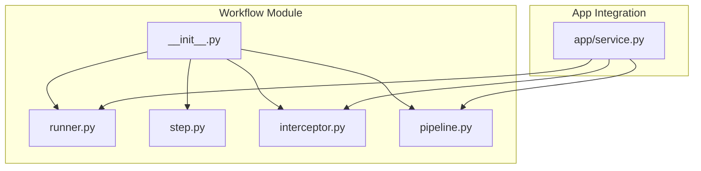
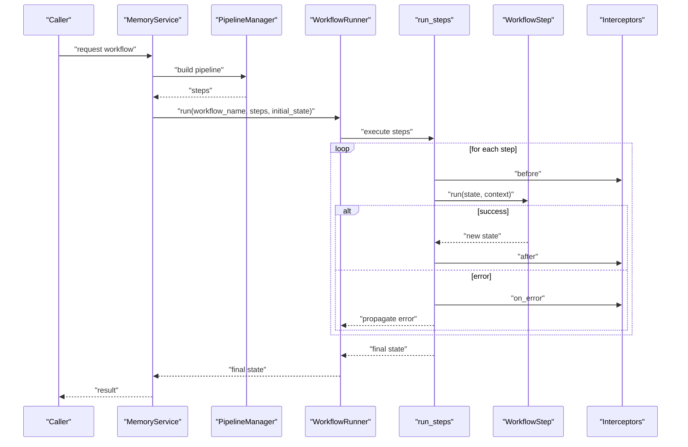
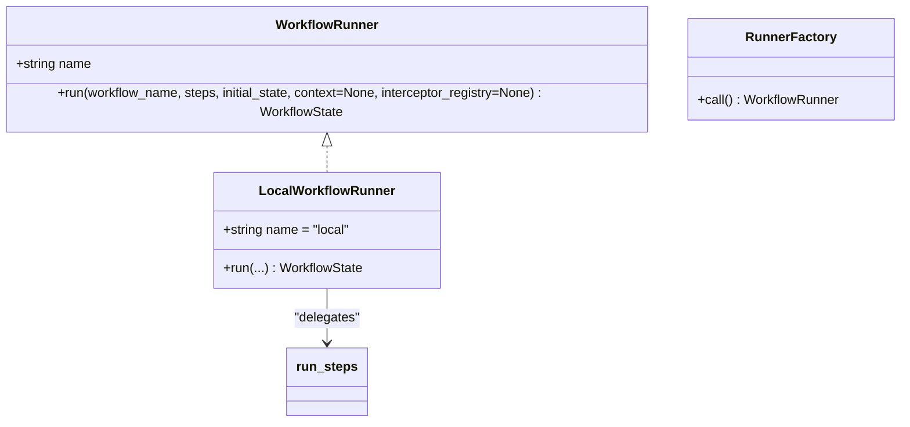
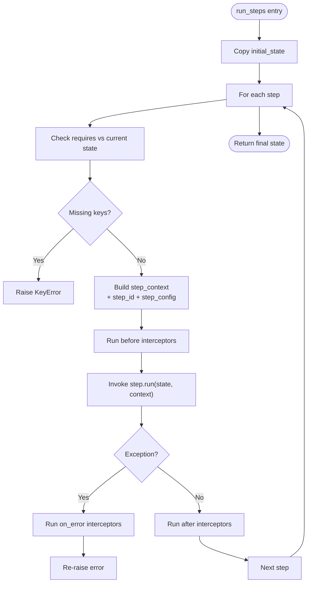
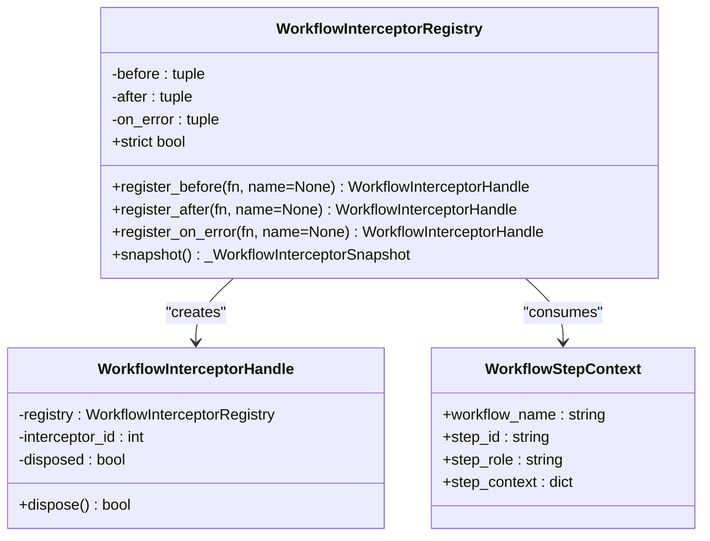
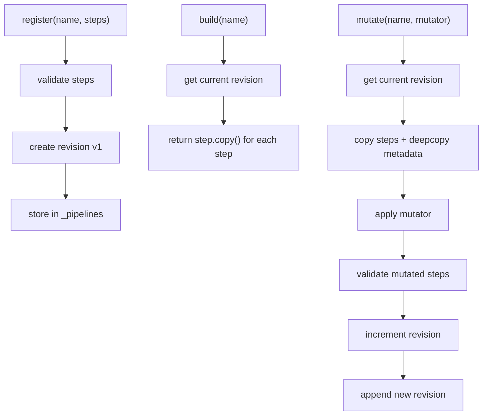
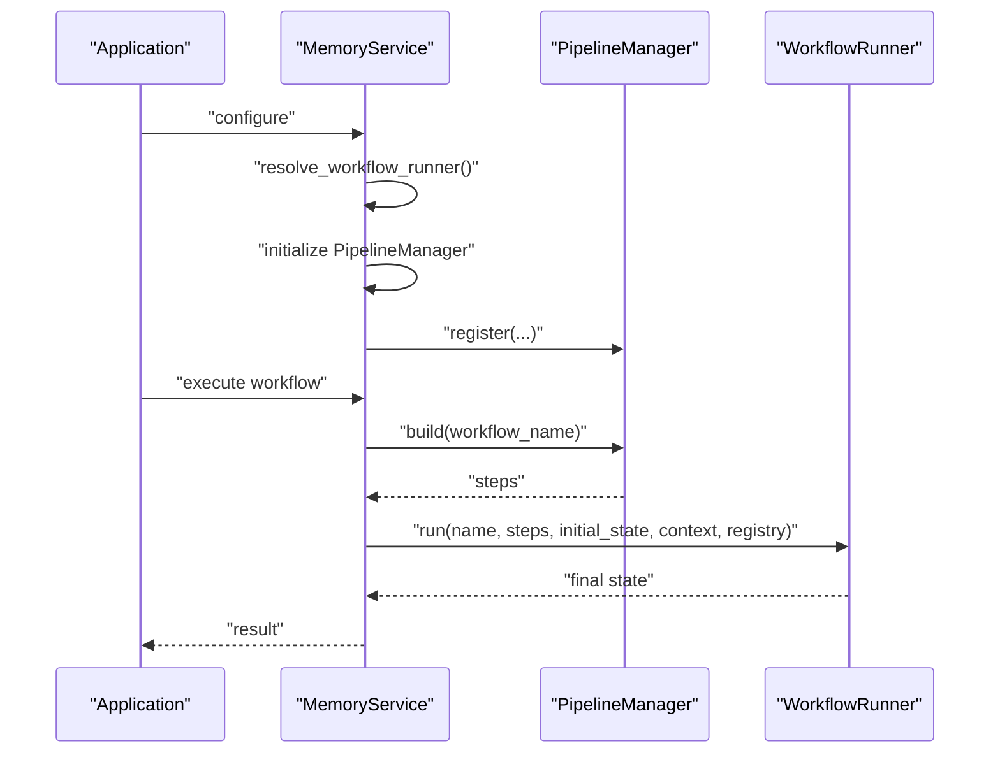
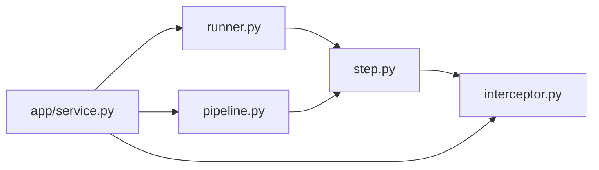

# Runner and Execution Engine

<cite>
**Referenced Files in This Document**
- [runner.py](file://src/memu/workflow/runner.py)
- [step.py](file://src/memu/workflow/step.py)
- [interceptor.py](file://src/memu/workflow/interceptor.py)
- [pipeline.py](file://src/memu/workflow/pipeline.py)
- [__init__.py](file://src/memu/workflow/__init__.py)
- [service.py](file://src/memu/app/service.py)
- [getting_started_robust.py](file://examples/getting_started_robust.py)
</cite>

## Table of Contents
1. [Introduction](#introduction)
2. [Project Structure](#project-structure)
3. [Core Components](#core-components)
4. [Architecture Overview](#architecture-overview)
5. [Detailed Component Analysis](#detailed-component-analysis)
6. [Dependency Analysis](#dependency-analysis)
7. [Performance Considerations](#performance-considerations)
8. [Troubleshooting Guide](#troubleshooting-guide)
9. [Conclusion](#conclusion)
10. [Appendices](#appendices)

## Introduction
This document explains the workflow runner and execution engine that powers the workflow execution system and runtime management. It covers the execution flow, step coordination, state management, error handling, and recovery strategies. It also documents how the runner integrates with the pipeline manager, how steps are executed, and how state is persisted and propagated. Guidance is included for asynchronous execution, parallel processing, resource management, performance monitoring, and debugging.

## Project Structure
The workflow subsystem resides under src/memu/workflow and is composed of:
- Runner: defines the execution interface and local execution backend
- Step: defines the step abstraction and the step execution loop
- Interceptor: provides hooks around step execution for cross-cutting concerns
- Pipeline: manages pipeline definitions, revisions, and validation
- Public exports: exposed APIs for consumers

**Diagram sources**
- [runner.py](file://src/memu/workflow/runner.py#L1-L82)
- [step.py](file://src/memu/workflow/step.py#L1-L102)
- [interceptor.py](file://src/memu/workflow/interceptor.py#L1-L219)
- [pipeline.py](file://src/memu/workflow/pipeline.py#L1-L171)
- [__init__.py](file://src/memu/workflow/__init__.py#L1-L30)
- [service.py](file://src/memu/app/service.py#L1-L427)

**Section sources**
- [runner.py](file://src/memu/workflow/runner.py#L1-L82)
- [step.py](file://src/memu/workflow/step.py#L1-L102)
- [interceptor.py](file://src/memu/workflow/interceptor.py#L1-L219)
- [pipeline.py](file://src/memu/workflow/pipeline.py#L1-L171)
- [__init__.py](file://src/memu/workflow/__init__.py#L1-L30)

## Core Components
- WorkflowRunner protocol and LocalWorkflowRunner: define the execution contract and local implementation that delegates to the step executor.
- WorkflowStep: encapsulates a single unit of work with handler, requires/produces declarations, capabilities, and configuration.
- run_steps: orchestrates step execution, validates state transitions, and coordinates interceptors.
- WorkflowInterceptorRegistry: registers before/after/on-error hooks around each step.
- PipelineManager: builds, mutates, and validates pipelines; tracks revisions and metadata.
- Integration in MemoryService: resolves runner, builds pipelines, and executes workflows.

**Section sources**
- [runner.py](file://src/memu/workflow/runner.py#L12-L82)
- [step.py](file://src/memu/workflow/step.py#L16-L102)
- [interceptor.py](file://src/memu/workflow/interceptor.py#L40-L219)
- [pipeline.py](file://src/memu/workflow/pipeline.py#L21-L171)
- [service.py](file://src/memu/app/service.py#L350-L427)

## Architecture Overview
The execution engine is designed around a simple, composable pattern:
- Pipelines define ordered sequences of steps with explicit state contracts.
- The runner resolves a backend (currently local/sync) and executes the pipeline.
- Each step runs with a handler that transforms state into a mapping.
- Interceptors wrap each step to add observability, tracing, and error handling.

**Diagram sources**
- [service.py](file://src/memu/app/service.py#L350-L361)
- [runner.py](file://src/memu/workflow/runner.py#L31-L39)
- [step.py](file://src/memu/workflow/step.py#L50-L102)
- [interceptor.py](file://src/memu/workflow/interceptor.py#L168-L219)
- [pipeline.py](file://src/memu/workflow/pipeline.py#L47-L49)

## Detailed Component Analysis

### Runner and Backend Resolution
- WorkflowRunner protocol defines the async run method with workflow name, steps, initial state, optional context, and optional interceptor registry.
- LocalWorkflowRunner delegates execution to run_steps.
- Resolver supports named runners ("local", "sync") and factories for external backends.

**Diagram sources**
- [runner.py](file://src/memu/workflow/runner.py#L12-L82)

**Section sources**
- [runner.py](file://src/memu/workflow/runner.py#L12-L82)

### Step Execution and State Management
- WorkflowStep holds step_id, role, handler, requires, produces, capabilities, and config.
- Step.run invokes handler(state, context) and ensures the result is a mapping.
- run_steps enforces requires/produces contracts, builds step context, and coordinates interceptors.

**Diagram sources**
- [step.py](file://src/memu/workflow/step.py#L50-L102)
- [interceptor.py](file://src/memu/workflow/interceptor.py#L168-L219)

**Section sources**
- [step.py](file://src/memu/workflow/step.py#L16-L102)
- [step.py](file://src/memu/workflow/step.py#L50-L102)

### Interceptors and Cross-Cutting Concerns
- WorkflowInterceptorRegistry maintains three lists: before, after, on_error.
- Interceptors are invoked in registration order for before/after and in reverse order for on_error.
- Strict mode controls whether interceptor failures propagate or are logged.

**Diagram sources**
- [interceptor.py](file://src/memu/workflow/interceptor.py#L40-L166)
- [interceptor.py](file://src/memu/workflow/interceptor.py#L168-L219)

**Section sources**
- [interceptor.py](file://src/memu/workflow/interceptor.py#L40-L219)

### Pipeline Manager and Revision Control
- PipelineManager stores revisions keyed by pipeline name.
- Validation ensures unique step IDs, capability availability, profile validity, and state dependency correctness.
- Mutations (insert/replace/remove) create new revisions and update metadata.

**Diagram sources**
- [pipeline.py](file://src/memu/workflow/pipeline.py#L27-L122)
- [pipeline.py](file://src/memu/workflow/pipeline.py#L131-L165)

**Section sources**
- [pipeline.py](file://src/memu/workflow/pipeline.py#L21-L171)

### Integration with Application Service
- MemoryService initializes a WorkflowRunner via resolver and a PipelineManager with capabilities and profiles.
- It registers built-in pipelines and exposes methods to mutate pipelines.
- _run_workflow builds steps from the pipeline and executes via the runner with a runner context and interceptor registry.

**Diagram sources**
- [service.py](file://src/memu/app/service.py#L49-L96)
- [service.py](file://src/memu/app/service.py#L315-L361)
- [runner.py](file://src/memu/workflow/runner.py#L61-L81)
- [pipeline.py](file://src/memu/workflow/pipeline.py#L47-L49)

**Section sources**
- [service.py](file://src/memu/app/service.py#L49-L96)
- [service.py](file://src/memu/app/service.py#L315-L361)

## Dependency Analysis
- Runner depends on step.run_steps for execution.
- Step depends on interceptor helpers for before/after/on_error invocation.
- PipelineManager depends on WorkflowStep for validation and copying.
- MemoryService composes Runner, PipelineManager, and InterceptorRegistry for orchestration.

**Diagram sources**
- [runner.py](file://src/memu/workflow/runner.py#L6-L6)
- [step.py](file://src/memu/workflow/step.py#L57-L62)
- [pipeline.py](file://src/memu/workflow/pipeline.py#L9)
- [service.py](file://src/memu/app/service.py#L33-L36)

**Section sources**
- [runner.py](file://src/memu/workflow/runner.py#L1-L82)
- [step.py](file://src/memu/workflow/step.py#L1-L102)
- [interceptor.py](file://src/memu/workflow/interceptor.py#L1-L219)
- [pipeline.py](file://src/memu/workflow/pipeline.py#L1-L171)
- [service.py](file://src/memu/app/service.py#L1-L427)

## Performance Considerations
- Asynchronous handlers: Handlers can be async; run_steps awaits them, enabling concurrency within a step’s implementation.
- Interceptor overhead: Before/after/on_error hooks are synchronous per step; keep them lightweight to minimize latency.
- State copying: run_steps copies initial_state; avoid large immutable state to reduce overhead.
- Pipeline validation cost: PipelineManager performs validation on mutations; batch changes when possible.
- Parallelism: The engine executes steps sequentially. To achieve parallelism, design steps to fan out internally or compose multiple pipelines and coordinate via shared state keys.

[No sources needed since this section provides general guidance]

## Troubleshooting Guide
Common issues and strategies:
- Missing required state keys: run_steps raises a KeyError when a step’s requires are not satisfied by current state.
- Handler return type: If a handler does not return a mapping, a TypeError is raised.
- Interceptor errors: By default, interceptor exceptions are logged; enable strict mode to propagate them.
- Unknown runner: resolve_workflow_runner raises a ValueError for unregistered runner names.
- Pipeline mutation errors: PipelineManager raises errors for invalid step IDs, unknown capabilities, or invalid LLM profiles.

Operational tips:
- Use interceptors to capture step_context and state snapshots for debugging.
- Enable strict mode temporarily to surface interceptor bugs early.
- Validate pipelines before deployment using PipelineManager’s validation logic.

**Section sources**
- [step.py](file://src/memu/workflow/step.py#L69-L72)
- [step.py](file://src/memu/workflow/step.py#L44-L47)
- [interceptor.py](file://src/memu/workflow/interceptor.py#L215-L219)
- [runner.py](file://src/memu/workflow/runner.py#L73-L75)
- [pipeline.py](file://src/memu/workflow/pipeline.py#L136-L164)

## Conclusion
The workflow runner and execution engine provide a robust, extensible foundation for composing and executing workflows. With explicit state contracts, step-level interceptors, and pipeline revision control, it supports safe evolution and observability. Integrating with MemoryService demonstrates how to wire pipelines, runners, and interceptors into a real application. For advanced scenarios, leverage interceptors for metrics and tracing, design handlers for concurrency, and manage pipelines carefully to ensure correctness and performance.

[No sources needed since this section summarizes without analyzing specific files]

## Appendices

### How to Execute Workflows
- Build a pipeline via PipelineManager and register steps with requires/produces.
- Resolve a runner (default local) and execute via WorkflowRunner.run.
- Use MemoryService to orchestrate built-in pipelines and pass initial state.

Example references:
- [service.py](file://src/memu/app/service.py#L350-L361)
- [runner.py](file://src/memu/workflow/runner.py#L61-L81)
- [pipeline.py](file://src/memu/workflow/pipeline.py#L27-L45)

**Section sources**
- [service.py](file://src/memu/app/service.py#L350-L361)
- [runner.py](file://src/memu/workflow/runner.py#L61-L81)
- [pipeline.py](file://src/memu/workflow/pipeline.py#L27-L45)

### Monitoring Execution Progress
- Register before/after interceptors to emit logs, metrics, or traces around each step.
- Use step_context to carry workflow_name, step_id, and step_config for correlation.

References:
- [interceptor.py](file://src/memu/workflow/interceptor.py#L78-L115)
- [step.py](file://src/memu/workflow/step.py#L73-L84)

**Section sources**
- [interceptor.py](file://src/memu/workflow/interceptor.py#L78-L115)
- [step.py](file://src/memu/workflow/step.py#L73-L84)

### Handling Execution Timeouts
- Wrap step handlers with timeout logic or integrate with external scheduling systems.
- Use interceptors to enforce per-step timeouts and fail fast.

References:
- [interceptor.py](file://src/memu/workflow/interceptor.py#L168-L219)
- [step.py](file://src/memu/workflow/step.py#L40-L47)

**Section sources**
- [interceptor.py](file://src/memu/workflow/interceptor.py#L168-L219)
- [step.py](file://src/memu/workflow/step.py#L40-L47)

### Asynchronous Execution Patterns
- Define async handlers to perform I/O-bound tasks concurrently within a step.
- run_steps awaits handlers; ensure handlers are non-blocking and return mappings.

References:
- [step.py](file://src/memu/workflow/step.py#L40-L47)
- [step.py](file://src/memu/workflow/step.py#L50-L102)

**Section sources**
- [step.py](file://src/memu/workflow/step.py#L40-L47)
- [step.py](file://src/memu/workflow/step.py#L50-L102)

### Parallel Processing Capabilities
- The engine executes steps sequentially. To parallelize, design steps to spawn concurrent tasks internally or compose multiple pipelines and coordinate via shared state keys.

[No sources needed since this section provides general guidance]

### Resource Management During Execution
- Use interceptors to allocate and release resources per step.
- Prefer lazy initialization of expensive clients (as demonstrated in MemoryService) and reuse where appropriate.

References:
- [service.py](file://src/memu/app/service.py#L97-L151)
- [interceptor.py](file://src/memu/workflow/interceptor.py#L168-L219)

**Section sources**
- [service.py](file://src/memu/app/service.py#L97-L151)
- [interceptor.py](file://src/memu/workflow/interceptor.py#L168-L219)

### Performance Monitoring and Metrics Collection
- Add interceptors to record timing, counts, and error rates per step.
- Use step_context to tag metrics with workflow_name, step_id, and step_role.

References:
- [interceptor.py](file://src/memu/workflow/interceptor.py#L78-L115)
- [step.py](file://src/memu/workflow/step.py#L79-L84)

**Section sources**
- [interceptor.py](file://src/memu/workflow/interceptor.py#L78-L115)
- [step.py](file://src/memu/workflow/step.py#L79-L84)

### Debugging Workflow Execution
- Capture step_context and state snapshots in before/after interceptors.
- Temporarily enable strict mode to surface interceptor exceptions immediately.

References:
- [interceptor.py](file://src/memu/workflow/interceptor.py#L78-L115)
- [interceptor.py](file://src/memu/workflow/interceptor.py#L215-L219)

**Section sources**
- [interceptor.py](file://src/memu/workflow/interceptor.py#L78-L115)
- [interceptor.py](file://src/memu/workflow/interceptor.py#L215-L219)

### Optimizing Workflow Performance
- Minimize requires/produces churn; reuse intermediate state keys.
- Keep handlers efficient; offload heavy work to background tasks or external systems.
- Batch pipeline mutations to reduce validation overhead.

[No sources needed since this section provides general guidance]

### Handling Complex Execution Scenarios
- Use PipelineManager to dynamically adjust steps and configurations.
- Compose multiple pipelines for complex flows and coordinate via shared state keys.

References:
- [pipeline.py](file://src/memu/workflow/pipeline.py#L51-L106)
- [service.py](file://src/memu/app/service.py#L390-L426)

**Section sources**
- [pipeline.py](file://src/memu/workflow/pipeline.py#L51-L106)
- [service.py](file://src/memu/app/service.py#L390-L426)