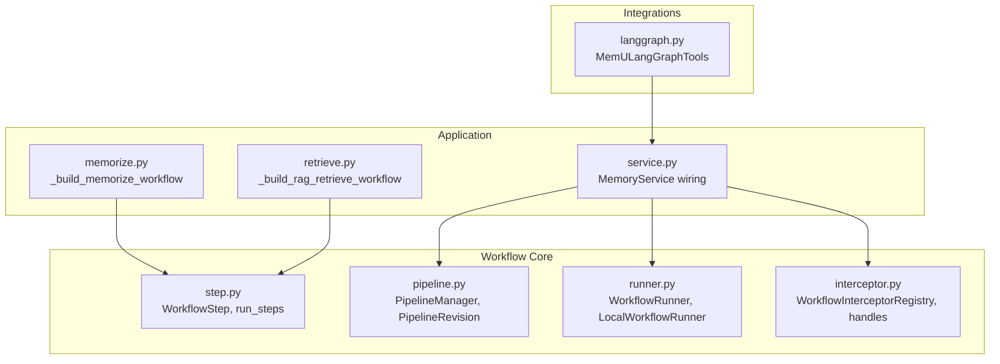
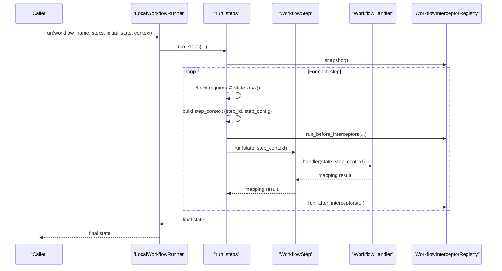
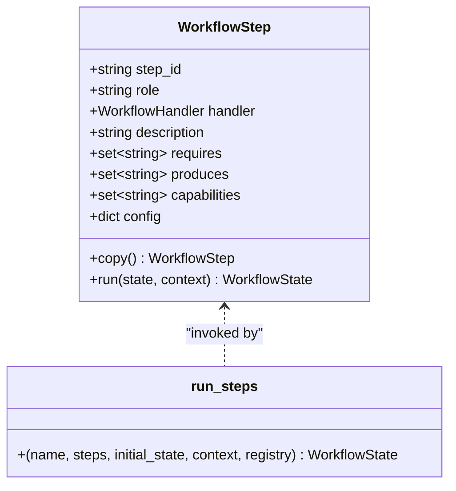
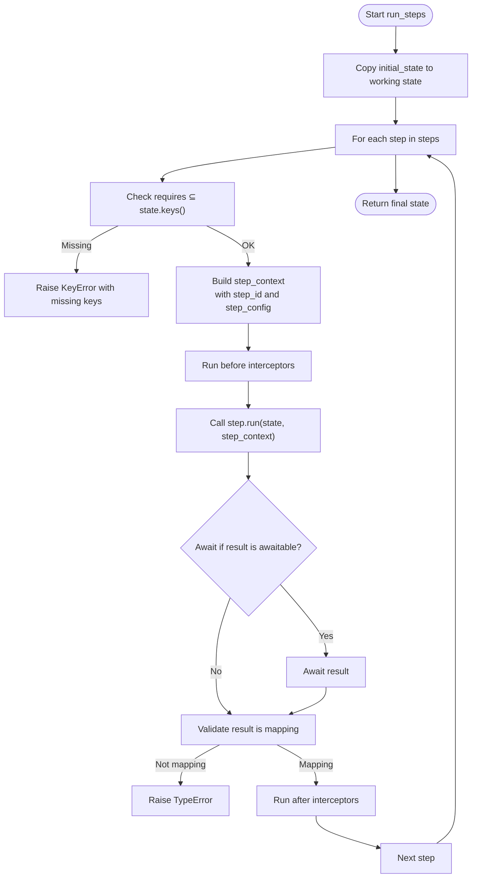
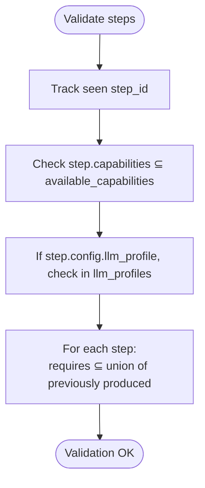
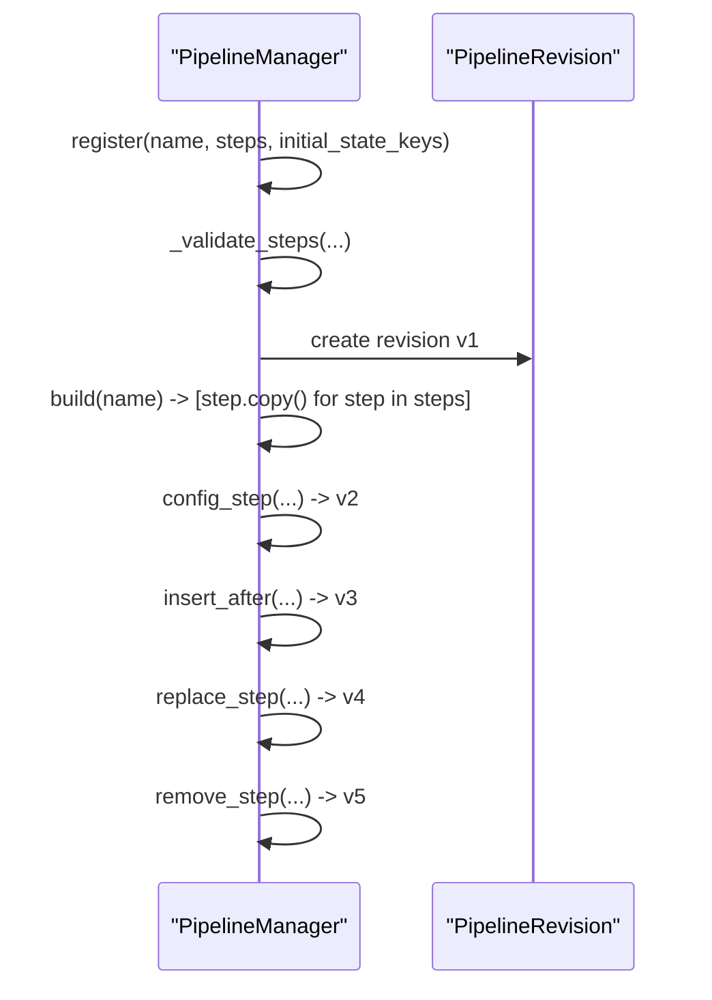
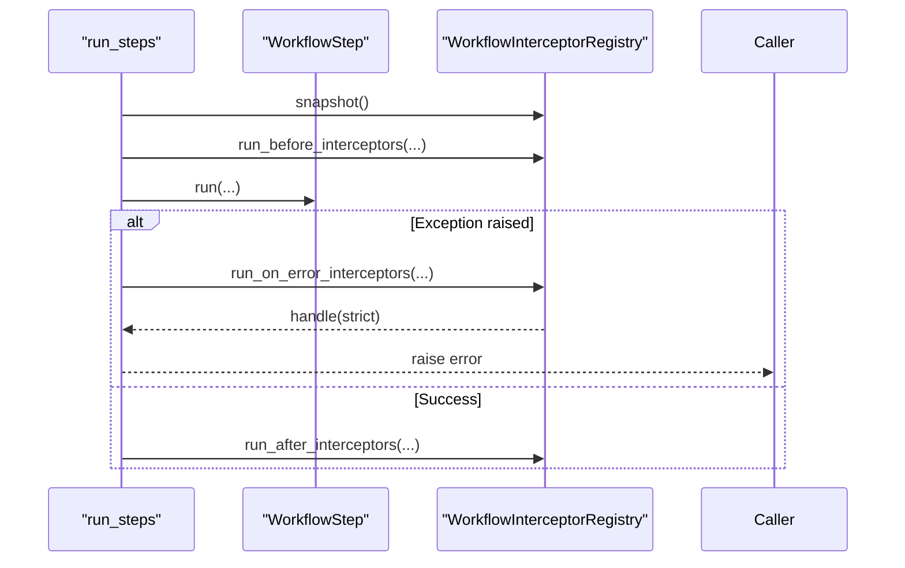
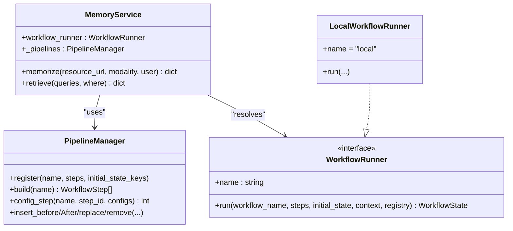
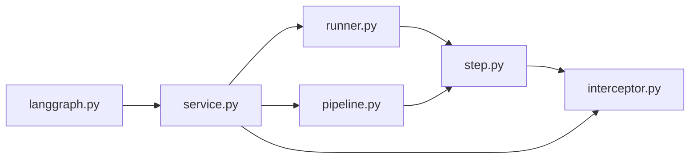

# Step Definition and Execution

<cite>
**Referenced Files in This Document**
- [step.py](file://src/memu/workflow/step.py)
- [pipeline.py](file://src/memu/workflow/pipeline.py)
- [runner.py](file://src/memu/workflow/runner.py)
- [interceptor.py](file://src/memu/workflow/interceptor.py)
- [__init__.py](file://src/memu/workflow/__init__.py)
- [service.py](file://src/memu/app/service.py)
- [memorize.py](file://src/memu/app/memorize.py)
- [retrieve.py](file://src/memu/app/retrieve.py)
- [langgraph.py](file://src/memu/integrations/langgraph.py)
- [getting_started_robust.py](file://examples/getting_started_robust.py)
- [langgraph_demo.py](file://examples/langgraph_demo.py)
</cite>

## Table of Contents
1. [Introduction](#introduction)
2. [Project Structure](#project-structure)
3. [Core Components](#core-components)
4. [Architecture Overview](#architecture-overview)
5. [Detailed Component Analysis](#detailed-component-analysis)
6. [Dependency Analysis](#dependency-analysis)
7. [Performance Considerations](#performance-considerations)
8. [Troubleshooting Guide](#troubleshooting-guide)
9. [Conclusion](#conclusion)
10. [Appendices](#appendices)

## Introduction
This document explains how workflow steps are defined and executed in the system, focusing on the WorkflowStep class and its lifecycle. It covers step configuration, capability requirements, state dependency management, the execution interface, parameter passing, result handling, step composition and chaining, validation and capability matching, state key management, debugging techniques, performance optimization, and best practices for extending step functionality while maintaining backward compatibility.

## Project Structure
The workflow subsystem resides under src/memu/workflow and integrates with application services under src/memu/app. The key modules are:
- step.py: Defines WorkflowStep and the step execution engine
- pipeline.py: Manages pipeline registration, revisioning, and mutation
- runner.py: Provides the WorkflowRunner protocol and local runner
- interceptor.py: Implements step-level interceptors for pre/post/error hooks
- __init__.py: Public API exports for workflow components
- Integrations and examples demonstrate usage in broader contexts

**Diagram sources**
- [step.py](file://src/memu/workflow/step.py#L16-L102)
- [pipeline.py](file://src/memu/workflow/pipeline.py#L12-L171)
- [runner.py](file://src/memu/workflow/runner.py#L12-L82)
- [interceptor.py](file://src/memu/workflow/interceptor.py#L16-L219)
- [service.py](file://src/memu/app/service.py#L49-L200)
- [memorize.py](file://src/memu/app/memorize.py#L97-L180)
- [retrieve.py](file://src/memu/app/retrieve.py#L106-L200)
- [langgraph.py](file://src/memu/integrations/langgraph.py#L53-L164)

**Section sources**
- [__init__.py](file://src/memu/workflow/__init__.py#L1-L30)

## Core Components
- WorkflowStep: Encapsulates a single unit of work with identifiers, handler, and metadata (requires, produces, capabilities, config). It exposes a run method that invokes the handler and validates the returned state mapping.
- run_steps: Executes a sequence of WorkflowStep instances, enforcing state dependency checks, building step context, invoking interceptors around each step, and propagating exceptions.
- PipelineManager: Registers pipelines, validates step sequences, manages revisions, and supports dynamic mutations (insert/replace/remove/config).
- WorkflowRunner and LocalWorkflowRunner: Abstraction for executing workflows via different backends; the local runner delegates to run_steps.
- WorkflowInterceptorRegistry: Provides before/after/on_error hooks around each step with snapshot semantics and strict mode.

Key execution interfaces:
- WorkflowHandler: Callable accepting (state, context) and returning either a mapping or an awaitable yielding a mapping.
- WorkflowState: A dictionary of string keys to arbitrary values representing the evolving state across steps.
- WorkflowContext: Optional mapping passed to each step handler; enriched with step_id and step_config during execution.

Validation and capability matching:
- PipelineManager enforces uniqueness of step_id, capability availability, LLM profile validity, and state dependency correctness across the pipeline.

**Section sources**
- [step.py](file://src/memu/workflow/step.py#L16-L102)
- [pipeline.py](file://src/memu/workflow/pipeline.py#L21-L171)
- [runner.py](file://src/memu/workflow/runner.py#L12-L82)
- [interceptor.py](file://src/memu/workflow/interceptor.py#L56-L219)

## Architecture Overview
The execution flow for a workflow is orchestrated by run_steps, which:
- Validates that each step’s requires keys are present in the current state
- Builds a step-specific context (including step_id and step_config)
- Invokes before interceptors
- Calls step.run(handler), awaiting if needed and ensuring a mapping result
- Invokes after interceptors
- Propagates exceptions to on_error interceptors before raising

**Diagram sources**
- [runner.py](file://src/memu/workflow/runner.py#L28-L40)
- [step.py](file://src/memu/workflow/step.py#L40-L47)
- [step.py](file://src/memu/workflow/step.py#L50-L102)
- [interceptor.py](file://src/memu/workflow/interceptor.py#L168-L203)

## Detailed Component Analysis

### WorkflowStep: Definition, Lifecycle, and Execution
- Purpose: Encapsulates a single step with:
  - step_id: Unique identifier
  - role: Semantic role for categorization
  - handler: Function implementing the step logic
  - description: Optional human-readable description
  - requires: Set of state keys the step expects
  - produces: Set of state keys the step writes
  - capabilities: Set of capability tags for filtering/validation
  - config: Arbitrary configuration (e.g., LLM profile selection)
- Copy semantics: copy creates a shallow copy with copied mutable fields but shared handler reference.
- run method:
  - Invokes handler(state, context)
  - Awaits if handler returns an awaitable
  - Validates that the result is a mapping; otherwise raises a TypeError
  - Returns a fresh dict of the result mapping

**Diagram sources**
- [step.py](file://src/memu/workflow/step.py#L16-L47)
- [step.py](file://src/memu/workflow/step.py#L50-L102)

**Section sources**
- [step.py](file://src/memu/workflow/step.py#L16-L47)
- [step.py](file://src/memu/workflow/step.py#L50-L102)

### Step Execution Interface, Parameter Passing, and Result Handling
- Handler signature: accepts (state, context) and returns a mapping or an awaitable mapping.
- Context enrichment:
  - step_id is injected into the context for each step
  - step_config is injected if present in the step’s config
- Result handling:
  - run ensures the result is a mapping; otherwise raises a TypeError
  - run_steps returns the final state after all steps

**Diagram sources**
- [step.py](file://src/memu/workflow/step.py#L50-L102)
- [interceptor.py](file://src/memu/workflow/interceptor.py#L168-L203)

**Section sources**
- [step.py](file://src/memu/workflow/step.py#L40-L47)
- [step.py](file://src/memu/workflow/step.py#L50-L102)

### Step Configuration, Capability Requirements, and Validation
- PipelineManager registers pipelines and validates:
  - Duplicate step_id detection
  - Capability availability against manager’s available capabilities
  - LLM profile validity against manager’s llm_profiles
  - State dependency correctness across the pipeline (requires must be satisfied by previously produced keys)
- Capability matching:
  - Steps declare capabilities; PipelineManager compares against available set
- State key management:
  - PipelineManager tracks available keys across steps and enforces forward-only dependencies

**Diagram sources**
- [pipeline.py](file://src/memu/workflow/pipeline.py#L131-L165)

**Section sources**
- [pipeline.py](file://src/memu/workflow/pipeline.py#L21-L171)

### Step Composition Patterns and Chaining
- Steps are chained in the order provided by the pipeline.
- Each step declares requires and produces to define data dependencies and side effects.
- PipelineManager.build returns copies of steps so modifications do not affect the original pipeline definition.
- Mutations supported:
  - config_step merges step configuration
  - insert_before/insert_after add new steps around a target
  - replace_step swaps a step
  - remove_step deletes a step
- Revisioning:
  - Each mutation increments the revision and stores a new PipelineRevision

**Diagram sources**
- [pipeline.py](file://src/memu/workflow/pipeline.py#L27-L122)

**Section sources**
- [pipeline.py](file://src/memu/workflow/pipeline.py#L21-L171)

### Step Failure Handling and Interceptors
- On step failure, run_steps invokes on_error interceptors with the error and current state.
- InterceptorRegistry supports:
  - register_before/register_after/register_on_error
  - snapshot for point-in-time invocation
  - strict mode: exceptions in interceptors propagate instead of being logged

**Diagram sources**
- [step.py](file://src/memu/workflow/step.py#L90-L96)
- [interceptor.py](file://src/memu/workflow/interceptor.py#L168-L203)

**Section sources**
- [interceptor.py](file://src/memu/workflow/interceptor.py#L56-L219)
- [step.py](file://src/memu/workflow/step.py#L50-L102)

### Practical Examples: Defining Custom Steps and Workflows
- Defining a step:
  - Create a handler function that accepts (state, context) and returns a mapping
  - Instantiate WorkflowStep with step_id, role, handler, requires, produces, capabilities, and config
- Using in a pipeline:
  - Build a list of WorkflowStep instances
  - Optionally register with PipelineManager and build a copy for execution
  - Execute via a WorkflowRunner (e.g., LocalWorkflowRunner) or run_steps directly
- Real-world examples in the codebase:
  - Memory ingestion and categorization workflow steps are defined in MemorizeMixin
  - Retrieval workflow steps are defined in RetrieveMixin
  - Integration with LangGraph exposes MemULangGraphTools that internally leverage the workflow runner

**Diagram sources**
- [service.py](file://src/memu/app/service.py#L49-L200)
- [pipeline.py](file://src/memu/workflow/pipeline.py#L21-L171)
- [runner.py](file://src/memu/workflow/runner.py#L12-L82)

**Section sources**
- [memorize.py](file://src/memu/app/memorize.py#L97-L180)
- [retrieve.py](file://src/memu/app/retrieve.py#L106-L200)
- [service.py](file://src/memu/app/service.py#L49-L200)
- [langgraph.py](file://src/memu/integrations/langgraph.py#L53-L164)

## Dependency Analysis
- Internal dependencies:
  - step.py depends on interceptor types for context and interceptor execution
  - runner.py depends on step.py for run_steps and on interceptor types for optional registry
  - pipeline.py depends on step.py for step validation and copying
  - service.py composes pipeline, runner, and interceptor registries
- External integration:
  - langgraph.py depends on MemoryService and exposes structured tools that internally use the workflow runner

**Diagram sources**
- [step.py](file://src/memu/workflow/step.py#L1-L13)
- [runner.py](file://src/memu/workflow/runner.py#L6-L9)
- [pipeline.py](file://src/memu/workflow/pipeline.py#L9)
- [service.py](file://src/memu/app/service.py#L33-L36)
- [langgraph.py](file://src/memu/integrations/langgraph.py#L16-L22)

**Section sources**
- [step.py](file://src/memu/workflow/step.py#L1-L13)
- [runner.py](file://src/memu/workflow/runner.py#L6-L9)
- [pipeline.py](file://src/memu/workflow/pipeline.py#L9)
- [service.py](file://src/memu/app/service.py#L33-L36)
- [langgraph.py](file://src/memu/integrations/langgraph.py#L16-L22)

## Performance Considerations
- Minimize handler overhead:
  - Keep handlers synchronous when possible; only use async when I/O is required
  - Avoid heavy computations inside handlers; offload to background tasks if needed
- Reduce state churn:
  - Limit the number of produces keys; only write what is necessary for subsequent steps
  - Reuse intermediate artifacts already present in state
- Interceptor cost:
  - Keep interceptors lightweight; avoid expensive operations in before/after/on_error handlers
  - Use strict=False unless you need immediate propagation of interceptor errors
- LLM profile selection:
  - Choose appropriate profiles to balance latency and quality; cache clients when feasible
- Pipeline validation:
  - Perform validation once during registration/build; avoid repeated checks at runtime

[No sources needed since this section provides general guidance]

## Troubleshooting Guide
Common issues and resolutions:
- Missing required state keys:
  - Symptom: KeyError indicating missing keys for a step
  - Cause: requires set not satisfied by current state
  - Resolution: Ensure preceding steps produce the required keys or provide them in initial_state
- Handler does not return a mapping:
  - Symptom: TypeError stating the step must return a mapping
  - Cause: handler returned a non-mapping type
  - Resolution: Ensure handler returns a mapping or an awaitable that resolves to a mapping
- Unknown capability or LLM profile:
  - Symptom: ValueError indicating unavailable capabilities or unknown llm_profile
  - Cause: step.capabilities or step.config.llm_profile not aligned with PipelineManager configuration
  - Resolution: Adjust step capabilities or config; or configure PipelineManager with matching sets
- Interceptor exceptions:
  - Symptom: Unexpected failures in interceptors
  - Cause: strict mode or unhandled exceptions
  - Resolution: Set strict=False to log and continue; or fix interceptor logic; use dispose to remove problematic interceptors

**Section sources**
- [step.py](file://src/memu/workflow/step.py#L44-L46)
- [step.py](file://src/memu/workflow/step.py#L69-L72)
- [pipeline.py](file://src/memu/workflow/pipeline.py#L141-L154)
- [interceptor.py](file://src/memu/workflow/interceptor.py#L215-L219)

## Conclusion
The workflow subsystem centers on the WorkflowStep abstraction and a robust execution engine that enforces state dependencies, capability matching, and configurable interception. By structuring logic as small, composable steps with explicit requires/produces, teams can build maintainable, testable, and extensible workflows. PipelineManager enables safe evolution of workflows through revisioning and controlled mutations, while the runner and interceptor layers provide flexibility and observability.

[No sources needed since this section summarizes without analyzing specific files]

## Appendices

### Best Practices for Step Implementation
- Keep handlers pure and deterministic when possible; isolate side effects
- Use requires and produces to make dependencies explicit and testable
- Prefer small steps with single responsibilities; compose via pipelines
- Use capabilities to gate steps requiring specialized backends
- Leverage step_config for environment-specific tuning (e.g., LLM profiles)
- Add before/after/on_error interceptors for cross-cutting concerns (logging, metrics, tracing)

### Extending Step Functionality and Backward Compatibility
- Extend via interceptors rather than modifying core handlers when possible
- Maintain stable step_id across revisions to preserve pipeline continuity
- Introduce new steps rather than changing existing ones to avoid breaking downstream dependencies
- Use PipelineManager’s revision mechanism to roll out changes safely
- Keep handler signatures stable; add optional context fields instead of changing parameters

**Section sources**
- [pipeline.py](file://src/memu/workflow/pipeline.py#L108-L122)
- [interceptor.py](file://src/memu/workflow/interceptor.py#L56-L166)