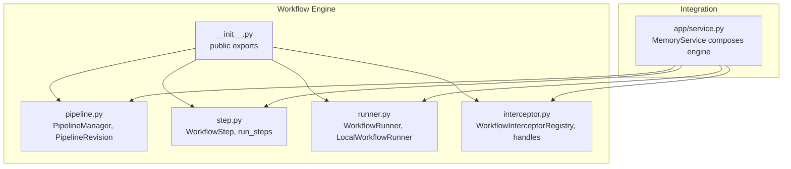
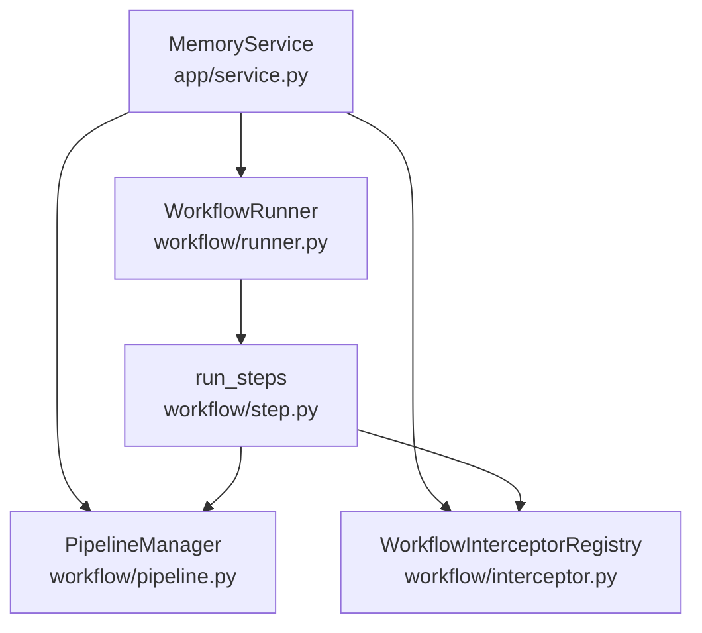
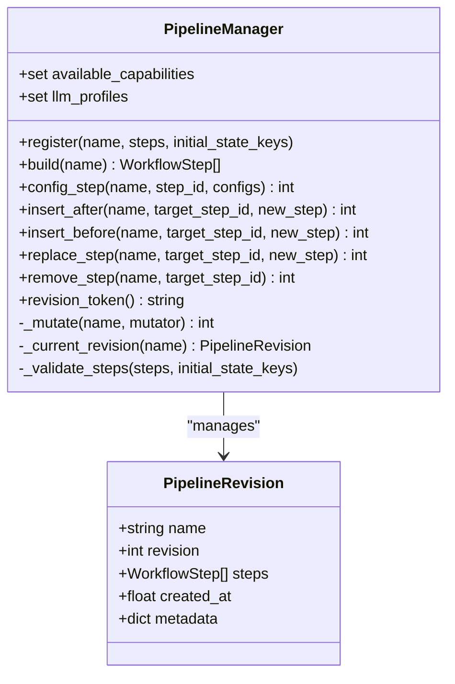
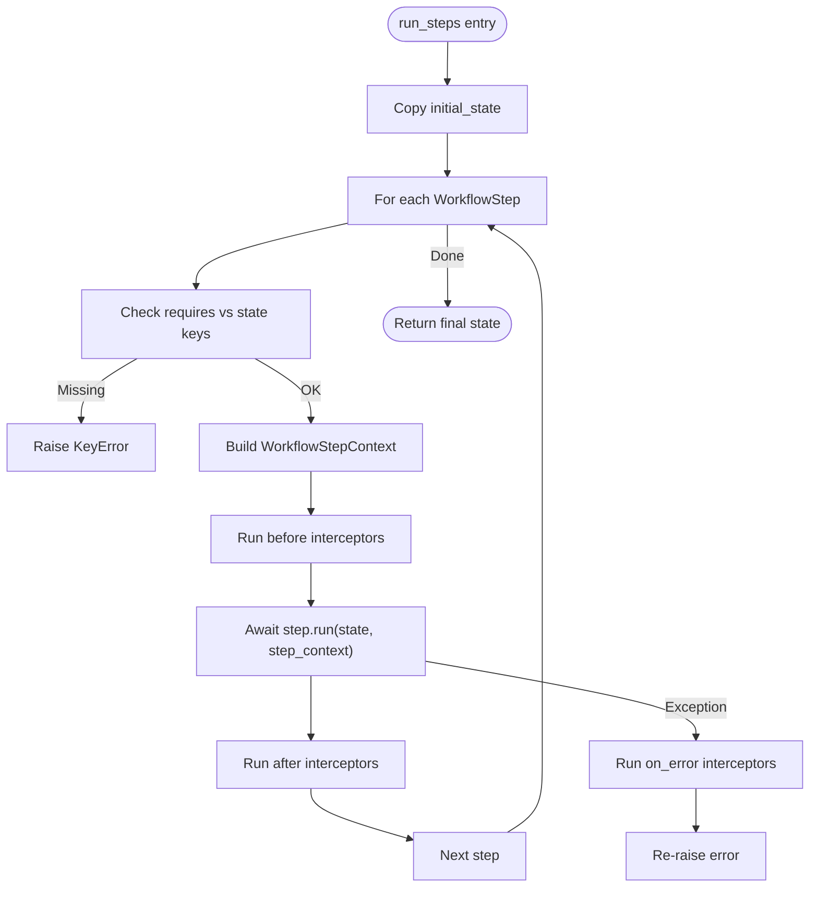
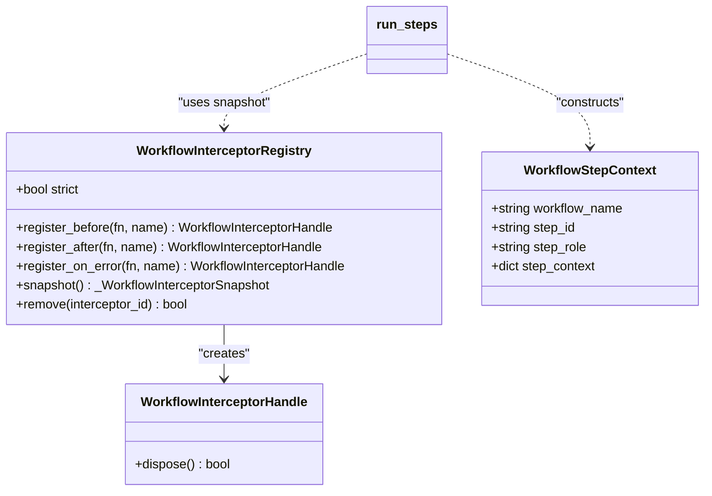
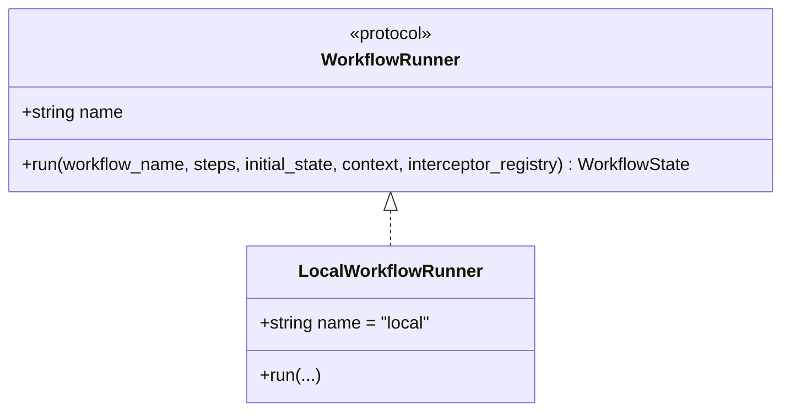
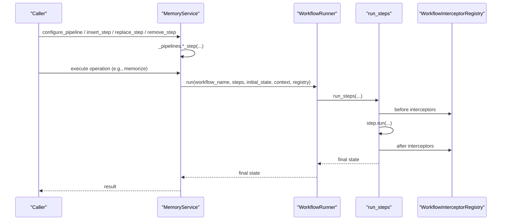
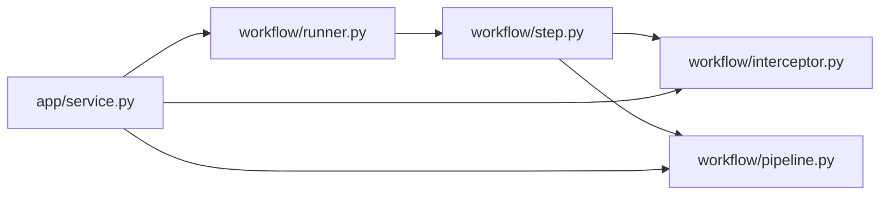

# Workflow Engine

<cite>
**Referenced Files in This Document**
- [src/memu/workflow/__init__.py](file://src/memu/workflow/__init__.py)
- [src/memu/workflow/pipeline.py](file://src/memu/workflow/pipeline.py)
- [src/memu/workflow/step.py](file://src/memu/workflow/step.py)
- [src/memu/workflow/runner.py](file://src/memu/workflow/runner.py)
- [src/memu/workflow/interceptor.py](file://src/memu/workflow/interceptor.py)
- [src/memu/app/service.py](file://src/memu/app/service.py)
- [docs/architecture.md](file://docs/architecture.md)
- [docs/adr/0001-workflow-pipeline-architecture.md](file://docs/adr/0001-workflow-pipeline-architecture.md)
- [examples/getting_started_robust.py](file://examples/getting_started_robust.py)
- [examples/example_1_conversation_memory.py](file://examples/example_1_conversation_memory.py)
</cite>

## Table of Contents
1. [Introduction](#introduction)
2. [Project Structure](#project-structure)
3. [Core Components](#core-components)
4. [Architecture Overview](#architecture-overview)
5. [Detailed Component Analysis](#detailed-component-analysis)
6. [Dependency Analysis](#dependency-analysis)
7. [Performance Considerations](#performance-considerations)
8. [Troubleshooting Guide](#troubleshooting-guide)
9. [Conclusion](#conclusion)
10. [Appendices](#appendices)

## Introduction
This document explains memU’s workflow engine that powers pipeline-based execution for memory ingestion and retrieval. It covers the pipeline architecture, step definition and execution patterns, interceptor registration, workflow runner implementation, error handling, and observability. It also provides practical examples for composing complex processing pipelines, integrating with memory ingestion/retrieval, asynchronous execution, performance optimization, debugging, monitoring, and extending the engine with custom functionality while maintaining backward compatibility.

## Project Structure
The workflow engine resides under src/memu/workflow and is integrated into the MemoryService runtime under src/memu/app. The documentation under docs provides architectural context and decisions that inform the engine’s design.

**Diagram sources**
- [src/memu/workflow/pipeline.py](file://src/memu/workflow/pipeline.py#L21-L171)
- [src/memu/workflow/step.py](file://src/memu/workflow/step.py#L16-L102)
- [src/memu/workflow/runner.py](file://src/memu/workflow/runner.py#L12-L82)
- [src/memu/workflow/interceptor.py](file://src/memu/workflow/interceptor.py#L56-L219)
- [src/memu/workflow/__init__.py](file://src/memu/workflow/__init__.py#L1-L30)
- [src/memu/app/service.py](file://src/memu/app/service.py#L49-L200)

**Section sources**
- [src/memu/workflow/__init__.py](file://src/memu/workflow/__init__.py#L1-L30)
- [src/memu/workflow/pipeline.py](file://src/memu/workflow/pipeline.py#L1-L171)
- [src/memu/workflow/step.py](file://src/memu/workflow/step.py#L1-L102)
- [src/memu/workflow/runner.py](file://src/memu/workflow/runner.py#L1-L82)
- [src/memu/workflow/interceptor.py](file://src/memu/workflow/interceptor.py#L1-L219)
- [src/memu/app/service.py](file://src/memu/app/service.py#L49-L200)
- [docs/architecture.md](file://docs/architecture.md#L52-L72)

## Core Components
- PipelineManager: Registers and manages named pipelines with revision history, validates step dependencies, and supports runtime mutations (insert/replace/remove/configure).
- WorkflowStep: Encapsulates a single processing unit with explicit state contracts (requires/produces), capability tags, and a handler function (sync or async).
- run_steps: Executes a list of steps sequentially, enforcing state contracts and invoking step-level interceptors.
- WorkflowRunner: Protocol for pluggable execution backends; LocalWorkflowRunner executes locally via run_steps.
- WorkflowInterceptorRegistry: Manages before/after/on_error interceptors around each step, with thread-safe registration and snapshot semantics.

**Section sources**
- [src/memu/workflow/pipeline.py](file://src/memu/workflow/pipeline.py#L21-L171)
- [src/memu/workflow/step.py](file://src/memu/workflow/step.py#L16-L102)
- [src/memu/workflow/runner.py](file://src/memu/workflow/runner.py#L12-L82)
- [src/memu/workflow/interceptor.py](file://src/memu/workflow/interceptor.py#L56-L219)

## Architecture Overview
The workflow engine is the backbone of core operations (memorize, retrieve, CRUD). MemoryService composes the engine by constructing PipelineManager, WorkflowRunner, and WorkflowInterceptorRegistry, then registers pipelines and exposes mutation APIs.

**Diagram sources**
- [src/memu/app/service.py](file://src/memu/app/service.py#L49-L200)
- [src/memu/workflow/pipeline.py](file://src/memu/workflow/pipeline.py#L21-L171)
- [src/memu/workflow/runner.py](file://src/memu/workflow/runner.py#L28-L40)
- [src/memu/workflow/step.py](file://src/memu/workflow/step.py#L50-L102)
- [src/memu/workflow/interceptor.py](file://src/memu/workflow/interceptor.py#L56-L219)

**Section sources**
- [docs/architecture.md](file://docs/architecture.md#L52-L72)
- [docs/adr/0001-workflow-pipeline-architecture.md](file://docs/adr/0001-workflow-pipeline-architecture.md#L12-L21)
- [src/memu/app/service.py](file://src/memu/app/service.py#L49-L200)

## Detailed Component Analysis

### Pipeline Manager and Pipeline Revisions
- Registration: Validates step uniqueness, capability availability, profile validity, and required state keys. Stores initial metadata including initial_state_keys.
- Revisioning: Mutations (config_step, insert_* , replace_step, remove_step) create new revisions with incremented revision counters and timestamps.
- Validation: Enforces step_id uniqueness, unknown capabilities, invalid LLM profiles, and missing required state keys.
- Tokenization: revision_token aggregates current revision states across pipelines for change detection.

**Diagram sources**
- [src/memu/workflow/pipeline.py](file://src/memu/workflow/pipeline.py#L12-L171)

**Section sources**
- [src/memu/workflow/pipeline.py](file://src/memu/workflow/pipeline.py#L21-L171)

### Step Definition and Execution
- WorkflowStep: Defines step_id, role, handler, description, requires, produces, capabilities, and config. Provides copy() to safely clone steps.
- Handler contract: handler(state, context) returns a mapping; async handlers are awaited automatically.
- run_steps: Iterates steps, validates requires, builds WorkflowStepContext, invokes before/after/on_error interceptors, executes step, and propagates errors to on_error interceptors before raising.

**Diagram sources**
- [src/memu/workflow/step.py](file://src/memu/workflow/step.py#L50-L102)
- [src/memu/workflow/interceptor.py](file://src/memu/workflow/interceptor.py#L163-L219)

**Section sources**
- [src/memu/workflow/step.py](file://src/memu/workflow/step.py#L16-L102)

### Interceptor Registration and Observability
- Registry: Thread-safe registration of before/after/on_error interceptors; maintains insertion order; supports snapshotting for consistent execution.
- Strict mode: When enabled, interceptor exceptions propagate instead of being logged.
- Lifecycle: Before interceptors run first; on_error interceptors run on exceptions; after interceptors run last (reverse order).
- Handles: Disposable handles allow removing interceptors by ID.

**Diagram sources**
- [src/memu/workflow/interceptor.py](file://src/memu/workflow/interceptor.py#L56-L219)
- [src/memu/workflow/step.py](file://src/memu/workflow/step.py#L50-L102)

**Section sources**
- [src/memu/workflow/interceptor.py](file://src/memu/workflow/interceptor.py#L56-L219)

### Workflow Runner Implementation
- Protocol: WorkflowRunner defines the interface for executing workflows with name, run signature, and context.
- LocalWorkflowRunner: Default runner that delegates to run_steps.
- Resolution: resolve_workflow_runner resolves a runner from a name, instance, or None (defaults to local). register_workflow_runner allows plugging in external backends.

**Diagram sources**
- [src/memu/workflow/runner.py](file://src/memu/workflow/runner.py#L12-L82)

**Section sources**
- [src/memu/workflow/runner.py](file://src/memu/workflow/runner.py#L12-L82)

### Integration with MemoryService and Pipelines
- MemoryService composes the engine: initializes LLM clients, interceptors, PipelineManager with capabilities and profiles, and a WorkflowRunner.
- Public mutation APIs delegate to PipelineManager for runtime pipeline customization.
- Architectural context: pipelines orchestrate ingestion and retrieval stages and integrate with LLM clients and database repositories.

**Diagram sources**
- [src/memu/app/service.py](file://src/memu/app/service.py#L390-L426)
- [src/memu/workflow/runner.py](file://src/memu/workflow/runner.py#L61-L82)
- [src/memu/workflow/step.py](file://src/memu/workflow/step.py#L50-L102)
- [src/memu/workflow/interceptor.py](file://src/memu/workflow/interceptor.py#L163-L219)

**Section sources**
- [src/memu/app/service.py](file://src/memu/app/service.py#L49-L200)
- [src/memu/app/service.py](file://src/memu/app/service.py#L390-L426)
- [docs/architecture.md](file://docs/architecture.md#L73-L110)

## Dependency Analysis
- Cohesion: Each module encapsulates a distinct concern—pipeline management, step execution, runner abstraction, and interceptors.
- Coupling: run_steps depends on WorkflowStep and WorkflowInterceptorRegistry; PipelineManager depends on WorkflowStep; WorkflowRunner is a protocol consumed by MemoryService.
- External dependencies: Logging is used in interceptors; threading.Lock is used for thread safety in the registry.

**Diagram sources**
- [src/memu/workflow/step.py](file://src/memu/workflow/step.py#L50-L102)
- [src/memu/workflow/interceptor.py](file://src/memu/workflow/interceptor.py#L163-L219)
- [src/memu/workflow/pipeline.py](file://src/memu/workflow/pipeline.py#L21-L171)
- [src/memu/workflow/runner.py](file://src/memu/workflow/runner.py#L28-L40)
- [src/memu/app/service.py](file://src/memu/app/service.py#L49-L200)

**Section sources**
- [src/memu/workflow/step.py](file://src/memu/workflow/step.py#L16-L102)
- [src/memu/workflow/interceptor.py](file://src/memu/workflow/interceptor.py#L56-L219)
- [src/memu/workflow/pipeline.py](file://src/memu/workflow/pipeline.py#L21-L171)
- [src/memu/workflow/runner.py](file://src/memu/workflow/runner.py#L12-L82)
- [src/memu/app/service.py](file://src/memu/app/service.py#L49-L200)

## Performance Considerations
- Asynchronous handlers: Handlers can be async; run_steps awaits them, enabling I/O-bound steps without blocking.
- Minimal copying: run_steps copies initial_state; PipelineManager creates copies for mutations to preserve immutability of prior revisions.
- Interceptor overhead: Before/after/on_error interceptors are invoked per step; keep them lightweight and avoid heavy synchronous work.
- Capability and profile validation: PipelineManager validates capabilities and profiles at registration/mutation time to prevent runtime failures.
- Concurrency: MemoryService orchestrates concurrent operations externally; the workflow engine executes steps sequentially by default. For parallelism, design steps to be independent or introduce controlled concurrency at the step level.

[No sources needed since this section provides general guidance]

## Troubleshooting Guide
Common issues and resolutions:
- Missing required state keys: run_steps raises a KeyError if a step’s requires are not satisfied by current state keys.
- Unknown step_id during mutation: PipelineManager raises a KeyError if the target step_id is not found.
- Unknown capability or LLM profile: PipelineManager raises a ValueError if a step requests unavailable capabilities or an unknown profile.
- Interceptor exceptions: In non-strict mode, interceptor exceptions are logged; enable strict mode to surface them immediately.
- Step handler return type: Handlers must return a mapping; otherwise, a TypeError is raised.

Operational tips:
- Use revision_token to detect pipeline changes.
- Snapshot interceptors before execution to ensure a consistent view during run_steps.
- Register before/after/on_error interceptors to capture timing and state snapshots for debugging.

**Section sources**
- [src/memu/workflow/step.py](file://src/memu/workflow/step.py#L67-L72)
- [src/memu/workflow/pipeline.py](file://src/memu/workflow/pipeline.py#L58-L60)
- [src/memu/workflow/pipeline.py](file://src/memu/workflow/pipeline.py#L141-L154)
- [src/memu/workflow/interceptor.py](file://src/memu/workflow/interceptor.py#L215-L219)

## Conclusion
The workflow engine provides a robust, extensible foundation for memU’s memory operations. Its pipeline-centric design, explicit state contracts, and interceptor system enable composability, observability, and safe runtime customization. By leveraging PipelineManager, WorkflowRunner, and WorkflowInterceptorRegistry, developers can build reliable, maintainable pipelines that integrate seamlessly with ingestion and retrieval processes.

[No sources needed since this section summarizes without analyzing specific files]

## Appendices

### Practical Examples and Patterns
- Defining custom workflow steps:
  - Create a handler function/state contract (requires/produces).
  - Instantiate WorkflowStep with step_id, role, handler, and config.
  - Register with PipelineManager.register(...) or mutate existing pipelines via insert/replace/remove/configure.
  - Reference example handlers and patterns in the repository’s examples and prompts modules.
- Registering interceptors:
  - Use WorkflowInterceptorRegistry.register_before/after/on_error to instrument step execution.
  - Enable strict mode for immediate failure feedback during development.
- Composing complex pipelines:
  - Chain steps with clear requires/produces to ensure deterministic execution order.
  - Use PipelineManager.build(...) to obtain a fresh copy of steps for execution.
- Integrating with memory ingestion/retrieval:
  - MemoryService composes the engine and exposes mutation APIs; operations like memorize and retrieve execute pipelines built from WorkflowStep units.
- Asynchronous execution:
  - Define async handlers to offload I/O; run_steps awaits them.
- Performance optimization:
  - Keep interceptors lightweight; minimize state copying; validate capabilities/profiles early.
- Debugging and monitoring:
  - Use before/after interceptors to log step_context and state snapshots.
  - Capture exceptions via on_error interceptors and surface them conditionally.
- Extending the engine:
  - Implement a custom WorkflowRunner via register_workflow_runner and resolve_workflow_runner.
  - Maintain backward compatibility by preserving the WorkflowRunner protocol and ensuring PipelineManager validations remain intact.

**Section sources**
- [src/memu/workflow/step.py](file://src/memu/workflow/step.py#L16-L102)
- [src/memu/workflow/pipeline.py](file://src/memu/workflow/pipeline.py#L27-L122)
- [src/memu/workflow/runner.py](file://src/memu/workflow/runner.py#L52-L82)
- [src/memu/workflow/interceptor.py](file://src/memu/workflow/interceptor.py#L78-L115)
- [src/memu/app/service.py](file://src/memu/app/service.py#L390-L426)
- [docs/architecture.md](file://docs/architecture.md#L73-L110)
- [examples/getting_started_robust.py](file://examples/getting_started_robust.py#L30-L108)
- [examples/example_1_conversation_memory.py](file://examples/example_1_conversation_memory.py#L51-L118)